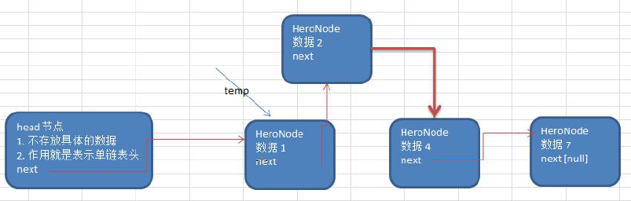
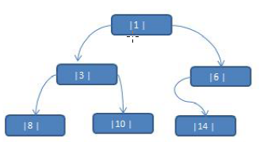
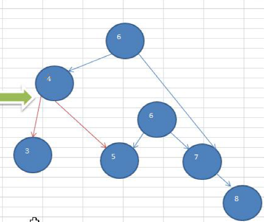
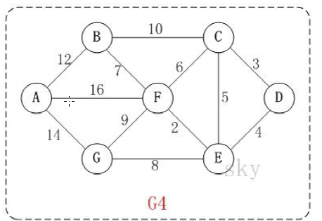
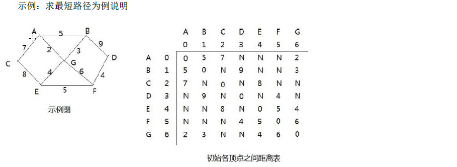

### 第一章 数据结构和算法

##### 1、线性结构和非线性结构

​	数据结构包括：线性结构和非线性结构。

##### 2、线性结构

- 线性结构作为最常用的数据结构，其特点是数据元素之间存在一对一的线性关系
- 线性结构有两种不同的存储结构，即顺序存储结构和（数组）和链式存储结构（链表）。顺序存储的线性表成为顺序表，顺序表中的存储元素是连续的。
- 链式存储的线性表成为链表，链表中的存储元素不一定是连续的，元素节点中存放数据元素以及相邻元素的地址信息。
- 线性结构常见的有：**数组，队列，链表和栈**；

##### 3、非线性结构

非线性结构包括： **二维数组、多维数组、广义表，树结构，图结构；**

### 第二章 数据结构和算法概述

#### 2.1 数据结构和算法的关系

**1、**数据data结构是一门研究组织数据方式的学科，有了编程语言也就有了数据结构.学号数据结构钢可以编写更加漂亮，更加有效的代码。

**2、**学好数据结构就要多多考虑如何将生活中遇到的问题，用程序去实现解决.

**3、** 程序 = 数据结构+算法

**4、**数据结构是算法的基础，换言之，想要修好算法，需要把数据结构学习到位。

### 第三章 稀疏数组和队列

#### 3.1 稀疏 sparsearray 数组

**3.1.1 先看一个实际的需求**

- 编写的五子棋程序中，有存盘退出和续上盘的功能。

  

- 分析问题：

  因为该二维数组的很多值是默认值0，因此记录了很多没有意义的数据 -> 稀疏数组。

#### 3.2 稀疏数组基本介绍

当一个数组中大部分元素为0，或者为同一个元素的数组时，可以使用稀疏数组来保存该数组。

**3.2.1 稀疏数组的处理方法是：**

- 记录数组一共有几行几列，有多少个不同的值
- 把具有不同值的元素的行列及值记录在一个小规模的数组中，从而缩小程序的规模

**3.2.2 稀疏数组举例说明**


**3.2.3 应用实例**

- 使用稀疏数组，来保留类似前面的二维数组（棋盘，地图等等）
- 把稀疏数组存盘，并且可以从新恢复的二维数组
- 整体思路分析


```properties
二维数组转化稀疏数组的思路
1、遍历 原始的二维数组，得到有效数据的个数 sum
2、根据sum 就可以创建稀疏数组 sparseArr int[sum+1][3]
3、将二维数组的有效数据存入到 稀疏数组

稀疏数组转化为原始的二维数组的思路
1、先读取稀疏数组的第一行，根据第一行的数据，创建原始的二维数组，比如上面的  chessArr2 int[11][11]
2、在读取稀疏数组后几行的数据，并赋给 原始的二维数组 即可
```

- 代码实现

```java
package com.example.datastruct;

import java.io.*;

/**
 * @author papi
 * @data 2020/9/6
 */
//数据结构和算法---稀疏数组的代码实现
public class SparseArray {
    public static void main(String[] args) {
        //创建一个数组 11*11 的
        //0:表示没有棋子，1 表示黑子，2 表示蓝子
        int chessArray[][] = new int[11][11];
        chessArray[1][2] = 1;
        chessArray[2][3] = 2;
        chessArray[3][4] = 2;
        //遍历原始的数组
        System.out.println("原始数组");
        for(int[] row : chessArray){
            for(int data : row){
                System.out.printf("%d\t",data);
            }
            System.out.println();
        }
        //将二维数组转稀疏数组的思
        //1、先遍历二维数组 得到非0数组的个数
        int sum = 0;
        for ( int i = 0 ; i < chessArray.length ; i++) {
            for (int j = 0 ; j < chessArray[i].length ; j++) {
                if(chessArray[i][j] != 0){
                    sum ++ ;
                }
            }
        }
        System.out.println("sum = "+ sum);

        //2、得的原始数组的长度
        //3、创建稀疏数组
        int sparseArr[][] = new int[sum+1][3] ;
            sparseArr[0][0] = chessArray.length;
        for ( int i = 0 ; i < chessArray.length ; i++) {
            for (int j = 0 ; j < chessArray[i].length ; j++) {
                sparseArr[0][0] = chessArray.length;
                sparseArr[0][1] = chessArray[i].length;
                sparseArr[0][2] = sum;
            }
        }

        //4、给稀疏数组进行赋值
        int count = 0;
        for ( int i = 0 ; i < chessArray.length ; i++) {
            for (int j = 0 ; j < chessArray[i].length ; j++) {
                if(chessArray[i][j] != 0){
                    count++;
                    sparseArr[count][0] = i ;
                    sparseArr[count][1] = j ;
                    sparseArr[count][2] = chessArray[i][j] ;
                }
            }
        }
        System.out.println("打印出稀疏数组");
        for(int[] row : sparseArr){
            for(int data : row){
                System.out.printf("%d\t",data);
            }
            System.out.println();
        }
        File file =new File("F:/temp/temp.data");
        FileOutputStream output = null;
        try {
            output = new FileOutputStream(file);
            OutputStreamWriter write = new OutputStreamWriter(output, "UTF-8");
            for(int i = 0; i < sparseArr.length; i++){
                for(int j = 0 ; j < sparseArr[i].length ; j ++){
                    if(i == sparseArr.length - 1 && j == sparseArr[i].length - 1){
                        write.append(sparseArr[i][j] + "");
                       // System.out.printf("%d\t",data);
                    }else {
                        write.append(sparseArr[i][j] + ",");
                    }

                }
                System.out.println();
            }
            write.close();
            output.close();

        } catch (Exception e) {
            e.printStackTrace();
        }
        System.out.println("写入文件中...");
        //从文件中读取数据
        FileInputStream fis = null;
        try {
            fis = new FileInputStream(file);
            InputStreamReader reader = new InputStreamReader(fis, "UTF-8");
            StringBuffer sb = new StringBuffer();
            while (reader.ready()) {
                sb.append((char) reader.read());// 转成char加到StringBuffer对象中
            }
            reader.close();// 关闭读取流
            fis.close();// 关闭输入流,释放系统资源
            //创建对应的稀疏数组
            int xishuArray[][] = new int[sb.length()/3][3];
            //给稀疏数组赋值
            String[] str = sb.toString().split(",");
            int i = 0;
            for (String st : str){
                xishuArray[i/3][i % 3] =  Integer.parseInt(st);
                i++;
            }
            System.out.println("文件中读取的数据------------------");
            for(int[] row : xishuArray) {
                for(int data : row) {
                    System.out.printf("%d\t",data);
                }
                System.out.println();
            }

        } catch (Exception e) {
            e.printStackTrace();
        }
        //将稀疏数组，转化为原始的二维数组
        //1、先读取稀疏数组的一行，根据第一行的数据创建二维数组的，行列；
        //2、在读取稀疏数组后几行的数据，并赋给 原始的二维数组即可
        System.out.println("打印出稀疏数组");
        int sparseChangArray[][] = new int[sparseArr[0][0]][sparseArr[0][1]];
        //输出恢复后的二维数组
        for(int i = 1 ; i < sparseArr.length ; i++) {
            sparseChangArray[sparseArr[i][0]][sparseArr[i][1]] = sparseArr[i][sparseArr[i].length-1];
        }
        System.out.println("打印出稀疏数组转化成为二维数组~~~~~~");
        for(int[] row : sparseChangArray){
            for(int data : row){
                System.out.printf("%d\t",data);
            }
            System.out.println();
        }
    }
}
```

#### 3.3 队列

##### 3.3.1 队列的一个使用场景

银行排队的案例：


##### 3.3.2 队列的介绍

- 队列是一个有序列表，可以用数组或是链表来实现。
- 遵循先入先出的原则。即：**先存入队列的数据，要先取出。后存入的要后取出** 【**先入先出**】

- 示意图：（使用数组模拟队列示意图）


##### 3.3.3 数组模拟队列的思路

- 队列本身是有序的，若使用数组的结构来存储队列的数据，则队列数组的生命如下图，其中 maxSize 列的最大容量。

- 因为队列的输出，输入是分别从前后端来处理，因此需要两个变量front 和 rear 分别记录队列前后端下标，front会随着数据输出而改变，而rear则是随着数据输入而改变，如图所示：

  

- 当我们将数据存入队列时称为： `addQueue` ,`addQueue` 的处理需要有两个步骤：思路分析

  1） 将尾指针往后移，rear +1 ,当 front == rear  【空】

  2） 若尾指针 rear 小于队列的最大下标  **maxSize -1** ，则将数据存入 **rear** 所指的数组元素中否则无法存入数据   **rear == maxSize - 1**  【**队列满**】

##### 3.3.4 代码如下

```java
package com.example.queue;

import java.util.Scanner;

/**
 * @author papi
 * @data 2020/9/7
 */
public class ArrayQueueDemo {
    public static void main(String[] args) {
        ArrayQueue arrayQueue = new ArrayQueue(3);
        char key = ' ';//接受用户输入
        Scanner scanner = new Scanner(System.in);
        boolean loop = true;
        while (loop){
            System.out.println("s(show): 显示队列");
            System.out.println("e(exit): 退出程序");
            System.out.println("a(add): 添加数据到队列");
            System.out.println("g(get): 从队列去除数据");
            System.out.println("h(head): 查看对列头的数据");
            key = scanner.next().charAt(0);//接受一个字符
            switch (key) {
                case 's' :
                    arrayQueue.showQueue();
                    break;
                case 'e' :
                    arrayQueue.showQueue();
                    break;
                case 'a' :
                    System.out.println("请输入一个数：");
                    int value = scanner.nextInt();
                    arrayQueue.addQueue(value);
                    break;
                case 'g' :
                    try {
                        int queue = arrayQueue.getQueue();
                        System.out.printf("取出的数据是%d\n",queue);
                    }catch (Exception e){
                        System.out.println(e.getMessage());
                    }
                    break;
                case 'h' :
                   //查看队列头的信息
                    try {
                        int head = arrayQueue.showHead();
                        System.out.println("头部的数据为：" + head );
                    } catch (Exception e){
                        System.out.println(e.getMessage());
                    }
                    break;
            }
        }
    }
}
```

```java
package com.example.queue;

/**
 * @author papi
 * @data 2020/9/7
 */
public class ArrayQueue {
    private int maxSize;//队列的最大容量
    private int front;//队列头
    private int rear; //队列尾
    private int[] arr;//该数据存储数据，模拟队列

    public ArrayQueue(int arrMaxSize) {
        this.maxSize = arrMaxSize;
        this.front = -1;//指向头部的数据
        this.rear = -1;//指向队列尾，指向队列尾的数据
        arr = new int[this.maxSize];
    }

    //判断队列是否满
    public boolean isFull() {
        return rear == maxSize - 1;
    }

    //判断队列是否为空
    public boolean isEmpty() {
        return rear == front;
    }

    //添加数据到队列中
    public void addQueue(int number) {
        //判断队列是否满
        if (isFull()) {
            System.out.println("队列满，不能加入数据~~~~~");
            return;
        }
        rear ++ ;
        arr[rear] = number ;
    }
    //获取队列中的数据
    public int getQueue() {
        //判断队列是否为空
        if(isEmpty()){
            //通过抛出异常
            throw new RuntimeException("队列为空，不能取数据");
        }
        front ++ ;
        return arr[front];
    }

    public void showQueue () {
        if(isEmpty()){
            System.out.println("队列为空，没有数据~~~");
            return;
        }
        for(int ar : arr) {
            System.out.println("arr = " + ar);
        }
    }
    //显示队列的头部数据，注意不是取出数据
    public int showHead() {
        //判断
        if (isEmpty()){
            throw new RuntimeException("队列为空，没有数据~~~~~");
        }
        return arr[front+1];
    }
}
```

##### 3.3.5 分析并优化

- 目前数组使用一次就不能用了，没有达到复用的效果
- 将这个数组使用算法，改进成为一个环形的队列  **取模：%**

##### 3.3.6 数组模拟环形队列

对前面的数组模拟队列的优化，充分利用数组。因此将数组看作是一个环形的。（通过**取模的方式来实现**即可）

**分析说明：**

​	**1）**尾索引的下一个为头索引时表示队列满，即将队列容量空出来一个作为约定，这个在做判断队列满的时候需要注意**（rear+1) % maxSize == front 满**】

​	**2） rear == front 【空】**

​	**3） ** **分析示意图：**


```xml-dtd
思路如下：
1、front 变量的含义做一个调整：front就指向队列的第一个元素，也就是说 arr[front] 就是队列的第一个元素 front 的初始值 = 0
2、rear 变量的含义做一个调整：rear 指向队列的最后一个元素的后一个位置。一次希望空出一个空间作为约定 rear 的初始值 = 0
3、当队列满时，条件是 （rear + 1）% maxSize == front 【满】
4、对队列为空的条件是   rear ==  front 空
5、当我们这样分析，队列中有效的数据的个数（rear + maxSize - front ） % maxSize  //rear = 1 front = 0
6、修改上面的队列，组一个环形队列 

```

**代码如下** : 

```java
package com.example.queueimpl;

/**
 * @author papi
 * @data 2020/9/7
 */
public class ArrayQueue {
    private int maxSize;//队列的最大容量
    private int front;//队列头
    private int rear; //队列尾
    private int[] arr;//该数据存储数据，模拟队列

    public ArrayQueue(int arrMaxSize) {
        this.maxSize = arrMaxSize;
        arr = new int[this.maxSize];
    }

    //判断队列是否满
    public boolean isFull() {
        return (rear + 1) % maxSize == front;
    }

    //判断队列是否为空
    public boolean isEmpty() {
        return rear == front;
    }

    //添加数据到队列中
    public void addQueue(int number) {
        //判断队列是否满
        if (isFull()) {
            System.out.println("队列满，不能加入数据~~~~~");
            return;
        }
        arr[rear] = number;
        rear = (rear + 1) % maxSize;
    }

    //获取队列中的数据
    public int getQueue() {
        //判断队列是否为空
        if (isEmpty()) {
            //通过抛出异常
            throw new RuntimeException("队列为空，不能取数据");
        }
        //这里需要分析出front是执行队列的第一个元素
        //1、先把front对应的值保留一个临时变量
        //2、将front后移，考虑取模
        //3、将练市保存的变量返回
        int value = arr[front];
        front = (front + 1) % maxSize;
        return value;
    }

    public void showQueue() {
        if (isEmpty()) {
            System.out.println("队列为空，没有数据~~~");
            return;
        }
        for (int i = front; i < front + size(); i++) {
            System.out.println("arr = " + arr[i % maxSize]);
        }
    }

    //显示队列的头部数据，注意不是取出数据
    public int showHead() {
        //判断
        if (isEmpty()) {
            throw new RuntimeException("队列为空，没有数据~~~~~");
        }
        return arr[front];
    }

    public int size() {
        return (rear + maxSize - front) % maxSize;
    }
}
```

### 第四章 单向链表

#### 4.1 链表介绍

链表是有序的列表，但是他在内存中是存储如下：


- 链表是一节点的方式来存储，**是链式存储**。
- 每个节点包含data域，next域：执行下一个节点。
- 如图：发现链表的各个节点不一定是连续存储。
- 链表分带头节点的链表和没有头节点的链表，根据实际的需求来确定。


#### 4.2 单链表的应用实例

使用带head头的单向链表实现  -实现对任务的增删改查操作  ， 注意删除和修改

##### 4.2.1 第一种方案在添加英雄时，直接添加到链表的尾部

思路分析示意图 ：


**head ： 节点**

- 不存放具体的数据
- 作用就是表示单链表头next

**HeroNode : 节点**

- 数据
- next

**思路**

```properties
一、添加（创建）
	1、先创建一个head头节点，作用就是表示单链表的头
	2、后面我们每添加一个几点，就直接加入到 链表的最后
二、遍历：
	1、通过一个辅助变量遍历，帮助遍历整个链表

```

##### 4.2.2 第二种方案在添加英雄时，根据排名添加到指定的位置（如果有这个排名，则添加失败，并给思路的分析示意图：



**思路**

```java
一、需要按照编号的顺序添加
    1、首先找到新添加的节点的位置，是通过辅助变量（指针），通过遍历来搞定
    2、新节点.next = temp.next
    3、将temp.next = 新节点
```

##### 4.2.3 修改节点的功能

思路(1)先找到该节点，通过遍历，(2) temp.name = newHeroNode.name ;

temp.nickname = newHeroNode.nickname

##### 4.2.4 删除节点

思路分析示意图


```java
一、从单链表中删除一个节点的思路
    1、我们首先遍历找到要删除的这个节点的前一个节点temp
    2、temp.next = temp.next.next
    3、被删除的节点，将不会有其它引用指向，会被垃圾回收机制回收
```

##### 4.2.5 代码如下

```java
package com.example.linkedlist;

/**
 * @author papi
 * @data 2020/9/8
 */
//定义HeroNode，每一个HeroNode对象就是一个节点
public class HeroNode {
    public int no;
    public String name;
    public String nickname;
    public HeroNode next;//指向下一个节点

    public HeroNode (int no, String name, String nickname) {
        this.no = no;
        this.name = name;
        this.nickname = nickname;
    }

    @Override
    public String toString() {
        return "HeroNode{" +
                "no=" + no +
                ", name='" + name + '\'' +
                ", nickname='" + nickname + '\'' +
                '}';
    }
}

```

```java
package com.example.linkedlist;

import java.net.HttpRetryException;

/**
 * @author papi
 * @data 2020/9/8
 */
//定义一个SingleLinkedList管理我们的英雄
public class SingleLinkedList {
    //先初始化一个头节点，头节点先不要动，不要放具体的数据
    private HeroNode head = new HeroNode(0, "", "");
    //添加节点到单向链表
    //思路，当不考虑编号顺序时
    //1、找到当前链表的最后一个节点
    //2、将节点的next域 指向 新的节点

    public void add(HeroNode heroNode) {
        //因为head 节点不能动，因此我们需要一个辅助遍历temp
        HeroNode temp = head;
        //遍历链表找到最后
        while (true) {
            //找到链表的最后
            if (temp.next == null) {
                break;
            }
            //如果没有找到最后，将temp后移
            temp = temp.next;
        }
        temp.next = heroNode;
    }

    //显示链表
    public void xianshilist() {
        //判断链表是否为空
        if(head.next == null){
            System.out.println("链表为空");
            return;
        }
        //因为头节点不能动，因此我们需要一个辅助节点来遍历
        HeroNode temp = head.next;
        while (true) {
            if(temp == null){
                break;
            }
            //输出节点的信息
            System.out.println("节点的信息为：" + temp);
            //将temp进行后移
            temp = temp.next;
        }
    }

}

```

```java
package com.example.linkedlist;

/**
 * @author papi
 * @data 2020/9/8
 */
public class SingleLinkedListDemo {
    public static void main(String[] args) {
        //创建节点
        HeroNode heroNode1 = new HeroNode(1,"zzz","zzz1");
        HeroNode heroNode2 = new HeroNode(2,"xxx","xxx1");
        HeroNode heroNode3 = new HeroNode(3,"ccc","ccc1");
        HeroNode heroNode4 = new HeroNode(4,"vvv","vvv1");

        SingleLinkedList singleLinkedList = new SingleLinkedList();
        //添加节点
        singleLinkedList.add(heroNode1);
        singleLinkedList.add(heroNode2);
        singleLinkedList.add(heroNode3);
        singleLinkedList.add(heroNode4);
        //遍历链表
        singleLinkedList.xianshilist();
    }
}
```

**完整的代码演示**

```java
package com.example.linkedlist;


/**
 * @author papi
 * @data 2020/9/8
 */
//定义一个SingleLinkedList管理我们的英雄
public class SingleLinkedList {
    //先初始化一个头节点，头节点先不要动，不要放具体的数据
    private HeroNode head = new HeroNode(0, "", "");
    //添加节点到单向链表
    //思路，当不考虑编号顺序时
    //1、找到当前链表的最后一个节点
    //2、将节点的next域 指向 新的节点

    public void add(HeroNode heroNode) {
        //因为head 节点不能动，因此我们需要一个辅助遍历temp
        HeroNode temp = head;
        //遍历链表找到最后
        while (true) {
            //找到链表的最后
            if (temp.next == null) {
                break;
            }
            //如果没有找到最后，将temp后移
            temp = temp.next;
        }
        temp.next = heroNode;
    }

    //显示链表
    public void xianshilist() {
        //判断链表是否为空
        if (head.next == null) {
            System.out.println("链表为空");
            return;
        }
        //因为头节点不能动，因此我们需要一个辅助节点来遍历
        HeroNode temp = head.next;
        while (true) {
            if (temp == null) {
                break;
            }
            //输出节点的信息
            System.out.println("节点的信息为：" + temp);
            //将temp进行后移
            temp = temp.next;
        }
    }

    public void addByOrder(HeroNode heroNode) {
        //因为头节点不能动，因此我们需要一个辅助（指针）变量来版主找到添加的位置
        //因为单链表，因为我们找的temp 是位于添加位置的前一个节点，否则插入不了
        HeroNode temp = head;
        boolean flag = false; //flag标志添加的编号是否存在，默认false
        while (true) {
            if (temp.next == null) {//说明temp已经在链表的最后
                break;
            }
            if (temp.next.no > heroNode.no) {
                //位置找到，就在temp的后面插入
                break;
            } else if (temp.next.no == heroNode.no) {//说明希望添加的herNode的编号依然存在
                flag = true;
                break;
            }
            temp = temp.next;//后移，遍历当前链表
        }
        if (flag) {
            //不能添加说明编号已经 存在
            System.out.println("准备插入的英雄的编号已经存在：" + heroNode.no);
        } else {
            heroNode.next = temp.next;
            temp.next = heroNode;
        }
    }

    public void updateNode(HeroNode heroNode) {
        //根据传进来的节点的编号进行修改
        boolean flag = false;
        HeroNode temp = head.next;
        //判断节点是否为空
        if (head.next == null) {
            System.out.println("链表为空链表~~~~~~");
            return;
        }

        while (true) {
            if (temp == null) {
                break;
            }
            if (temp.no == heroNode.no) {
                //找到数据
                flag = true;
                break;
            }
            temp = temp.next;
        }
        //根据flag，判断是否找到要修改的节点
        if (flag) {
            temp.name = heroNode.name;
            temp.nickname = heroNode.nickname;
        } else {
            System.out.println("没有找到该节点~~~~~~");
        }

    }
    public void delete( int no){
        //需要一个辅助的节点来帮助删除节点
        HeroNode temp = head.next;
        boolean flag = false;
        while(true){
            if (head.next == null) {
                System.out.println("链表为空链表~~~~~~");
                return;
            }
            if (temp.next.no == no){
                flag = true;
                break;
            }
            temp = temp.next;//temp ，向后遍历
        }
        if(flag){
            temp.next = temp.next.next;
        }else {
            System.out.println("该节点不存在+++++++++++");
        }
    }
}
```

#### 4.3 单链表按照顺序插入节点

```java 
 public void addByOrder(HeroNode heroNode) {
        //因为头节点不能动，因此我们需要一个辅助（指针）变量来版主找到添加的位置
        //因为单链表，因为我们找的temp 是位于添加位置的前一个节点，否则插入不了
        HeroNode temp = head;
        boolean flag = false; //flag标志添加的编号是否存在，默认false
        while (true) {
            if (temp.next == null) {//说明temp已经在链表的最后
                break;
            }
            if (temp.next.no > heroNode.no) {
                //位置找到，就在temp的后面插入
                break;
            } else if (temp.next.no == heroNode.no) {//说明希望添加的herNode的编号依然存在
                flag = true;
                break;
            }
            temp = temp.next;//后移，遍历当前链表
        }
        if (flag) {
            //不能添加说明编号已经 存在
            System.out.println("准备插入的英雄的编号已经存在：" + heroNode.no);
        } else {
            heroNode.next = temp.next;
            temp.next = heroNode;
        }
    }
```

#### 4.4单链表面试题（新浪，百度，腾讯）

单链表常见面试题如下：

- **求单链表中有效节点的个数**

  **代码如下**

```java
package com.example.linkedlist;
/**
 * @author papi
 * @data 2020/9/8
 */
//定义一个SingleLinkedList管理我们的英雄
public class SingleLinkedList {
    //先初始化一个头节点，头节点先不要动，不要放具体的数据
    private HeroNode head = new HeroNode(0, "", "");
    //添加节点到单向链表

    public HeroNode getHead() {
        return head;
    }

    //思路，当不考虑编号顺序时
    //1、找到当前链表的最后一个节点
    //2、将节点的next域 指向 新的节点

    public void add(HeroNode heroNode) {
        //因为head 节点不能动，因此我们需要一个辅助遍历temp
        HeroNode temp = head;
        //遍历链表找到最后
        while (true) {
            //找到链表的最后
            if (temp.next == null) {
                break;
            }
            //如果没有找到最后，将temp后移
            temp = temp.next;
        }
        temp.next = heroNode;
    }

    //显示链表
    public void xianshilist() {
        //判断链表是否为空
        if (head.next == null) {
            System.out.println("链表为空");
            return;
        }
        //因为头节点不能动，因此我们需要一个辅助节点来遍历
        HeroNode temp = head.next;
        while (true) {
            if (temp == null) {
                break;
            }
            //输出节点的信息
            System.out.println("节点的信息为：" + temp);
            //将temp进行后移
            temp = temp.next;
        }
    }

    public void addByOrder(HeroNode heroNode) {
        //因为头节点不能动，因此我们需要一个辅助（指针）变量来版主找到添加的位置
        //因为单链表，因为我们找的temp 是位于添加位置的前一个节点，否则插入不了
        HeroNode temp = head;
        boolean flag = false; //flag标志添加的编号是否存在，默认false
        while (true) {
            if (temp.next == null) {//说明temp已经在链表的最后
                break;
            }
            if (temp.next.no > heroNode.no) {
                //位置找到，就在temp的后面插入
                break;
            } else if (temp.next.no == heroNode.no) {//说明希望添加的herNode的编号依然存在
                flag = true;
                break;
            }
            temp = temp.next;//后移，遍历当前链表
        }
        if (flag) {
            //不能添加说明编号已经 存在
            System.out.println("准备插入的英雄的编号已经存在：" + heroNode.no);
        } else {
            heroNode.next = temp.next;
            temp.next = heroNode;
        }
    }

    public void updateNode(HeroNode heroNode) {
        //根据传进来的节点的编号进行修改
        boolean flag = false;
        HeroNode temp = head.next;
        //判断节点是否为空
        if (head.next == null) {
            System.out.println("链表为空链表~~~~~~");
            return;
        }

        while (true) {
            if (temp == null) {
                break;
            }
            if (temp.no == heroNode.no) {
                //找到数据
                flag = true;
                break;
            }
            temp = temp.next;
        }
        //根据flag，判断是否找到要修改的节点
        if (flag) {
            temp.name = heroNode.name;
            temp.nickname = heroNode.nickname;
        } else {
            System.out.println("没有找到该节点~~~~~~");
        }

    }
    public void delete( int no){
        //需要一个辅助的节点来帮助删除节点
        HeroNode temp = head.next;
        boolean flag = false;
        while(true){
            if (head.next == null) {
                System.out.println("链表为空链表~~~~~~");
                return;
            }
            if (temp.next.no == no){
                flag = true;
                break;
            }
            temp = temp.next;//temp ，向后遍历
        }
        if(flag){
            temp.next = temp.next.next;
        }else {
            System.out.println("该节点不存在+++++++++++");
        }
    }

    /**
     *
     * @param head 链表的头节点
     * @return 返回的就是有效节点的个数
     */
    public int getLength(HeroNode head){
        if(head.next == null) {
            //空链表
            return 0;
        }
        int length = 0;
        //这里没有统计头节点
        HeroNode temp = head.next;
        while(temp != null){
            length++;
            temp = temp.next;
        }
        return length;
    }
}
```

#### 4.5 查找单链表中的倒数第k个节点【新浪面试题】

【思路】

```dtd
1、编写一个方法，接接受 head 节点，同时接受一个index
2、index 表示是倒数第 index 个节点
3、先把链表从头到位进行遍历，得到链表的总长度 getLength
4、得到链表的 size ，从链表的第一个开始遍历 （size-index）个，就可以找到了
5、如果找到了，则返回该节点，否则返回 null
```

#### 4.6 单链表的反转【腾讯面试题】

【思路】

```java
思路：
    1、先定义一个节点reverseHead = new HeroNode();
	2、从头到尾遍历原来的链表，没遍历一个节点，就将其取出来，并凡在最新的链表reverseHead的最前面。
    3、从原来的链表的head.next = reverseHead.next;
```

【代码】

```java
package com.example.linkedlist;


import java.util.Stack;

/**
 * @author papi
 * @data 2020/9/8
 */
//定义一个SingleLinkedList管理我们的英雄
public class SingleLinkedList {
    //先初始化一个头节点，头节点先不要动，不要放具体的数据
    private HeroNode head = new HeroNode(0, "", "");
    //添加节点到单向链表

    public HeroNode getHead() {
        return head;
    }

    //思路，当不考虑编号顺序时
    //1、找到当前链表的最后一个节点
    //2、将节点的next域 指向 新的节点

    public void add(HeroNode heroNode) {
        //因为head 节点不能动，因此我们需要一个辅助遍历temp
        HeroNode temp = head;
        //遍历链表找到最后
        while (true) {
            //找到链表的最后
            if (temp.next == null) {
                break;
            }
            //如果没有找到最后，将temp后移
            temp = temp.next;
        }
        temp.next = heroNode;
    }

    //显示链表
    public void xianshilist() {
        //判断链表是否为空
        if (head.next == null) {
            System.out.println("链表为空");
            return;
        }
        //因为头节点不能动，因此我们需要一个辅助节点来遍历
        HeroNode temp = head.next;
        while (true) {
            if (temp == null) {
                break;
            }
            //输出节点的信息
            System.out.println("节点的信息为：" + temp);
            //将temp进行后移
            temp = temp.next;
        }
    }

    public void addByOrder(HeroNode heroNode) {
        //因为头节点不能动，因此我们需要一个辅助（指针）变量来版主找到添加的位置
        //因为单链表，因为我们找的temp 是位于添加位置的前一个节点，否则插入不了
        HeroNode temp = head;
        boolean flag = false; //flag标志添加的编号是否存在，默认false
        while (true) {
            if (temp.next == null) {//说明temp已经在链表的最后
                break;
            }
            if (temp.next.no > heroNode.no) {
                //位置找到，就在temp的后面插入
                break;
            } else if (temp.next.no == heroNode.no) {//说明希望添加的herNode的编号依然存在
                flag = true;
                break;
            }
            temp = temp.next;//后移，遍历当前链表
        }
        if (flag) {
            //不能添加说明编号已经 存在
            System.out.println("准备插入的英雄的编号已经存在：" + heroNode.no);
        } else {
            heroNode.next = temp.next;
            temp.next = heroNode;
        }
    }

    public void updateNode(HeroNode heroNode) {
        //根据传进来的节点的编号进行修改
        boolean flag = false;
        HeroNode temp = head.next;
        //判断节点是否为空
        if (head.next == null) {
            System.out.println("链表为空链表~~~~~~");
            return;
        }

        while (true) {
            if (temp == null) {
                break;
            }
            if (temp.no == heroNode.no) {
                //找到数据
                flag = true;
                break;
            }
            temp = temp.next;
        }
        //根据flag，判断是否找到要修改的节点
        if (flag) {
            temp.name = heroNode.name;
            temp.nickname = heroNode.nickname;
        } else {
            System.out.println("没有找到该节点~~~~~~");
        }

    }

    public void delete(int no) {
        //需要一个辅助的节点来帮助删除节点
        HeroNode temp = head.next;
        boolean flag = false;
        while (true) {
            if (head.next == null) {
                System.out.println("链表为空链表~~~~~~");
                return;
            }
            if (temp.next.no == no) {
                flag = true;
                break;
            }
            temp = temp.next;//temp ，向后遍历
        }
        if (flag) {
            temp.next = temp.next.next;
        } else {
            System.out.println("该节点不存在+++++++++++");
        }
    }

    /**
     * @param head 链表的头节点
     * @return 返回的就是有效节点的个数
     */
    public int getLength(HeroNode head) {
        if (head.next == null) {
            //空链表
            return 0;
        }
        int length = 0;
        //这里没有统计头节点
        HeroNode temp = head.next;
        while (temp != null) {
            length++;
            temp = temp.next;
        }
        return length;
    }

    public HeroNode findLastIndexNode(HeroNode head, int no) {
        if (head.next == null) {
            System.out.println("该链表为空");
            return null;
        }
        //遍历节点得到链表的长度
        int length = getLength(head);
        HeroNode cur = head.next;
        for (int i = 0; i < length - no; i++) {
            cur = cur.next;
        }
        return cur;
    }

    public void reversetList(HeroNode head) {
        //如果当前的链表为空或者只有一个节点，无需翻转，直接返回
        if (head.next == null || head.next.next == null) {
            return;
        }
        //定义一个辅助的指针（变量），帮助我们遍历原来的链表
        HeroNode temp = head.next;
        HeroNode next = null;
        HeroNode reversetNode = new HeroNode(0, "", "");
        //遍历原来的链表，每遍历一个几点，就将其取出来，并放在新的链表reverseHead 的最前端
        while (temp != null) {
            next = temp.next;
            temp.next = reversetNode.next;//将temp的下一个节点指向新的链表的最前端
            reversetNode.next = temp;
            temp = next;//让链表向后移动一位
        }
        head.next = reversetNode.next;
    }

    /**
     * @param head 头节点
     * @return 返回值
     */
    public void printHeroNode(HeroNode head) {
        Stack<HeroNode> stack = new Stack<>();
        if (head.next == null) {
            return;
        }
        HeroNode cur = head.next;
        while (cur != null) {
            stack.push(cur);
            cur = cur.next;
        }
        while (stack.size() > 0) {
            System.out.println("逆序打印结果：" + stack.pop());
        }
    }
}
```

### 第五章 双向链表

#### 5.1 双向链表的操作分析和实现

使用带head头的双向链表实现  

【**单向链表的缺点分析**】：

- 单向链表。查找的防线只能是一个方向，而双向链表可以向前或者向后查找。
- 单向链表不能自我删除，需要靠辅助节点，而双向链表，则可以自我删除，所以前面我们单链表删除时节点，总是找到temp，temp是带删除节点的前一个节点（认真体会）。
- 分析双向链表如何完成遍历，添加，修改和删除的思路。


【**对上图进行说明**】

```xml-dtd
分析 双向链表的遍历 ，添加，修改，删除的操作思路 ====> 代码实现
1、遍历 方法 和 单链表是一样，只是可以向前，也可以向后查找
2、添加（默认添加到双向链表的最后）
	(1) 先找到双线链表的最后这个节点
	(2) temp.next = newHeroNode
	(3) newHeroNode.pre = temp;
3、修改 思路 和 原来的单向链表一样 
4、删除
	(1) temp.pre.next = temp.next;
	(2) temp.next.pre = temp.pre;
```

### 第六章 单向环链表问题

#### 6.1 经典算法--约瑟夫环问题

约瑟夫环问题，这是一个很经典算法，处理的关键是：伪链表

【**问题描述**】:N 个人围城一圈，从第一个人开始包数，报道m的人出圈，剩下的人继续从1开始报数，报道m的人出圈；如此往复，直到所有人出圈。()


提示：用一个不带节点的循环链表来处理josephu问题：先构成一个有n个节点的单循环链表，然后又k节点起 从1爱是计数，计到m时，对应节点从链表中删除，然后在从被删除的节点的下一个节点又从1开始计数，知道最后一个节点从链表中删除算法结束。

#### 6.2 单向环形链表介绍


【**约瑟夫问题的示意图**】 

```java
josephu 问题 ： 设 编号为 1,2，...n的  n个人围坐在一圈，约定编号为 k(1 <= K <= n)的人从1开始报数，数到m的那个人出列，它的下一位从1开始报数，数到m的那个人又出列，一次类推，知道所有人出列为止。由此产生一个出队编号的序列。

n = 5, 有5个人
k = 1, 从第一个人开始报数
m = 2, 数2下
       
```


【**约瑟夫问题-创建环形链表的思路图解**】

  

```java
构建一个单向的环形链表思路
    1、先创建第一个节点，让 first 指向该节点，并形成环形
    2、后面当我们没创建一个新的节点，就把该节点，加入到已有的环形链表中即可。
    
遍历环形链表
    1、先让一个辅助指针（变量）curBoy,指向first节点
    2、然后通脱一个while循环遍历该环形链表即可 curBoy.next == first 结束
    
```

【**约瑟夫问题---小孩出圈的思路分析图**】


【**思路**】

```java
根据用户的输入，生成一个小孩出圈的顺序
n = 5, 有5个人
k = 1, 从第一个人开始报数
m = 2, 数2下

1、需求创建一个辅助指针（变量）helper， 事先应该指向环形链表的最后这个节点。
    小孩报数前，先让 first 和 helper 移动 k-1 次
 
2、当小孩报数时，让first和helper指针同时的移动 m-1 次

3、这时就可以将first指向的小孩节点出圈
    
    first = first.next
    helper.next = first
    原来first指向的节点就没有任何引用，就会被回收
    
  出圈的顺序：2 --> 4 --> 1 --> 5 -->3
    
```

【**代码**】


```java
package com.example.josepfu;

/**
 * @author papi
 * @data 2020/9/10
 */

//创建josepfuNode 类表示一个节点

public class JosepfuNode {
    private int no;
    private JosepfuNode next;

    public JosepfuNode(int no) {
        this.no = no;
    }

    public int getNo() {
        return no;
    }

    public void setNo(int no) {
        this.no = no;
    }

    public JosepfuNode getNext() {
        return next;
    }

    public void setNext(JosepfuNode next) {
        this.next = next;
    }
}
```

```java
package com.example.josepfu;

import lombok.experimental.Helper;

/**
 * @author papi
 * @data 2020/9/10
 */
public class CircleSingleLinkedList {
    //创建一个first节点，当前没有编号
    private JosepfuNode first = null;

    //添加约瑟夫节点
    public void addJoseNode(int numbs) {
        if (numbs < 1) {
            System.out.println("添加节点的值不正确：" + numbs);
            return;
        }
        //创建一个辅助指针，帮助构建环形链表
        JosepfuNode curJose = null;
        //添加numbs个节点
        for (int i = 1; i <= numbs; i++) {
            //根据编号创建约瑟夫编号
            JosepfuNode jose = new JosepfuNode(i);
            //如果是第一个孩子
            if (i == 1) {
                first = jose;
                first.setNext(first); //构成环状
                curJose = first;//辅助指针指向第一个小孩
            } else {
                curJose.setNext(jose);
                jose.setNext(first);
                curJose = jose;
            }
        }

    }

    public void showJoseSingleLinkedList() {
        if (first == null) {
            System.out.println("该节点为没有任何孩子节点~~~~~~");
            return;
        }

        //应为first不能动，所以使用一个辅助节点来完成该节点的遍历
        JosepfuNode temp = first;

        while (true) {
            System.out.println("小孩的编号是：" + temp.getNo());
            if (temp.getNext() == first) {
                //说明已经遍历完成
                break;
            }
            temp = temp.getNext();//向后移动
        }
    }

    //根据用户的输入选择出圈的顺序

    /**
     * @param startNo  表示从第几个孩子开始数数
     * @param countNum 表示数几下
     * @param nums     表示最初由几个还在 圈里
     */
    public void countJosepfuNode(int startNo, int countNum, int nums) {
        //对数据进行校验
        if (first == null || startNo < 1 || startNo > nums) {
            System.out.println("数据由问题请重新输入");
            return;
        }
        //创建要给辅助节点，帮助小孩子进行出圈
        JosepfuNode josep = first;
        //需求创建一个指针josep，事先应该指向环形链表的最后这个节点
        while (true) {
            if(josep.getNext() == first){//说明josep执行最后一个节点
                break;
            }
            josep = josep.getNext();
        }

        //小孩子报数前，先让first和josep移动k-1次
        for(int j = 0; j < startNo -1; j++){
            first = first.getNext();
            josep = josep.getNext();
        }
        //当孩子进行报数的时候，让first和helper指针同时的移动 m-1 次，然后出圈
        //这里是一循环操作只知道圈中只有一个节点
        while(true){
            if(josep == first){
                //说明圈中只有一个节点
                break;
            }
            //让first和josep指针同时的移动countNum -1
            for(int j=0; j < countNum -1 ;j++){
                first = first.getNext();
                josep = josep.getNext();

            }
            //这个时候first指向的节点就是需要出圈的节点
            System.out.println("出圈孩子的节点编号为：" + first.getNo());
            //这时将孩子节点指向出圈节点
            first = first.getNext();

            josep.setNext(first);
        }
        System.out.println("最后留在圈中孩子的节点是："+ first.getNo());
    }
}
```

```java
package com.example.josepfu;

/**
 * @author papi
 * @data 2020/9/9
 */
public class JosepfuDemo {
    public static void main(String[] args) {
        CircleSingleLinkedList circles = new CircleSingleLinkedList();
        circles.addJoseNode(5);
        circles.showJoseSingleLinkedList();

        circles.countJosepfuNode(1,2,5);
    }
}

```

### 第六章 栈的应用场景和介绍

#### 6.1 栈的介绍

- 栈的英文（stack）
- 栈是一个先入后出的有序列表（FILO First In Last Out)
- 栈是限制线性表中元素的插入和删除呀只能在线性表的同一段进行的一种特殊线性表。允许插入和删除的一端，为变化的一端，成为栈顶（Top），另外一端为固定的一端，称为栈地（Bottom）
- 根据栈的定义可知，最后放入栈中的栈地，最后放入的元素在栈顶，而删除元素刚好相反，最后放入的元素最先删除，最先放入的元素最后删除。


#### 6.2【栈的添加、显示、出栈代码】

```java
package com.example.stack;

import java.util.Scanner;

/**
 * @author papi
 * @data 2020/9/11
 */
public class StackDemo {
    public static void main(String[] args) {
        StackArray stackArray = new StackArray(4);

        Scanner scanner = new Scanner(System.in);

        boolean bool = true;
        String key = "";
        while (bool) {
            System.out.println("show:表示显示栈");
            System.out.println("exit:表示退出程序");
            System.out.println("push:表示添加数据到栈");
            System.out.println("pop:表示数据出栈");
            System.out.println("请输入你的选择：");
            key = scanner.next();
            switch (key) {
                case "show":
                    stackArray.list();
                    break;
                case "exit":
                    scanner.close();
                    bool = false;
                    break;
                case "pop":
                    try {
                        int i = stackArray.popStack();
                        System.out.println("出栈的数据为：" + i);
                    } catch (Exception e) {
                        e.printStackTrace();
                    }
                    break;
                case "push":
                    System.out.println("请输入一个数：");
                    int val = scanner.nextInt();
                    stackArray.pushStack(val);
                    break;
                default:
                    break;
            }
        }
        System.out.println("退出程序~~~~");
    }
}

```

```java
package com.example.stack;

/**
 * @author papi
 * @data 2020/9/11
 */
//定义一个ArrayStack 表示栈
public class StackArray {


    private int maxSize;//栈的大小
    private int[] stack;//数组，数组模拟栈，数据就放在该数组
    private int top = -1; //表示栈顶，初始化为-1

    //构造器
    public StackArray(int maxSize) {
        this.maxSize = maxSize;
        this.stack = new int[this.maxSize];
    }
    //判断栈满
    public boolean isFull(){
        return top == maxSize -1;
    }
    //判断栈空
    public boolean isEmpty(){

        return top == -1;
    }

    //入栈
    public void pushStack(int numb){
        if(isFull()){
            System.out.println("栈已满");
            return;
        }
        top++;
        stack[top] = numb;
    }
    //出栈
    public int popStack(){
        if(isEmpty()){
            new RuntimeException("栈为空~~~~");
        }
        int result = stack[top];
        top--;
        System.out.println("出栈的数据为：" + result);
        return result;
    }

    public void list(){
        if(isEmpty()){
            new RuntimeException("栈为空~~~~");
        }
        for(int i = top; i >=0; i--) {
            int result = stack[i];
            System.out.println("出栈的数据为：" + result);
        }

    }
}

```

#### 6.3 栈实现综合计算器（中缀表达式）

##### 6.3.1 使用栈完成表达式的计算思路

	1. 通过一个index值（索引），来遍历我们的表达式
 	2. 如果我们发现是一个数字，就直接入栈
 	3. 如果发现扫描到是一个符合，就认为如下情况：
      	1. 如果发现当前的符号栈为空，就直接入栈
      	2. 如果符号栈有操作符，就进行比较，如果当前的操作符的优先级小于或等于栈中的操作符，就需要从数栈中pop出两个数在符号栈中pop出一个符号，进行运算，将得到的结果，入数栈，然后将当前的操作符入符号栈，如果当前的符号栈的优先级大于占中的操作符，就直接入符号栈

4. 当表达式扫描完毕，就顺序的从数栈和符号栈中pop出相应的数和符号，并运行。
5. 最后再数栈只有一个数字，就是表达式的结果。


##### 6.3.2 【代码】

```java
package com.example.calculator;

/**
 * @author papi
 * @data 2020/9/11
 */
//定义一个ArrayStack 表示栈
public class StackCalCulator {


    private int maxSize;//栈的大小
    private int[] stack;//数组，数组模拟栈，数据就放在该数组
    private int top = -1; //表示栈顶，初始化为-1

    //构造器
    public StackCalCulator(int maxSize) {
        this.maxSize = maxSize;
        this.stack = new int[this.maxSize];
    }
    //判断栈满
    public boolean isFull(){
        return top == maxSize -1;
    }
    //判断栈空
    public boolean isEmpty(){

        return top == -1;
    }

    //入栈
    public void pushStack(int numb){
        if(isFull()){
            System.out.println("栈已满");
            return;
        }
        top++;
        stack[top] = numb;
    }
    //出栈
    public int popStack(){
        if(isEmpty()){
            new RuntimeException("栈为空~~~~");
        }
        int result = stack[top];
        top--;
        System.out.println("出栈的数据为：" + result);
        return result;
    }

    public void list(){
        if(isEmpty()){
            new RuntimeException("栈为空~~~~");
        }
        for(int i = top; i >=0; i--) {
            int result = stack[i];
            System.out.println("出栈的数据为：" + result);
        }

    }
    //返回运算符的优先级，优先级是程序员来确定的，优先级使用数字表示
    public int priority(int oper) {
        if(oper == '*' || oper == '/') {
            return 1;
        } else if(oper == '+' || oper == '-') {
            return 0;
        }else {
            return -1;//假目前的表达式只有+,-,*,/
        }
    }

    public boolean isOper(char val){
        return val == '+' || val == '-' || val == '*' || val == '/' ;
    }

    //计算方法
    public int cal(int num1,int num2, int oper) {
        int res = 0;//用于存放计算的结果
        switch (oper){
            case '+':
                res = num1 + num2;
                break;
            case '-':
                res = num2 - num1;
                break;
            case '*':
                res = num1 * num2;
                break;
            case '/':
                res = num2 / num1;
                break;
        }
        return res;
    }
    //增加一个方法，可以放回当前栈顶的值
    public int peek(){

        return  stack[top];
    }


}

```

```java
package com.example.calculator;

/**
 * @author papi
 * @data 2020/9/13
 */
public class CalculatorDemo {
    public static void main(String[] args) {
        String expression = "30+2*6-2";
        //创建两个栈，一个用于存数栈，一个用于存符号栈
        StackCalCulator numCulator = new StackCalCulator(10);
        StackCalCulator operCalCulator = new StackCalCulator(10);
        //需要定义的相关变量
        int index = 0; //用于扫描
        int num1 = 0;
        int num2 = 0;
        int oper = 0;
        int res = 0;
        char ch = ' ';//每次将扫描到的char保存到ch中
        String keepNum = "";
        while (true) {
            //依次得到expression的每一个字符
            ch = expression.substring(index, index + 1).charAt(0);
            if (operCalCulator.isOper(ch)) {//如果是运算符
                //
                if (operCalCulator.isEmpty()) {
                    //如果为空直接入栈
                    operCalCulator.pushStack(ch);
                } else {
                    //如果不为空，比较，两个运算符的优先顺序
                    if (operCalCulator.priority(ch) <= operCalCulator.priority(operCalCulator.peek())) {
                        num1 = numCulator.popStack();
                        num2 = numCulator.popStack();
                        oper = operCalCulator.popStack();
                        res = numCulator.cal(num1, num2, oper);
                        //把运算结构入栈
                        numCulator.pushStack(res);
                        //然后将当前的操作符入符号栈
                        operCalCulator.pushStack(ch);
                    } else {
                        operCalCulator.pushStack(ch);
                    }
                }
            } else {
                //如果数字的情况 直接入栈
                //当处理对位数的时候发现是不能立即入栈，因为他可能是多位数
                keepNum += ch;
                if (index == expression.length() - 1) {
                    numCulator.pushStack(Integer.parseInt(keepNum));
                } else {
                    if (operCalCulator.isOper(expression.substring(index + 1, index + 2).charAt(0))) {
                        //如果最后一位是运算符，则入栈keepNum = '1' 或 “123”
                        numCulator.pushStack(Integer.parseInt(keepNum));
                        keepNum = "";
                    }
                }
            }
            index++;
            if (index >= expression.length()) {
                break;
            }

        }

        //当表达式扫描完毕，就顺序的从数栈和符号栈中pop出相应的数和符号，并运行
        while (true) {
            //如果符号栈为空，则计算到最后的结果，数栈中只有一个数字【结果】
            if (operCalCulator.isEmpty()) {
                break;
            }
            num1 = numCulator.popStack();
            num2 = numCulator.popStack();
            oper = operCalCulator.popStack();

            res = numCulator.cal(num1, num2, oper);
            numCulator.pushStack(res);

        }
        //表达式的结果
        res = numCulator.popStack();
        System.out.println("最中的结果为：" + res);
    }
}
```

#### 6.4 中缀表达式转化为后缀表达式

##### 6.4.1 逆波兰计算器

【思路分析】

```java
例如：（3+4）*5 - 6对应的后缀表达式就是 3 4 + 5 * 6 - ，针对后缀表达式求值步骤如下：
    
    1、从左到右扫描，将 3 和 4 压人堆栈；
    2、遇到 + 运算符，因此弹出 4 和 3 （4为栈顶元素，3为次顶元素），计算出 3 + 4 的值，得 7，再将 		7 入栈；
    3、将 5 入栈 ；
    4、接下来是 * 运算符，因此弹出 5 和 7，计算出 7 * 5 = 35 ，将 35 入栈；
    5、将 6 入栈；
    7、最后是 - 运算符，计算出 35 - 6 = 29 ，由此的出最结果；
    
```

##### 6.4.2【代码如下】

```java


```


##### 6.4.3 具体步骤如下：

- 初始化两个栈：运算符栈 `s1` 和   存储中间结构的栈 `s2` ;
- 从左至右扫描中缀表达式；
- 遇到操作数时，将其压`s2` ;
- 遇到运算符时，比较其余 `s1` 栈顶运算符的优先级；
  1. 如果 `s1` 为空，或栈顶运算符为左括号 ”（“ ，则直接将此运算符入栈；
  2. 否则。若优先级比栈顶运算符的高，也将运算符压入 `s1` ;
  3. 否则，将s1栈顶的运算符弹出并压入到s2中，再次转到（4-1）与s1中心的栈顶运算符相比较；

- 遇到括号时：
  1. 如果是左括号 “（” ，则直接压人s1；
  2. 如果是有括号 “）” ，则依次弹出s1栈顶的运算符，并压入s2，直到遇到左括号为止，此时将这一对括号丢弃

- 重复步骤2到5，直到表达式的最右边；
- 将s1中剩余的运算符依次弹出并压入s2；
- 依次弹出s2中的元素并输出结果，结果的逆序即为中缀表达式对应的后缀表达式；

##### 6.4.4 【代码如下】

```java
package com.example.polish.polishimprove;

import java.util.ArrayList;
import java.util.List;
import java.util.Stack;

/**
 * @author papi
 * @data 2020/9/15
 */
//完成一个将中缀表达式转化为后缀表达式的
public class PolishNotation {
    //1、写一个中缀表达式.完成一个中缀表达式转化为后缀表达式
    //2、因为直接对于expression操作不是很方便，所以讲expression转化为对应的list
    String exp = "1+((3+2)*4)-5";

    //奖中缀表达式转化为list
    public List<String> fixExpressionList(String exp) {
        //定义一个list来存放expression中的内容
        List<String> list = new ArrayList<>();
        int i = 0;
        char ch; //遍历到一个字符就放到ch中
        String str;
        if (exp.equals("")) {
            return null;
        }
        do {
            if ((ch = exp.charAt(i)) < 48 || (ch = exp.charAt(i)) > 57) {
                list.add(ch + "");
                i++;//遍历的指针需要后移
            } else {
                str = "";
                //得到的ch为 数字
                if (i < exp.length() && (ch = exp.charAt(i)) >= 48 && (ch = exp.charAt(i)) <= 57) {
                    str += ch;
                    i++;
                }
                list.add(str);
            }
        } while (i < exp.length());
        return list;
    }

    // 把list中的[1, +, (, (, 3, +, 2, ), *, 4, ), -, 5] =====》 后缀模式
    public List<String> parseSuffixExpressionList(List<String> list) {
        //定义两个栈
        //stack1 用来存储运算符
        Stack<String> stack1 = new Stack<>();
        //stack2 用来存储 中间的数
        List<String> stack2 = new ArrayList<>();
        //定义一个expList 存储表达式
        List<String> expList = new ArrayList<>();

        //遍历list集合
        for (String str : list) {
            // 如果遇到的操作数添加入栈
            if (str.matches("\\d+")) {
                stack2.add(str);
            } else if (str.equals("(")) {
                //遇到的是运算符
                stack1.push(str);
            } else if (str.equals(")")) {
                while (!stack1.peek().equals("(")) {
                    stack2.add(stack1.pop());
                }
                stack1.pop();
            } else {
                // 当str中的运算符的优先级低于 stack1中栈顶的运算符，
                // 将弹出 stack1 中的运算符弹出，加入 stack2 中，
                // 中与 stack1 中的栈顶运算符比较
                while (stack1.size() != 0 &&
                        Operation.getPriority(stack1.peek()) >= Operation.getPriority(str)) {
                    stack2.add(stack1.pop());
                }
                //str的 优先级 比栈顶运算符的高，也将运算符压入 s1 ;
                stack1.push(str);
            }
        }
        //stack1 中剩余的运算符添加到stack2 中
        while (stack1.size() != 0) {
            stack2.add(stack1.pop());
        }
        return stack2;

    }

}

```

```java
package com.example.polish.polishimprove;

/**
 * @author papi
 * @data 2020/9/14
 */
//编写一个类，Operation可以返回一个运算符，对应的优先级
public class Operation {
    private static int ADD = 1;
    private static int SUB = 1;
    private static int MUL = 2;
    private static int DIV = 2;

    //创建一个方法，返回对应的优先级数字
    public static int getPriority(String str) {
        int result = 0;

        switch (str) {
            case "+":
                result = ADD;
                break;
            case "-":
                result = SUB;
                break;
            case "*":
                result = MUL;
                break;
            case "/":
                result = DIV;
                break;
            default:
                break;
        }
        return result;
    }

}

```

```java
package com.example.polish.polishimprove;

import com.example.polish.PolishDemo;

import java.util.List;

/**
 * @author papi
 * @data 2020/9/15
 */
public class PolishNotationDemo {
    public static void main(String[] args) {
        String exp = "1+((3+2)*4)-5";
        PolishNotation polishNotation = new PolishNotation();
        List<String> list = polishNotation.fixExpressionList(exp);
        System.out.println("list中的值为：" + list);
        List<String> suffixExpressionList = polishNotation.parseSuffixExpressionList(list);
        System.out.println("suffixExpressionList = " + suffixExpressionList);
        PolishDemo polishDemo = new PolishDemo();
        int calcul = polishDemo.calcul(suffixExpressionList);
        System.out.println("最后的计算结果是：" + calcul);
    }

}
```

### 第七章 八皇后问题


### 第八章 排序算法

#### 8.1 排序算法的介绍

​	排序也称为排序算法（Sort Alogrithm），排序是将一组数据，依指定的顺序进行排列的过程。

#### 8.2 排序的分类

- 内部排序：

  指将需要处理的所有数据都加载到内部存储 器（内存）中进行排序。

- 外部排序法：

  数据量过大，无法全部加载到内存中需要借助外部存储（文件等）进行排序。

- 常见的排序分类如下：


#### 8.3 算法的时间复杂度

##### 8.3.1 度量一个程序执行时间的两种方法

- 事后统计的方法

  这种方法可行，但是有两个问题：一是想要对设计的算法的运行性能进行评测，需要实际运行改程序；

  二是所的时间的统计量依赖于计算机的硬件，软件等环境因素，这种方式，要在同一台计算机的相同状态下运行，才能比较那个算法的速度更快。

- 事前估算的方法

  通过分析某个算法的时间复杂度来判断那个算法更优。

##### 8.3.2 时间频度

- 基本介绍：

  **时间频度**：一个算法花费的时间与算法中语句的执行次数成正比例，那个算法中语句执行次数多，它花费的时间就多。一个算法中的语句执行次数成为语句频度或时间频度。（记为T(n)。

  

#### 8.4 冒泡排序

```java
package com.example.sort;

import java.util.Arrays;

/**
 * @author papi
 * @data 2020/9/16
 */
public class BubbleSort {
    public static void main(String[] args) {
        int[] arrExp = {3, 9, -1, 10, -2};
        //冒泡算法，给大家演示
        //冒泡排序 的时间复杂度O(n^2)
        //定义一个临时变量
        int temp;
        //表示变量，表示是否进行过交换
        boolean flag = false;
        for (int i = 0; i < arrExp.length - 1; i++) {
            for (int j = 0; j < arrExp.length - 1 - i; j++) {
                if (arrExp[j] > arrExp[j + 1]) {
                    flag = true;
                    temp = arrExp[j];
                    arrExp[j] = arrExp[j + 1];
                    arrExp[j + 1] = temp;
                }
            }
            System.out.println("第"+ i + "趟遍历后的数组为：" + Arrays.toString(arrExp));
            if(!flag) {
                break;
            }else{
                flag = false;
            }
        }
        System.out.println("最后输出的结果是：" + Arrays.toString(arrExp));
    }
}
```

#### 8.5 选择排序

【**选择排序思想**】

```java
1、选择排序移动有 数组大小 - 1 论排序
2、每 1 论 排序，又是一个循环，循环的规则(代码)
    1、先假定当前这个数是最小数。
    2、然后和后面的每个数进行比较，如果发现有比当前数更小的数，就重新确定最小数，并得到下标。
    3、当遍历到数组的最后时，就得到本轮最小数和下标。
    4、交换代码。  
```


```java
选择排序 (select sorting) 也是一种简单的排序方法。它的基本思想是：
    第一次：从 arr[0]~arr[n-1] 中选取最小的值，与 arr[0]交换；
    第二次：从 arr[1]~arr[n-1] 中选取最小的值，与 arr[1]交换；
    第三次：从 arr[2]~arr[n-1] 中选取最小的值，与 arr[2]交换；
    .
    .
    .
    第i次：从 arr[i-1]~arr[n-1] 中选取最小的值，与 arr[i-1]交换；
    总共通过 n-1 次，得到一个按排序从小到大排序的有序序列。
```

【**选择排序代码**】

```java
package com.example.sort;
import java.util.Arrays;
/**
 * @author papi
 * @data 2020/9/17
 */
public class SelectSort {
    //选择排序
    public static void main(String[] args) {
        int arr[] = {3,-8,9,71,-9,10};
        for(int i = 0; i < arr.length - 1; i++){
            int minIndex = i;
            int min = arr[i];
            for (int j = 1 + i; j < arr.length; j++){
                //
                if( min > arr[j]){ // 说明假定的最小值，并不是最小
                    min = arr[j];  // 重置min
                    minIndex = j;  // 重置minIndex
                }
            }
            if(minIndex != i) {
                arr[minIndex] = arr[i];
                arr[i] = min;
            }
        }
        System.out.println("选择排序最后的结果为：" + Arrays.toString(arr));
    }
}
```

#### 8.6 插入排序

##### 8.6.1 插入排序法介绍：

​	插入式排序属于内部排序法，是对于欲排序的元素以插入的方式寻找该元素的适当位置，以达到排序的目的。

##### 8.6.2 插入排序的思想：

插入排序（Insertion Sorting）的**基本思想**是：**把 n个带排序的元素看成为一个有序表和一个无序表**，开始有序表中只有包含一个元素，无序表中包含有 n-1 个元素，排序过程中每次从无序表中去除第一个元素，把它的排序码一次与有序元素的排序码进行比较，将它插入到有序表中的适当位置，使它成为新的有序表。

##### 8.6.3 插入排序的思路图：


【**代码**】

```java
package com.example.sort;

import java.util.Arrays;

/**
 * @author papi
 * @data 2020/9/17
 */
public class InsertSort {
    //插入排序
    public static void main(String[] args) {
        int arr[] = {101,34,119,1};
        insertSort(arr);
        System.out.println("result：" + Arrays.toString(arr));
    }

    private static void insertSort(int[] arr) {
        //定义待插入的数

        for (int i = 1; i < arr.length; i++){
            int insertVal = arr[i];
            int insertIndex = i - 1;

            while (insertIndex >= 0 && insertVal < arr[insertIndex]){
                arr[insertIndex + 1] = arr[insertIndex];
                insertIndex --;
            }
            arr[insertIndex + 1] = insertVal;
        }
    }
}
```

#### 8.7 希尔排序算法

##### 8.7.1 希尔排序的分析

- 原始数组，以下是一组原始的数组

  8 9 1 7 2 3 5 4 6 0

- 初始增量 gap=length/2=5,意味着整个数组被分为5组 ，【8,3】【9,5】【1,4】【7,6】【2,0】。
- 对这个5组分别进行直接插入排序，结果如下，可以看到，向3,5,6这些小元素都被调到前面了，然后缩小增量 gap=5/2 = 2, 这些数组分别被分为2组 【3,1,0,9,7】【5,6,8,4,2】
- 对以上2组在进行分别进行直接插入排序，结果如下，可以看到，此时整个数组的有序程序更近一步啦。在缩小增量gap = 2/2 =1,此时，整个数组为1组【0,  2，1,  4,  3， 5,  7，6，9，8】


##### 8.7.2 【希尔排序代码】

```java
package com.example.sort;

import java.util.Arrays;

/**
 * @author papi
 * @data 2020/9/23
 */
public class ShellSort {
    public static void main(String[] args) {
        int[] arr = {8,9,1,7,2,3,5,4,6,0};
        shellSort(arr);
        System.out.println("希尔排序之后的结果为：" + Arrays.toString(arr));
    }
    private static void shellSort(int[] arr) {
        //使用步长对希尔排序进行划分。
        for( int gap = arr.length/2; gap > 0; gap = gap/2){
            //从第gap个数据直接进行插入排序。
            for (int i = gap; i < arr.length; i++){
                int j = i;
                int temp = arr[j];
                if(arr[j] < arr[j-gap]){
                    while (j - gap >= 0 && temp < arr[j-gap]){
                        arr[j] = arr[j-gap];
                        j = j - gap;
                    }
                    //当while退出之后，就给temp找到位置了。
                    arr[j] = temp;
                }
            }
        }
    }
}
```


#### 8.8 快速排序

##### 8.8.1 快速排序思想1	

​     快速排序是对冒泡排序的一种改进。基本思想是：通过一趟排序将要排序的数据分割成独立的两个部分，其中一个部分的所有数据逗比另外一部分的所有数据都要小，然后在按照此方法对这两部分数据分别进行快速排序，整个排序过程可以递归进行，以此发到整个数据变成有序序列。

##### 8.8.2 【排序思想2】

快速排序是由冒泡排序改进而得到的，是一种分区交换排序的方法。思想如下：一趟快速排序采用从两头向中间扫描的方法，同时交换与准记录逆序的记录。

```java
1、在带排序的 N 个记录中任意取一个元素（通常取第一个记录）作为基准，成为基准记录；
2、定义两个索引 left 和 right 分别表示 “手索引” 和  “尾索引”， key 表示 “基准值”；
3、首先，尾索引向前扫描，直接找到比基准值小的记录（left != right），并替换首索引对应的值；
4、然后，首索引向后扫描，直找到比基准值大于的记录（left != right），并替换尾索引对应的值；
5、若在扫描过程中首索引等于尾索引（left == right），则一趟排序结束；将基准值（key）替换首索引对应的值；
6、在进行下一趟排序时，带排序列别分为两个区：[0,left-1],[right+1,end];
7、对每一个分区重复步骤 2~6 ，直到所有分区中的记录都有序，排序成功；
   
```

##### 8.8.3 【快速排序代码】

```java
package com.example.sort;

import java.util.Arrays;

/**
 * @author papi
 * @data 2020/9/30
 */
public class QuickSort {
    public static void main(String[] args) {
        int[] arr = {-9, 78, 0, 23, -567, 70};
        quickSort(arr, 0, arr.length - 1);
        System.out.println("排序之后的结果：" + Arrays.toString(arr));
    }

    private static void quickSort(int[] arr, int left, int right) {
        int l = left;//左下标
        int r = right;//右下标
        int pivot = arr[(left + right) / 2];//中间的值
        int temp;
        while (l < r) {

            while (arr[l] < pivot) {
                l += 1;
            }

            while (arr[r] > pivot) {
                r -= 1;
            }

            if (l >= r) {
                break;
            }
            //进行交换
            temp = arr[l];
            arr[l] = arr[r];
            arr[r] = temp;
            //如果交换完成之后，发现这个arr[l] == pivot 值相等 r-- ,前移
            if (arr[l] == pivot) {
                r -= 1;
            }
            //如果交换完成之后，发现这个arr[l] == pivot 值相等 l++ ,后移
            if (arr[r] == pivot) {
                l += 1;
            }
        }
        // 如果 l == r 必须l++，r--。否则出现栈溢出
        if ( l == r) {
            l += 1;
            r -= 1;
        }
        //向左递归
        if(left < r) {
            quickSort(arr,left,r);
        }
        //向右递归
        if (right > l) {
            quickSort(arr,l,right);
        }
    }
}
```

####  8.9 归并排序

##### 8.9.1 归并排序的介绍

   归并排序（merge-sort）是利用归并的思想实现的排序方法，该算法采用经典的分治（divide-an-conquer）策略（分治法将问题分（divide）成一些小的问题然后递归求解，而治（coonquer）的阶段则将分的阶段得到的哥答案“修补”在一起，即分而治之）。


​	可以看到这种结构很像一棵完全二叉树，本文的归并排序我们采用递归去实现（也可采用迭代的方式去实现）。**分**阶段可以理解为就是递归拆分子序列的过程，递归深度为log2n。

【**合并相邻有序子序列**】

​	**再来看看**治**阶段，我们需要将两个已经有序的子序列合并成一个有序序列，比如上图中的最后一次合并，要将[4,5,7,8]和[1,2,3,6]两个已经有序的子序列，合并为最终序列[1,2,3,4,5,6,7,8]，来看下实现步骤。**


##### 8.9.2 归并排序代码

```java
package com.example.sort;

import java.util.Arrays;

/**
 * @author papi
 * @data 2020/10/2
 */
public class guiBingSort {
    public static void main(String[] args) {

        int[] arr = {8, 4, 5, 7, 1, 3, 6, 2};
        int[] temp = new int[arr.length];
        mergeSort(arr,0,arr.length -1,temp);
        System.out.println("排序后的结果为：" + Arrays.toString(arr));
    }

    public static void mergeSort(int[] arr, int left, int right, int[] temp) {
        if (left < right){
            int mid = (left + right)/2;
            mergeSort(arr,left,mid,temp);
            mergeSort(arr,mid+1,right,temp);
            merge(arr,left,mid,right,temp);

        }

    }

    public static void merge(int[] arr,int left,int mid,int right,int[] temp){
        int i = left;   //初始化i，左边有序序列的初始索引
        int j = mid + 1;//初始化j,右边有序序列的初始索引
        int t = 0;      //指向temp数组的当前索引

        while (i<=mid && j<= right) {

            if (arr[i] <= arr[j]) {
                temp[t] = arr[i];
                t += 1;
                i += 1;
            } else {
                temp[t] = arr[j];
                t += 1;
                j += 1;
            }

        }
        //把左边剩余的数填充到temp中
        while (i <= mid){
            temp[t] = arr[i];
            t += 1;
            i += 1;
        }
        while (j <= right) {
            temp[t] = arr[j];
            t += 1;
            j += 1;
        }
        //将temp中的元素拷贝到arr中
        t = 0;
        int templeft = left;
        while (templeft <= right) {
            arr[templeft] = temp[t];
            t += 1;
            templeft += 1;
        }

    }

}

```

#### 8.10 基数排序

##### 8.10.1 基数排序介绍

- 基数排序（radix sort）属于"分配式排序" 又称为桶子法，或 bin sort 顾名思义，它是通过键值对的各个位的值，将要排序的元素分配至某个 ” 桶 “ 中，达到排序的目的。
- 基数排序法是属于稳定新的排序，基数排序法是效率高的稳定排序法。
- 基数排序法（Radix sort）是桶排序的扩展

##### 8.10.2 基数排序的思想

- 将所有比较数值统一同样的数位长度，数位比较短的数前面补零。然后从最低位开始，一次惊醒一次排序。这样从最低拍一直到最高排序完成以后，数列就变成一个有序序列。 

##### 8.10.3 【基数排序代码】

```java
package com.example.sort;

import java.util.Arrays;

/**
 * @author papi
 * @data 2020/10/9
 */
public class RadixSort {
    public static void main(String[] args) {
        int[] arr = {59, 9, 549, 749, 19, 219};
        redixSort(arr);
    }

    public static void redixSort(int[] arr) {
        //得到数组中最大的位数
        int temp = 0;
        for (int i = 0; i < arr.length; i++) {
            if (arr[i] > temp) {
                temp = arr[i];
            }
        }
        //获取最大数的长度
        int tempLength = (temp + "").length();

        int[][] bucket = new int[10][arr.length];

        int[] bucketCounts = new int[10];
        for (int i = 0, n = 1; i < tempLength; i++, n *= 10) {
              for (int j = 0; j < arr.length; j++) {
                //去除每一个元素的个位的值
                int digitOfElement = arr[j] / n % 10;
                //放入到对应的桶中
                bucket[digitOfElement][bucketCounts[digitOfElement]] = arr[j];
                bucketCounts[digitOfElement]++;
            }
            int index = 0;
            for (int k = 0; k < bucketCounts.length; k++) {
                if (bucketCounts[k] != 0) {
                    for (int l = 0; l < bucketCounts[k]; l++) {
                        arr[index] = bucket[k][l];
                        index++;
                    }
                }
                //第一次处理后，需要将每个bucketCounts中的清除
                bucketCounts[k] = 0;
            }
            System.out.println("第" + (i + 1) + "次排序之后的结果：" + Arrays.toString(arr));
        }
    }  
}
```

#### 8.11 常用排序算法总结和对比


##### 8.11.1 相关术语解释

- 稳定性：如果 a 原本在 b 前面，而 a = b, 排序之后 a仍然在 b 前面；
- 不稳定性：如果 a 原本在 b 前面，而 a = b, 排序之后 a 可能会出现在 b 前面；
- 内排序：所有排序操作都在内存中完成；
- 外排序：由于数据太大，因此把数据放在磁盘中，而排序通过磁盘和内存的数据传输才能进行。
- 时间复杂度：一个算法执行所耗费的时间。
- 空间复杂度：运行玩一个程序所需内存的大小。
- n：数据规模
- k：”桶“ 的个数
- In-place : 不占用额外内存
- Out - place ： 占用额外内存

### 第九章 查找算法

#### 9.1 查找算法介绍

​	在java中，我们常用的查找有四种：

- 顺序（线性）查找
- 二分查找/折半查找
- 插值查找
- 斐波那契查找

#### 9.2 线性查找算法

有一个数列：{1,8,10,89,1000,1234} , 判断这些数列中是否包含【顺序查找】 要求：如果找到了，就提示找到，并给出下标的值

##### 9.2.1 【线性查找算法代码】

```java
package com.example.sort;

/**
 * @author papi
 * @data 2020/10/9
 */
public class SequenceSort {
    public static void main(String[] args) {
        int[] arr = {1,9,11,67,34,89};
        int val = 34;
        int sort = sequnceSort(val, arr);
        System.out.println("顺序查找的值的下标为：" + sort);
    }

    private static int sequnceSort(int val, int[] arr) {
        for (int i = 0; i < arr.length; i++) {
            if (val == arr[i]) {
                return i;
            }
        }
        return -1;
    }
}

```

#### 9.3 二分查找

二分查找请对一个有序数组进行二分查找 {1,8,10,89,1000,1234}，输入一个数，看看这个数组是否存在，并且 求出下表，如果没有就返回提示 “没有这个数”

##### 9.3.1  二分查抄思路分析

```xml
二分查找的思路分析
 1、首先确定该数组的中间的下表
    mid = (left+right)/2
 2、然后让需要查找的数findVal 和 arr[mid] 比较 
    findVal > arr[min] : 说明你要查找的数字在右边，因此需要递归右边的查找
    findVal < arr[min] : 说明你要查找的数字在左边，因此需要进行左边进行递归。
    findVal == arr[min]  : 说明找到，就返回
  3、什么时候结束递归呢？
     【1】：找到就结束递归
     【2】：一直没有找到findVal， 也需要递归结束 当 left > right 就需要退出
        
```

##### 9.3.2 【二分查找的代码】

```java
package com.example.sort;

import java.time.chrono.MinguoChronology;
import java.util.ArrayList;
import java.util.List;

/**
 * @author papi
 * @data 2020/10/10
 */
//注意 二分查找的前提，该数组是有序的
public class BinarySearch {
    public static void main(String[] args) {
        int[] arr = {1, 8, 10, 89, 1000,1000,1000, 1234};//二分查找的前提是该数组必须是有序的       
        int result = binarySerach(arr, 0, arr.length - 1, 1000);
        List result2 = binarySerach2(arr, 0, arr.length - 1, 1000);
//        for (int i = 0; i < arr.length ; i++) {
//            if (result == arr[i]){
//                System.out.println("二分查找下标结果为:" + i);
//            }
//        }
        System.out.println("输出的结果为：" + result2);
    }
    public static int binarySerach(int[] arr, int left, int right, int findVal) {
        //确定一个中间值
        int mid = (left + right) / 2;
        if (left > right) {
            return -1;
        }

        int midVal = arr[mid];
        if (findVal > midVal) {
            return binarySerach(arr, mid + 1, right, findVal);
        } else if (findVal < midVal) {
            return binarySerach(arr, left, mid - 1, findVal);
        } else {
            return midVal;
        }
    }

    public static List binarySerach2(int[] arr, int left, int right, int findVal) {

        //确定一个中间值
        int mid = (left + right) / 2;
        if (left > right) {
            return new ArrayList();
        }

        int midVal = arr[mid];
        if (findVal > midVal) {
            return binarySerach2(arr, mid + 1, right, findVal);
        } else if (findVal < midVal) {
            return binarySerach2(arr, left, mid - 1, findVal);
        } else {
            ArrayList<Integer> listIndex = new ArrayList<>();
            //向mid的索引的左边进行扫描，将所有满足的1000，的元素的下标添加到list中
            int temp = mid - 1;
            while (true){
                if(arr[temp] != midVal || temp < left){
                    break;
                }
                listIndex.add(temp);
                temp--;
            }
            //查找到的中间的值
            listIndex.add(mid);
            //向mid 的索引的右边进行扫描，将所有满足1000的元素，添加套list中
            int tempright= mid + 1;
            while (true) {
                if (arr[tempright] != midVal || tempright > arr.length - 1){
                    break;
                }
                listIndex.add(tempright);
                tempright++;
            }
            return listIndex;
        }
    }
}
```

#### 9.4 插值查找算法

##### 9.4.1 插值查找算法原理

1. 插值查找算法类十余二分查找，不同的是插值查找每次从适应mid处开始查找。

2. 将折半查找中的mid 索引的公式，low表示左边的索引left，hight 表示右边索引 right 。key 就是前面我们将的 findVal

   

3. int mid = low + (high -low) * (key - arr[low]) / (arr[hight] -arr[low]) ;//插值索引

   对应前面的公式：

   int mid = left + （right - left ）*  （findVal - arr[left])/(arr[right] - arr[left])

##### 9.4.2 【插值查找代码】

```java
package com.example.sort;

import java.util.Arrays;

/**
 * @author papi
 * @data 2020/10/11
 */
//插入查找：选择下标 = left + (right - left) * (key - arr[left])/(arr[right] - arr[left])
public class InsertValueSearch {
    public static void main(String[] args) {
        int[] arr = new int[100];
        for (int i = 0; i < arr.length ; i++) {
            arr[i]= i + 1;
            
        }
        int valueSearch = insertValueSearch(arr, 0, arr.length - 1, 80);
        System.out.println(valueSearch);
    }
    //编写插值查找算法
    public static  int insertValueSearch(int[] arr,int left,int right,int findVal) {
        if (left > right || findVal < arr[0] || findVal > arr[arr.length - 1]) {
            return -1;
        }
        int mid = left + (right - left)* (findVal - arr[left])/(arr[right] - arr[left]);
        int midVal = arr[mid];
        if(findVal > midVal) { //说明应该向右变递归
            return insertValueSearch(arr,mid + 1 ,right,findVal);
        }else if (midVal < findVal) {
            return insertValueSearch(arr, left, mid - 1,findVal);
        }else {
            return mid;
        }
    }
}
```

##### 9.4.3 【插值查注意事项】

插值查找注意的事项：

- 对于数据量较大，关键字分布比较均匀的查找表来说，采用插值查找，速度是比较快的。
- 关键字分布不均匀的情况下，该方法不一定比折半查找要好。

#### 9.5 斐波那契（黄金分割法）查找算法

斐波那契查找原理与前面两种相似，仅仅改变了中间节点（mid）的位置，mid不在是中国建或插值得到，而是位于黄金分割带你附近，即 **mid = low + F（k-1）-1**   **F代表斐波那契数列**，如下图所示：

对 F（k-1）-1的理解：

- 有斐波那契数列  **F[k] = F[k-1] + F[k-2]** 的性质得到，可以得到 **F[k]- 1 = （ F[k-1]-1） + (F[k-2]-1) + 1**  该式说明：只要顺序表的长度为 F[k]-1, 则可以将该表分成长度为 F[k-1] 和 F[k-2] - 1的两段，既如此上图所示。从而中间位置为 mid = low + F(k-1) - 1;

- 类似的，每一个子段也可以用相同的方式分割；

- 但顺序表长度 n 不一定刚好等于 F[k] - 1,所以需要将原来的顺序表长度 n 增加至 F[k]-1.这里的 k 值只要能使得 F[k] -1 恰好大于或等于 n 即可，由以下代码得到，顺序表成都增加后，新增的位置 （从 n+1 到 F[k]-1位置),都赋为 n 位置的值即可。

  while （n > fib(k) - 1)

  k++;

##### 9.5.1【 斐波那契代码】

```java
package com.example.sort;

import java.util.Arrays;

/**
 * @author papi
 * @data 2020/10/12
 */
public class FibonaSearch {
    public static int maxSize = 20;
    public static void main(String[] args) {
        int[] arr = {1,8,10,89,1000,1234};
        System.out.println("返回的结果：" + fibSearch(arr,1000));
    }
    //因为后面的我们mid = low + F(k-1) +1,需要使用到斐波那契数列，因此我们需要获取到一个斐波那契数列
    public static int[] fib() {
        int[] f = new int[maxSize];
        f[0] = 1;
        f[1] = 1;
        for (int i = 2; i < maxSize; i++) {
            f[i] = f[i-1] + f[i - 2];
        }
        return f;
    }

    /**
     * 编写斐波那契查找算法，
     * 使用非递归的方式编写算法。
     * @param arr 数组
     * @param key 我们需要查找的关键数字
     * @return 返回对应的下标，如果没有-1
     */
    public static int fibSearch(int[] arr, int key){
        int low = 0;
        int high = arr.length - 1;
        int k = 0; //表示斐 波那契分割数值的下标
        int mid = 0 ;//存放mid的值
        int f[] = fib();//获取到斐波那契数列
        while (high > f[k] - 1) {
            k++;
        }
        //f[k] 对应的值 可能大于数组arr的长度， 使用一个Arrays类，构造一个新的数组，并指向a[];
        //不足的部分会使用0填充

        int[] temp = Arrays.copyOf(arr,f[k]);
        //实际上需要使用arr数组最后的数填充temp
        for (int i = high + 1; i < temp.length; i++) {
            temp[i] = arr[high];
        }
        //使用while来循环处理，找到我们的数key
        while (low < high) {
            mid = low + f[k-1] - 1;
            if(key < temp[mid]) {//我们应该继续想数组的前面查找（左边）
                high = mid - 1;
                //为什么是k--
                //说明：
                //1. 全部的元素 = 前面的元素 + 后面的元素
                //2. f[k] = f[k-1] + f[k-2];
                //   因为前面有 f[k-1]个元素，所以可以继续拆分 f[k-1] = f[k-2] + f[k-3];
                //   即在f[k-1] 的前面继续查找 k--
                //   即下次循环 mid = f[k-1-1]-1
                k --;
            } else if(key > temp[mid]) {
                low = mid + 1;
                //为什么是 k -=2
                //说明：
                //1.全部元素 = 前面的元素 + 后边的元素
                //2.f[k] = f[k-1] + f[k-2]
                //3.因为后面我们有f[k-2] 所以可以继续拆分 f[k-2] = f[k-3] + f[k-4]
                //4.即在f[k-2] 的前面进行查找k -=2
                //5.即下次循环mid = f[k-1-2]-1
                k-=2;
            }else {
                if(mid <= high) {
                    return mid;
                }else {
                    return high;
                }
            }
        }
        return -1;
    }

}

```

### 第十章  哈希表

#### 10.1 哈希表（散列）-Google上机题

- 看一个实际需求，google公司的一个上机题；
- 有一个公司，当有新员工来报道时，要求将该员工的信息加入（id，性别，年龄，住址...），当输入该员工的id时，要求查找到该员工的所有信息。
- 要求：不使用数据库，尽量节省内存，速度越快越好  => 哈希表（散列）；

#### 10.2 哈希表的基本介绍

​	散列表（Hash table ，也叫哈希表），是根据关键码值（Key  Value）而直接进行访问的数据结构。也就是说，它通过把关键码值映射到表中一个位置来访问记录，以加快查找的速度。这个映射函数叫做散列函数，存放记录的数组叫做散列表

#### 10.3【哈希表代码】

**Emp 员工类**

```java
package com.example.sort.employee;

/**
 * @author papi
 * @data 2020/10/18
 */
public class Emp {
    public int id;
    public String name;
    public Emp next;

    public Emp(int id, String name) {
        super();
        this.id = id;
        this.name = name;
    }
}

```

**EmpLinkedList : 表示链表**

```java
package com.example.sort.employee;

/**
 * @author papi
 * @data 2020/10/18
 */
//创建一个EmpLinkedList,表示链表
public class EmpLinkedList {
    //头指针，执行第一个Emp，因此我们这个链表的head是直接指向第一个Emp
    private Emp head ;//默认为null;

    public void add(Emp emp){
        //如果第一个是雇员
        if (head == null) {
            head = emp;
            return;
        }
        //如果不是第一个雇员，则使用一个辅助指，帮助定位到最后一个Emp
        Emp curEmp = head;
        while (true) {
            if (curEmp.next == null) {
                break;
            }
            curEmp = curEmp.next;//后移
        }
        //退出的时候直接将emp 添加到后面
        curEmp.next = emp;
    }
    //遍历链表的雇员信息
    public void list(int no){
        if (head == null){//链表中没有雇员的信息，说明链表为空
            System.out.println("第"+ (no+1) + "链表为空");
            return;
        }
        //创建一个独立的指针，则使用第一个辅助，帮助定位到查找到最后一个雇员信息
        Emp curEmp = head;
       while (true) {
           System.out.printf(" => id=%d name=%s/t",curEmp.id,curEmp.name);
            if (curEmp.next == null){
                break;
            }
            curEmp = curEmp.next;
        }
        System.out.println();
    }

    //根据id查找雇员
    //如果查找到，就返回Emp，如果没有找到，就返回null
    public Emp findEmpById (int id){
        //判断链表是否为空
        if (head == null) {
            return null;
        }
        //辅助指针
        Emp curEmp = head;
        while (true) {
            if (curEmp.id == id) {//找到
                break;//这时候curEmp就指向要查找的雇员
            }
            if (curEmp.next == null) {
                curEmp = null;
                break;
                //说明是最后一个
            }
            curEmp = curEmp.next;//以后
        }
        return curEmp;
    }
}
```

**HashTab**

```java
package com.example.sort.employee;

/**
 * @author papi
 * @data 2020/10/18
 */
public class HashTab {
    private EmpLinkedList[] empLinkedLists;
    private int size;

    public HashTab(int size) {
        this.size = size;
        //初始化 empLinkedLists
        empLinkedLists = new EmpLinkedList[size];
        for (int i = 0; i < size; i++) {
            //初始化每个链表
            empLinkedLists[i] = new EmpLinkedList();
        }
    }
    //添加雇员
    public void add(Emp emp) {
        //根据员工的id，得到员工应当添加到那个链表上
        int empLinkedNo = hashCode(emp.id);
        //将emp添加到对应的链表上
        empLinkedLists[empLinkedNo].add(emp);

    }
    //遍历所有的链表，遍历hashtab
    public void list(){
        for (int i = 0; i < size; i++) {
            empLinkedLists[i].list(i);
        }

    }

    //编写一个散列函数，使用一个简单的取模法
    public int hashCode(int id){
        return id % size;
    }

    public void findEmpById(int id) {
        //使用散列表确定到那条链表查找
        int empLinkedListNo = hashCode(id);
        Emp emp = empLinkedLists[empLinkedListNo].findEmpById(id);

        if (emp != null) {
            System.out.printf("在第%d条链表中找到 雇员 id = %d\n",(empLinkedListNo+1),id);
        }else {
            System.out.println("在哈希表中，没有找到该雇员");
        }
    }
}
```

**HashTabDemo**

```java
package com.example.sort.employee;

import java.util.Scanner;

/**
 * @author papi
 * @data 2020/10/18
 */
public class HashTabDemo {
    public static void main(String[] args) {
        //创建hash表
        HashTab hashTab = new HashTab(7);
        //写一个简单的菜单
        String key = "";
        Scanner scanner = new Scanner(System.in);
        while (true) {
            System.out.println("add: 添加雇员");
            System.out.println("list: 显示雇员");
            System.out.println("find: 查找雇员");
            System.out.println("exit: 退出雇员");

            key = scanner.next();
            switch (key) {
                case "add" :
                    System.out.println("输入 id");
                    int id = scanner.nextInt();
                    System.out.println("请输入名称：");
                    String name = scanner.next();
                    //创建雇员
                    Emp emp = new Emp(id,name);
                    hashTab.add(emp);
                    break;
                case "list" :
                    hashTab.list();
                    break;

                case "find" :
                    System.out.println("请输入要查找的id");
                     id = scanner.nextInt();
                    hashTab.findEmpById(id);
                    break;
                case "exit" :
                    scanner.close();
                    System.exit(0);
                 default:
                     break;
            }
        }
    }
}
```

### 第十一章 树结构的基础部分

#### 11.1 二叉树 为什么需要数这种数据结构

- 数组存储方式的分析

  **优点**：通过**下标方式访问元素**，速度快。对于有序数组，还可以使用**二分查找**提高检索速度。

  **缺点**：如果要检索具体的某个值，或者**插入值（按照一定顺序）会整体移动**，效率比较低【示意图】

  **画出操作示意图**


**集合**：ArrayList[底层维护了数组 Object[] 

**数组扩容**：每次在底层都需要创建新数组，要将原来的数据拷贝到数组，并插入新的数据；

- 链式存储方式的分析

  优点：在一定程度上对数组存储方式优化（比如：插入一个数值节点，只需要将插入节点，连接到链表中即可，删除效率也很好）

  缺点：在进行检索时，效率仍然比较低比如（检索某个值，需要从头节点开始遍历）【示意图】

  **操作示意图：**


- **树存储** 方式的分析

  能提高数据**存储，读取**的效率，比如利用  **二叉排序树（Binary Sort Tree）**，既可以保证数据的检索速度，同时也可以保证数据的 **插入，删除，修改** 的速度。【示意图，后面】


#### 11.2 树示意图


##### 11.2.1 二叉树的概念

- 树有很多种每个几点最多稚嫩有两个子节点的一种形式成为二叉树。

- 二叉树的子节点分为做几点和右节点

- 示意图

  

- 如果该二叉树的所有 **叶子节点 **都在 **最后一层** ，并且节点总数 **= 2^n-1** , n 为层数，则我们称为**满二叉树** 。


- 如果该二叉树的所有叶子节点都在**最后一层** 或者 **倒数第二层** ，而且最后一层的叶子节点在左边连续，倒数第二层的叶子节点在右边连续，我们称为完全二叉树。
- 

#### 11.3 二叉树的遍历说明

- 使用 **前序  中序  和 后序** 对下面的二叉树进行遍历。
- 前序遍历：先输出父节点，在遍历左子树和右子树。
- 中序遍历：先遍历左子树，在输出父节点，在遍历右子树。
- 后序遍历：先遍历左子树，在遍历右子树，最后输出父节点。
- 

##### 11.3.1 【二叉树中序，前序，后序遍历代码】

```java
package com.example.sort.binarytree;

/**
 * @author papi
 * @data 2020/10/19
 */

//创建一个节点
public class HeroNode {
    private int no;
    private String name;
    private HeroNode left; //默认null
    private HeroNode right;//默认null

    public HeroNode(int no, String name) {
        this.no = no;
        this.name = name;
    }

    public int getNo() {
        return no;
    }

    public void setNo(int no) {
        this.no = no;
    }

    public String getName() {
        return name;
    }

    public void setName(String name) {
        this.name = name;
    }

    public HeroNode getLeft() {
        return left;
    }

    public void setLeft(HeroNode left) {
        this.left = left;
    }

    public HeroNode getRight() {
        return right;
    }

    public void setRight(HeroNode right) {
        this.right = right;
    }

    @Override
    public String toString() {
        return "HeroNode{" +
                "no=" + no +
                ", name='" + name + '\'' +
                '}';
    }

    //编写前序遍历的方法
    public void preOrder() {
        System.out.println(this);//先输出父节点
        if (this.left != null) {
            this.left.preOrder();
        }
        //递归向右子树遍历
        if (this.right != null) {
            this.right.preOrder();
        }
    }

    //中序遍历
    public void infixOrder() {
        if (this.left != null) {
            this.left.preOrder();
        }
        System.out.println(this);
        if (this.right != null) {
            this.right.preOrder();
        }
    }
    //后序遍历
    public void postOrder() {
        if (this.left != null) {
            this.left.preOrder();
        }

        if (this.right != null) {
            this.right.preOrder();
        }
        System.out.println(this);

    }
}

```

```java
package com.example.sort.binarytree;
/**
 * @author papi
 * @data 2020/10/20
 */
public class BinaryTree {
    private HeroNode root;

    public void setRoot(HeroNode root) {
        this.root = root;
    }
    //前序遍历
    public void  preOreder(){
        if (this.root != null) {
            this.root.preOrder();
        }else {
            System.out.println("二叉树为空，无法遍历");
        }
    }
    //中序遍历
    public void infixOrder() {
        if (this.root != null) {
            this.root.infixOrder();
        }else {
            System.out.println("二叉树为空，无法遍历");
        }
    }
    //后序遍历
    public void postOrder() {
        if (this.root != null) {
            this.root.postOrder();
        } else {
            System.out.println("二叉树为空，无法遍历");
        }
    }
}
```

```java
package com.example.sort.binarytree;

/**
 * @author papi
 * @data 2020/10/19
 */
public class BinaryTreeDemo {
    public static void main(String[] args) {
        //创建二叉树
        BinaryTree binaryTree = new BinaryTree();
        //创建节点
        HeroNode root = new HeroNode(1,"tom");
        HeroNode node2 = new HeroNode(2,"jerry");
        HeroNode node3 = new HeroNode(3,"lisa");
        HeroNode node4 = new HeroNode(4,"lily");

        binaryTree.setRoot(root);
        root.setLeft(node2);
        root.setRight(node3);
        node3.setRight(node4);

        //前序遍历
        System.out.println("前序遍历");
        binaryTree.preOreder();
        System.out.println("中序遍历");
        binaryTree.infixOrder();
        System.out.println("后序遍历");
        binaryTree.postOrder();
    }
}
```

##### 11.3.2 二叉树-查找指定节点

要求：

- 请编写前序查找，中序查找和后序查找的方法。

- 并分别使用三种查找方式，查找 heroNO = 5 的节点

- 并分析各种查找方式，分别比较多少次

- 思路分析图解

  ```bash
  使用前序，中序，后序的方式来查询指定的节点：
  一、前序查找思路：
  	1、先判断当前节点的no是否等于要查找的
  	2、如果是相等，则返回当前节点
  	3、如果不等，则判断当前节点的左子节点是否为空，如果不为空 ，则递归前序查找
  	4、如果左递归前序查找，找到节点，则返回，否继续判断，当前的节点的右子节点是否为空，如果不为空，则即系向右递归前序查找。
  
  二、中序查找思路：
  	1、判断当前节点的左子节点是否为空，不为空，则递归中序查找；
  	2、如果找到，则返回，如果没有找到，就和当前节点比较，如果是则返回当前节点，否则继续进行右递归娥中序查找；
  	3、如果有递归中中序查找到，就返回，否则返回null；
  	
  三、后序查找思想：
  	1、判断当前节点的左子节点是否为空，如果不为空，则递归后序查找。
  	2、如果找到，就返回，如果没有找到，就判断当前节点的右子节点是否为空，如果不为空，则右递归进行后序查找，如果找到，就返回；
  	3、就和当前节点进行比较，如果是，就返回，否则返回null；
  ```

##### 11.3.3 二叉树-删除节点

要求：

- 如果删除的节点是叶子节点，则删除该节点
- 如果删除的节点是非叶子节点，则删除该子树
- 测试，删除掉5号叶子节点和 3号子树
- 完成思路

```java
删除节点思路分析：
    1、因为我们是二叉树是单向的，所以我们是判断当前节点的子节点是否需要删除节点，而不能去判断当前这个节点是不是需要删除的节点。
    2、如果当前节点的左子节点不为空，并且左自己诶单就是需要删除节点，就将this.left = null;并且就返回（结束递归删除）
    3、如果当前节点的右子节点不为空，并且右子节点就是要删除节点，就将this.right = null;并且就返回（结束递归删除）
    4、如果第2和第3步没有删除节点，那么我们就需要向左子树进行递归删除。
    5、如果第4步也没有删除节点，则应当向右子树进行递归删除。
```

##### 11.3.4 【二叉树代码】

```java
package com.example.sort.binarytree;

import javax.xml.ws.handler.HandlerResolver;

/**
 * @author papi
 * @data 2020/10/19
 */

//创建一个节点
public class HeroNode {
    private int no;
    private String name;
    private HeroNode left; //默认null
    private HeroNode right;//默认null

    public HeroNode(int no, String name) {
        this.no = no;
        this.name = name;
    }

    public int getNo() {
        return no;
    }

    public void setNo(int no) {
        this.no = no;
    }

    public String getName() {
        return name;
    }

    public void setName(String name) {
        this.name = name;
    }

    public HeroNode getLeft() {
        return left;
    }

    public void setLeft(HeroNode left) {
        this.left = left;
    }

    public HeroNode getRight() {
        return right;
    }

    public void setRight(HeroNode right) {
        this.right = right;
    }

    @Override
    public String toString() {
        return "HeroNode{" +
                "no=" + no +
                ", name='" + name + '\'' +
                '}';
    }

    //二叉树--删除节点
    public void delTree(int no){
        //如果当前节点的左子节点不为空，并且左子节点就是要删除的节点，就将 this.left = null;并且返回；
        if (this.left != null && this.left.getNo() == no){
            this.left = null;
            return;
        }
        if (this.right != null && this.right.getNo() == no){
            this.right = null;
            return;
        }
        //进行左子树遍历
        if(this.left != null) {
            this.left.delTree(no);
        }
        //进行右子树遍历
        if (this.right != null) {
            this.right.delTree(no);
        }

    }

    //编写前序遍历的方法
    public void preOrder() {
        System.out.println(this);//先输出父节点
        if (this.left != null) {
            this.left.preOrder();
        }
        //递归向右子树遍历
        if (this.right != null) {
            this.right.preOrder();
        }
    }

    //中序遍历
    public void infixOrder() {
        if (this.left != null) {
            this.left.preOrder();
        }

        System.out.println(this);

        if (this.right != null) {
            this.right.preOrder();
        }
    }
    //后序遍历
    public void postOrder() {
        if (this.left != null) {
            this.left.preOrder();
        }

        if (this.right != null) {
            this.right.preOrder();
        }
        System.out.println(this);

    }

    //前序遍历查找
    public HeroNode preOrderSerach(int no) {
        if (this.no == no) {
            return this;
        }
        //1、判断当前左子节点的是否为空，如果不为空则递归查找
        //2、如果左递归前序查找，找到节点，则返回
        HeroNode heroNode = null;
        if (this.left != null) {
              heroNode = this.left.preOrderSerach(no);
        }
        if (heroNode != null){
            return heroNode;
        }
        //左递归查找，找到节点，则返回，否继续
       if (this.right != null) {
           heroNode = this.right.preOrderSerach(no);
       }
        return heroNode;
    }

    //中序遍历查找
    public HeroNode infixOrderSearch(int no){
        //1、判断当前节点的左子节点是否为空，不为空，则递归中序查找；
        HeroNode heroNode = null;
        if(this.left != null){
             heroNode = this.left.infixOrderSearch(no);
        }
        if (heroNode != null){
            return heroNode;
        }
        //如果找到，则返回，如果没有找到，就和当前节点比较，如果是则返回当前节点
        if (this.no == no) {
            return this;
        }
        //如果没有找到，则进行右递归的中序查找
        if (this.right != null){
            heroNode = this.right.infixOrderSearch(no);
        }
        return heroNode;
    }
    //后序遍历查找
    public HeroNode postOrderSearch(int no) {
        HeroNode heroNode = null;
        //1、判断当前节点的左子节点是否为空，如果不为空，则递归后序查找。
        if (this.left != null){
            heroNode = this.left.postOrderSearch(no);
        }
        //找到则跳出
        if(heroNode != null) {
            return heroNode;
        }
        //
        if (this.right != null) {
            heroNode = this.right.postOrderSearch(no);
        }
        if (heroNode != null){
            return heroNode;
        }
        if (this.no == no) {
            return this;
        }
        return heroNode;
    }

}
```

```java
package com.example.sort.binarytree;

/**
 * @author papi
 * @data 2020/10/20
 */
public class BinaryTree {
    private HeroNode root;

    public void setRoot(HeroNode root) {
        this.root = root;
    }

    //前序遍历
    public void preOreder() {
        if (this.root != null) {
            this.root.preOrder();
        } else {
            System.out.println("二叉树为空，无法遍历");
        }
    }

    //中序遍历
    public void infixOrder() {
        if (this.root != null) {
            this.root.infixOrder();
        } else {
            System.out.println("二叉树为空，无法遍历");
        }
    }

    //后序遍历
    public void postOrder() {
        if (this.root != null) {
            this.root.postOrder();
        } else {
            System.out.println("二叉树为空，无法遍历");
        }
    }

    //前序遍历查找
    public HeroNode preOrderSearch(int no) {
        return root.preOrderSerach(no);
    }

    //中序遍历查找
    public HeroNode infixOrderSearch(int no) {
        return root.infixOrderSearch(no);
    }

    //后序遍历查找
    public HeroNode postOrderSearch(int no) {
        return root.postOrderSearch(no);
    }

    //二叉树----节点删除
    public void delTree(int no) {
        if (root != null) {
            if (root.getNo() == no) {
                root = null;//根节点就是要删除的节点
            } else {
                root.delTree(no);
            }
        }else {
            System.out.println("空树，不能删除");
        }
    }
}
```

#### 11.4 顺序存储二叉树

**顺序存储二叉树的概念**

- 从数据存储来看，数组的存储方式和树的存储方式可以相互转换，即**数组可以转换成树，树也可以转换成数组**。

顺序存储二叉树的特点：

- 顺序二叉树通常只考虑完全二叉树
- 第n个元素的左子节点为 2*n + 1
- 第n个元素的右子节点为 2*n + 2
- 第 n 个元素的父节点为 （n-1)/2
- n：表示二叉树中的第几个元素（按0开始编号如图所示）


要求：

- 右图的二叉树的结点，要求数组的方式来存放  arr:[1,2,3,4,5,6,6];
- 要求在遍历数组 arr 时 ，仍然可以前序遍历，中序遍历和后序遍历的方式完成结点的遍历。

##### 11.4.1 顺序存储二叉树遍历

需求：给你一个数组 {1,2,3,4,5,6,7}，要求以二叉树前序遍历的方式进行遍历。前序遍历的结果应当为 1,2,4,5,3,6,7

```java
package com.example.sort.arraybinarysort;

/**
 * @author papi
 * @data 2020/10/21
 */
//编写一个 ArrBinaryTree , 实现顺序存储二叉树遍历
public class ArrBinaryTree {
    private int[] arr;

    public ArrBinaryTree(int[] arr) {
        this.arr = arr;
    }
    public void preOrder(){
        this.preOrder(0);
    }
    public void preOrder(int index) {
        //如果数组为空，或者arr.length = 0
        if (arr == null || arr.length == 0){
            System.out.println("数组为空，不能按照二叉树的前序遍历");
            return ;
        }
        //输出当前这个元素
        System.out.println(arr[index]);
        //向左递归
        if ((index * 2 + 1) < arr.length) {
            preOrder(index * 2 + 1);
        }
        //向右递归
        if ((index * 2 + 2) < arr.length) {
            preOrder(index * 2 + 2);
        }
    }
}

```

```java
package com.example.sort.arraybinarysort;

/**
 * @author papi
 * @data 2020/10/21
 */
public class ArrBinarySortDemo {
    public static void main(String[] args) {
        int[] arr = {1,2,3,4,5,6,7};
        ArrBinaryTree arrBinaryTree = new ArrBinaryTree(arr);
        arrBinaryTree.preOrder();
    }
}
```

##### 11.4.2 顺序存储二叉树应用实例

八大排序算法中的对排序，就会使用到顺序存储二叉树，关于堆排序，我们放在 <<树结构实际应用>>章节讲解。

#### 11.5 线索化二叉树

**问题如下：**

将数列 {1,3,6,8,10,14} 构建成一颗二叉树  。 n + 1 = 7




问题分析：

- 当我们对上面的二叉树进行中序遍历时，数列为 {8,3,10,1,6,14}
- 但是6,8,10,14 这几个节点的  左右指针，并没有完全的利用上。
- 如果我们希望充分的利用 各个节点的左右指针， 让各个节点可以执行自己的前后节点，怎么办？
- 解决方案---线索二叉树

##### 11.5.1 线索二叉树基本介绍

-  **n个节点的二叉链表** 中含有 **n+1  【公式  2n-(n-1)=n+1】** 个空指针域，利用二叉链表中的空指针域，存放指向该节点在某种遍历次序下的钱去和后继节点的指针 （这种附加的指针成为 “线索”）；

- 这种加上了线索的二叉链表成为线索链表，相应的二叉树称为**线索二叉树（Threaded BinaryTree）**。根据线索性质的不同，线索二叉树可分为 **前序线索二叉树**，**中序线索二叉树 **和 **后序线索二叉树**三种。

  

- 一个结点的前一个结点，称为 **前驱 **结点。

- 一个结点的后一个结点，称为 **后继** 结点。

##### 11.5.2 遍历线索化二叉树

- 说明：对前面的中序线索化的二叉树，进行遍历
- 分析：因为线索化后，各个几点指向有变化，因此原来的遍历方式不能使用，这是需要使用新的方式遍历线索化二叉树，各个节点可以通过线性方式遍历，因此无需使用递归方式，这样提高了遍历的效率。遍历的次序应当和中序遍历保持一致。

##### 11.5.3 【代码线索化二叉树】

```java
package com.example.sort.threadedbinarytree;

/**
 * @author papi
 * @data 2020/10/19
 */

//创建一个节点
public class HeroNode {
    private int no;
    private String name;
    private HeroNode left; //默认null
    private HeroNode right;//默认null
    //1、如果 leftType == 0 表示指向的是左子树，如果1则表示指向前驱节点
    //2、如果 rightType == 0 表示指向的是右子树，如果1则表示指向前驱节点
    private int leftType;
    private int rightType;

    public int getLeftType() {
        return leftType;
    }

    public void setLeftType(int leftType) {
        this.leftType = leftType;
    }

    public int getRightType() {
        return rightType;
    }

    public void setRightType(int rightType) {
        this.rightType = rightType;
    }

    public HeroNode(int no, String name) {
        this.no = no;
        this.name = name;
    }

    public int getNo() {
        return no;
    }

    public void setNo(int no) {
        this.no = no;
    }

    public String getName() {
        return name;
    }

    public void setName(String name) {
        this.name = name;
    }

    public HeroNode getLeft() {
        return left;
    }

    public void setLeft(HeroNode left) {
        this.left = left;
    }

    public HeroNode getRight() {
        return right;
    }

    public void setRight(HeroNode right) {
        this.right = right;
    }

    @Override
    public String toString() {
        return "HeroNode{" +
                "no=" + no +
                ", name='" + name + '\'' +
                '}';
    }

    //二叉树--删除节点
    public void delTree(int no){
        //如果当前节点的左子节点不为空，并且左子节点就是要删除的节点，就将 this.left = null;并且返回；
        if (this.left != null && this.left.getNo() == no){
            this.left = null;
            return;
        }
        if (this.right != null && this.right.getNo() == no){
            this.right = null;
            return;
        }
        //进行左子树遍历
        if(this.left != null) {
            this.left.delTree(no);
        }
        //进行右子树遍历
        if (this.right != null) {
            this.right.delTree(no);
        }

    }

    //编写前序遍历的方法
    public void preOrder() {
        System.out.println(this);//先输出父节点
        if (this.left != null) {
            this.left.preOrder();
        }
        //递归向右子树遍历
        if (this.right != null) {
            this.right.preOrder();
        }
    }

    //中序遍历
    public void infixOrder() {
        if (this.left != null) {
            this.left.preOrder();
        }

        System.out.println(this);

        if (this.right != null) {
            this.right.preOrder();
        }
    }
    //后序遍历
    public void postOrder() {
        if (this.left != null) {
            this.left.preOrder();
        }

        if (this.right != null) {
            this.right.preOrder();
        }
        System.out.println(this);

    }

    //前序遍历查找
    public HeroNode preOrderSerach(int no) {
        if (this.no == no) {
            return this;
        }
        //1、判断当前左子节点的是否为空，如果不为空则递归查找
        //2、如果左递归前序查找，找到节点，则返回
        HeroNode heroNode = null;
        if (this.left != null) {
              heroNode = this.left.preOrderSerach(no);
        }
        if (heroNode != null){
            return heroNode;
        }
        //左递归查找，找到节点，则返回，否继续
       if (this.right != null) {
           heroNode = this.right.preOrderSerach(no);
       }
        return heroNode;
    }

    //中序遍历查找
    public HeroNode infixOrderSearch(int no){
        //1、判断当前节点的左子节点是否为空，不为空，则递归中序查找；
        HeroNode heroNode = null;
        if(this.left != null){
             heroNode = this.left.infixOrderSearch(no);
        }
        if (heroNode != null){
            return heroNode;
        }
        //如果找到，则返回，如果没有找到，就和当前节点比较，如果是则返回当前节点
        if (this.no == no) {
            return this;
        }
        //如果没有找到，则进行右递归的中序查找
        if (this.right != null){
            heroNode = this.right.infixOrderSearch(no);
        }
        return heroNode;
    }
    //后序遍历查找
    public HeroNode postOrderSearch(int no) {
        HeroNode heroNode = null;
        //1、判断当前节点的左子节点是否为空，如果不为空，则递归后序查找。
        if (this.left != null){
            heroNode = this.left.postOrderSearch(no);
        }
        //找到则跳出
        if(heroNode != null) {
            return heroNode;
        }
        //
        if (this.right != null) {
            heroNode = this.right.postOrderSearch(no);
        }
        if (heroNode != null){
            return heroNode;
        }
        if (this.no == no) {
            return this;
        }
        return heroNode;
    }

}
```

```java
package com.example.sort.threadedbinarytree;

/**
 * @author papi
 * @data 2020/10/22
 */
//创建一个二叉树，实现前，中，后序遍历
public class BinaryTree {
    private HeroNode root;
    //为了实现线索化，需要创建要给指向当前节点的前驱节点的指针
    //在递归进行线索化时，pre 总是保留前一个几点
    private HeroNode pre = null;

    public void setRoot(HeroNode root) {
        this.root = root;
    }
    public void threadedNodes(){
        threadedNodes(root);
    }
    //前序遍历
    public void preOrder() {
        if (this.root != null){
            this.root.preOrder();
        }else {
            System.out.println("二叉树为空，无法遍历");
        }
    }

    //中序遍历
    public void infixOrder() {
        if (this.root != null) {
            this.root.infixOrder();
        }else {
            System.out.println("二叉树为空，无法遍历");
        }
    }
    //后序遍历
    public void postOrder() {
        if (this.root != null) {
            this.root.postOrder();
        }else {
            System.out.println("二叉树为空，无法遍历");
        }
    }
    //前序遍历查找
    public HeroNode preOrderSearch(int no) {

        return this.root.preOrderSerach(no);
    }
    //中序遍历查找
    public HeroNode infixOrderSearch(int no) {
        return this.root.infixOrderSearch(no);
    }
    public HeroNode postOrderSearch(int no) {
        return this.root.postOrderSearch(no);
    }

    //二叉树删除节点
    public void del(int no){
        if (root != null) {
            if (root.getNo() == no){
                root = null;
            }else {
                root.delTree(no);
            }

        }else {
            System.out.println("该二叉树为空");
        }

    }

    public void threadedNodes(HeroNode node) {
        //如果node == null，不能线索化
        if (node == null){
            return;
        }
        //1.先线索化左子树
        threadedNodes(node.getLeft());
        //2、线索化当前节点
        //处理当前节点的前驱节点
        if (node.getLeft() == null) {
            //让当前节点的左指针指向前驱节点
            node.setLeft(pre);
            //修改当前节点的左指针的类型,指向的是前驱节点
            node.setLeftType(1);
        }
        if (pre != null && pre.getRight() == null){
            //让前驱节点的右指针指向当前节点
            pre.setRight(node);
            //修改前驱节点的右指针类型
            pre.setRightType(1);

        }
        //每处理一个结点后，让当前节点是下一个节点的前驱节点
        pre = node;
        //3、在线索化右子树
        threadedNodes(node.getRight());
    }

    public void threadedList(){
        //顶一个一个变量，村粗当前遍历的结果，从root节点开始
        HeroNode node = root;
        while (node != null) {
            //循环找到leftTypr == 1的节点。第一个找到的就是8节点
            //后面随着遍历而变化，应为当前leftType == 1 时没说明节点是按照线索化
            //处理后的有效节点
            while (node.getLeftType() == 0){
                node = node.getLeft();
            }
            //打印当前这个节点
            System.out.println(node);
            //如果当前节点的右指针 指向的是后继节点，就一直输出
            while (node.getRightType() == 1) {
                //获取到当前节点的后继节点
                node = node.getRight();
                System.out.println(node);
            }
            //替换这个遍历的节点
            node = node.getRight();
        }
    }
}
```

```java
package com.example.sort.threadedbinarytree;

/**
 * @author papi
 * @data 2020/10/22
 */
public class ThreadedBinaryTree {
    public static void main(String[] args) {
        HeroNode root = new HeroNode(1, "tom");
        HeroNode node2 = new HeroNode(3, "jack");
        HeroNode node3 = new HeroNode(6, "smith");
        HeroNode node4 = new HeroNode(8, "mary");
        HeroNode node5 = new HeroNode(10, "king");
        HeroNode node6 = new HeroNode(14, "dim");
        root.setLeft(node2);
        root.setRight(node3);
        node2.setLeft(node4);
        node2.setRight(node5);
        node3.setLeft(node6);
        BinaryTree binaryTree = new BinaryTree();
        binaryTree.setRoot(root);
        binaryTree.threadedNodes();

        HeroNode left = node5.getLeft();
        HeroNode right = node5.getRight();
        System.out.println("result:"+left+";post:" + right);
        System.out.println("使用线索化的方式遍历 线索化二叉树");
        binaryTree.threadedList();
    }
}
```

### 第十二章  堆排序

#### 12.1 堆排序基本介绍

- 堆排序是利用堆这种数据结构而设计的一排序算法，堆排序时一种选择排序，它的最坏，最好，平均时间复杂度为O（nlogn)，它也是不稳定排序。
- 堆是具有以下性质的完全二叉树：每个节点的值都大于或等于其左右孩子节点的值，称为大顶堆，注意：没有要求节点的做孩子的值和右孩子的值的大小关系。
- 每个接待你的值都小于等于其左右孩子节点的值，称为小顶堆。


- 小顶堆举例说明


**大顶堆的特点：** arr[i] >= arr[2 * i + 1] && arr[i] >= arr[2 * i + 2  ]  

**i 对应第几个节点，i 从 0 开始编号 ；**

**小顶堆的特点** ： arr[i] <= arr[2 * i + 1] && arr[i] <= arr[2 * i + 2]

**i 对应第几个节点，i 从 0 开始编号 ；**

- 一般升序采用大顶堆，降序采用小顶堆

  

##### 12.2 堆排序基本思想

堆排序的基本思想是：

- 将待排序的列构造成一个大顶堆
- 此时，整个序列的最大值就是堆顶的根节点。
- 将其与末尾元素进行交换，此时末尾九尾最大值。
- 然后将剩余 n-1 个元素重新构造成一个堆，这样会得到 n 个元素的次小值。如此反复执行，便能得到一个有序了。

##### 12.3 堆排序步骤图解说明

要求：给一个数组{4，6,8,5,9}， 要求使用堆排序法，将数组升序排序。

**步骤一： 构造初始堆。将给定无序序列构造成一个大顶堆（一般升序采用大顶堆，降序采用小顶堆）。原始的数组 [4,5,8,5,9]**

1、假设给定无序序列结构如下


2、此时我们从最后一个非叶子节点开始（叶子节点自然不用调整，第一个非叶子结点 arr.length/2 - 1 = 5/2 - 1 = 1,也就是下面的 6 结点），从左到右，从下到上进行调整。


3、找到第二个非叶子节点4 ，由于[4,9,8]中 9 元素最大，4 和 9 交换。


4、这时，交换导致了子根[4,5,6] 结构混乱，即系调整，[4,5,6] 中 6 最大，交换 4 和 6。


此时，我们就将一个无序序列构造成一个大顶堆。

**步骤二：将堆顶元素与末尾元素静交换，使末尾元素最大。然后继续调整堆，再将堆顶元素与末尾元素交换，得到第二大元素。如此反复进行交换、重建、交换。**

1、将堆顶元素 9 和 末尾元素 4 进行交换


2、重新调整结构，使其继续满足对定义


3、在将堆顶元素 8 与 末尾元素 5 进行交换，得到第二大元素 8 。


4、后续过程，继续进行调整，交换，如此反复进行，最忠实的整个序列有序。


**总结堆排序的基本思路：**

- 将无序序列构建成一个堆，根据升序降序需求选择大顶堆或小顶堆；
- 将堆顶元素与末尾元素交换，将最大元素 ”沉“ 到数组末尾；
- 重新调整结构，使其满足堆定义，然后继续交换堆顶元素与当前末尾元素，反复执行调整 + 交换步骤，知道整个序列有序。

##### 12.4  堆排序代码实现

要求：给你一个数组 {4,6,8,5,9}，要求使用堆排序法，将数组升序排序。

代码实现如下：

- 堆排序不是很好理解，老师通过Debug 帮助大家了解对排序。
- 堆排序的素服非常快，时间复杂度 O（nlogn）


#### 12.2 赫夫曼树

##### 12.2.1 基本介绍

- 给定 n 个 权值为 n 个叶子结点，构造一颗二叉树，若概述的带权路径长度（wpl）达到最小，称这样的二叉树为最有二叉树，也成为哈夫曼树（Huffman Tree）。
- 赫夫曼树是带权路径长度最短的树，权值比较大的节点离根比较近。

##### 12.2.2 赫夫曼树几个重要概念和举例说明

- **路径和路径长度：** 在一颗树中，从一个节点往下可以达到的孩子或孙子结点之间的通路，称为路径。**通路中分支的数目称为路径长度**。若规定根节点的层数为 `1`，则从根节点到 L 层节点的路径长度为` L - 1`

- **结点的权及带权路径长度**：若将树中节点赋给一个有这某种含义的数值，则这个数值称为该节点带权。节点的带权路径长度为：从更节点到该节点之间的路径长度与该节点的权的乘积。
- **树的带权路径长度**：树的带权路径长度规定为所有叶子节点的带权路径长度之和，记为 WPL（weighted path length),权值越大的节点离根节点越近的二叉树才是最优二叉树
- **WPL最小的就是赫夫曼树** 


##### 12.2.3 赫夫曼树创建思路图解

​     给你一个数列 {13,7,8,29,6,1}，要求转成一个赫夫曼树。

​    **构成赫夫曼树的步骤：**

- 从小到大进行排序，将每一个数据，每一个数据都是一个节点，每个节点可以看成是一颗最简单的二叉树
- 取出根节点权值最小的两颗二叉树
- 组成一颗新的二叉树，该新的二叉树的根节点的权值是前面两颗二叉树根节点权值的和。


#### 12.3 赫夫曼编码

##### 12.3.1 基本介绍

- 赫夫曼编码也称为 哈夫曼编码（Huffman Coding），又称为霍夫曼编码，是一种编码方式，属于一种程序算法

- 赫夫曼编码是赫夫曼树在电讯通信中的经典的应用之一。
- 赫夫曼码是可变字长编码（VLC）的一种。Huffman 于 1952年提出一种编码方式，称之为最佳编码。

##### 12.3.2 原理剖析

- i like like like java do you like a java
- 找上面字符出现的次数构建一颗赫夫曼树，次数作为权值

```java
步骤：
    构成赫夫曼树的步骤
    1、从小到大进行排序，将每一个数据，每一个数据都是一个节点，每个节点可以看成是一颗最简单的二叉树
    2、取出根节点权值最小的两颗二叉树
    3、组成一颗新的二叉树，该新的二叉树的根节点的权值是前面两颗二叉树根节点权值的和
    4、再将这颗心的二叉树，以根节点的权值大小在次排序，不断重复 1-2-3-4 的步骤，直到数列中，所有的数据都被处理，就得到一颗赫夫曼树。
```

##### 12.3.3 【赫夫曼编码代码】

```java
package com.example.sort.huffmancode;

import org.omg.CORBA.RepositoryIdHelper;

import java.util.*;

/**
 * @author papi
 * @data 2020/10/26
 */
public class HuffmanCode {
    public static void main(String[] args) {
        String content = "i like like like java do you like a java";
        byte[] bytes = content.getBytes();
       // System.out.println(bytes.length);
        List<Node> nodes = getNodes(bytes);
        System.out.println("result:" + nodes);
        Node huffmanTree = createHuffmanTree(nodes);
        //System.out.println("huffmanTree:"+huffmanTree);
        preOrder(huffmanTree);
    }
    //前序遍历
    private static void preOrder(Node root){
        if (root != null){
            root.preOrder();
        }else {
            System.out.println("Huffman is null!");
        }
    }
    private static List<Node> getNodes(byte[] bytes) {
        //创建一个list
        ArrayList<Node> nodes = new ArrayList<>();
        //存储每一个byte出现的次数 -》map【key,value】
        HashMap<Byte, Integer> counts = new HashMap<>();
        for (byte b : bytes) {
            Integer count = counts.get(b);
            if (count == null) {
                counts.put(b, 1);
            } else {
                counts.put(b, count + 1);
            }
        }
        //把每一个键值对转成一个node对象，并加入到nodes集合
        for (Map.Entry<Byte, Integer> entry : counts.entrySet()) {
            nodes.add(new Node(entry.getKey(), entry.getValue()));
        }

        return nodes;
    }
    //创建赫夫曼树
    private static Node createHuffmanTree(List<Node> nodes){
        while (nodes.size() > 1){
            //排序，小到大
            Collections.sort(nodes);
            //去除第一颗最小的二叉树
            Node leftNode = nodes.get(0);
            Node rightNode = nodes.get(1);
            //创建一颗新的二叉树，它的根节点 没有data ，只有权值
            Node parent = new Node(null,leftNode.weight + rightNode.weight);
            parent.left = leftNode;
            parent.right = rightNode;

            //将已经处理的两颗二叉树删除
            nodes.remove(leftNode);
            nodes.remove(rightNode);
            //将新的二叉树，加入到nodes
            nodes.add(parent);
        }
        return nodes.get(0);
    }
}

```

```java
package com.example.sort.huffmancode;

/**
 * @author papi
 * @data 2020/10/26
 */
//创建Node，带数据和权值
public class Node implements Comparable<Node> {
    Byte data; //存放数据本身
    int weight;//权值
    Node right;
    Node left;

    public Node(Byte data, int weight) {
        this.data = data;
        this.weight = weight;
    }

    @Override
    public String toString() {
        return "Node{" +
                "data=" + data +
                ", weight=" + weight +
                '}';
    }

    @Override
    public int compareTo(Node o) {
        return this.weight - o.weight;
    }
    //前序遍历
    public void preOrder(){
        System.out.println(this);
        if (this.left != null) {
            this.left.preOrder();
        }
        if (this.right != null){
            this.right.preOrder();
        }
    }
}
```

##### 12.3.4 最佳时间-数据解压（使用赫夫曼编码解码）

使用赫夫曼编码来解码数据，具体要求是

- 前面我们得到了赫夫曼编码和对应的编码 byte[] ,即：[-88,-65,........-90,28]
- 现在要求还是用赫夫曼编码进行解码，又重新得到原来的字符串 “i like like like java do you like a java”
- 思路：解码过程，就是编码的一个逆向操作。

##### 12.3.5 最佳实践----文件压缩

我们学习了赫夫曼编码对一个字符串进行编码和解码，下面我们来完成对文件的压缩和解压，具体要求：

给你一个图片文件，要求对其进行无损压缩，看看压缩效果如何。

- 思路 ： 读取文件 --> 得到赫夫曼编码表 ---> 完成压缩

##### 12.3.6 【赫夫曼文件---压缩---解压代码】

```java
package com.example.sort.huffmancode;

import jdk.nashorn.internal.ir.Flags;
import org.omg.CORBA.RepositoryIdHelper;

import java.io.*;
import java.util.*;

/**
 * @author papi
 * @data 2020/10/26
 */
public class HuffmanCode {
    //生成赫夫曼树对应的赫夫曼编码
    //思路：
    //1、将生成的赫夫曼编码表放在Map<Byte,String>形式
    //2、在生成赫夫曼编码表示，需要去拼接，定义一个StringBuilder存储某个叶子结点的路径
    static Map<Byte, String> huffmanCodes = new HashMap<>();
    static StringBuilder builder = new StringBuilder();
    public static void main(String[] args) {
       /* String content = "i like like like java do you like a java";
        byte[] bytes = content.getBytes();
        byte[] huffmanZip = huffmanZip(bytes);
        //System.out.println("byte result :" + Arrays.toString(huffmanzip));
        String s = byteToBitString(true, (byte) 1);
        byte[] decodes = decodes(huffmanZip, huffmanCodes);
        System.out.println("decodes result : " + new String(decodes));*/
        // System.out.println(bytes.length);
       /* List<Node> nodes = getNodes(bytes);
        System.out.println("result:" + nodes);
        Node huffmanTree = createHuffmanTree(nodes);
        //System.out.println("huffmanTree:"+huffmanTree);
        preOrder(huffmanTree);
        //赫夫曼编码表的值
        Map<Byte, String> codes = getCodes(huffmanTree);
        System.out.println("code result ：" + codes);
        byte[] zip = zip(bytes, codes);*/

       String srcFile = "d://plan2.png";
       String desFile = "d://newplan.png";
       //zipFile(srcFile,desFile);
        System.out.println("~压缩成功");
        unzipFile(desFile,srcFile);
    }
    /**
     * @param bytes 原始的字符串对应的编码
     * @return
     */
    private static byte[] huffmanZip(byte[] bytes) {
        List<Node> nodes = getNodes(bytes);
        //根据nodes创建赫夫曼树
        Node huffmanTree = createHuffmanTree(nodes);
        //对应的赫夫曼编码
        //preOrder(huffmanTree);
        //赫夫曼编码表的值
        Map<Byte, String> codes = getCodes(huffmanTree);
        byte[] zip = zip(bytes, codes);
        return zip;
    }

    //为了调用方便创建一个方法，进行重载getCodes
    private static Map<Byte, String> getCodes(Node root) {
        if (root != null) {
            getCodes(root.left, "0", builder);
            getCodes(root.right, "1", builder);
            return huffmanCodes;
        }
        return null;
    }

    private static void getCodes(Node node, String code, StringBuilder builder) {
        StringBuilder stringBuilder = new StringBuilder(builder);
        stringBuilder.append(code);
        if (node != null) {
            if (node.data == null) {//非叶子节点
                //递归处理
                //左递归
                getCodes(node.left, "0", stringBuilder);
                //右递归
                getCodes(node.right, "1", stringBuilder);
            } else {
                huffmanCodes.put(node.data, stringBuilder.toString());
            }
        }
    }

    //前序遍历
    private static void preOrder(Node root) {
        if (root != null) {
            root.preOrder();
        } else {
            System.out.println("Huffman is null!");
        }
    }

    private static List<Node> getNodes(byte[] bytes) {
        //创建一个list
        ArrayList<Node> nodes = new ArrayList<>();
        //存储每一个byte出现的次数 -》map【key,value】
        HashMap<Byte, Integer> counts = new HashMap<>();
        for (byte b : bytes) {
            Integer count = counts.get(b);
            if (count == null) {
                counts.put(b, 1);
            } else {
                counts.put(b, count + 1);
            }
        }
        //把每一个键值对转成一个node对象，并加入到nodes集合
        for (Map.Entry<Byte, Integer> entry : counts.entrySet()) {
            nodes.add(new Node(entry.getKey(), entry.getValue()));
        }
        return nodes;
    }

    //创建赫夫曼树
    private static Node createHuffmanTree(List<Node> nodes) {
        while (nodes.size() > 1) {
            //排序，小到大
            Collections.sort(nodes);
            //去除第一颗最小的二叉树
            Node leftNode = nodes.get(0);
            Node rightNode = nodes.get(1);
            //创建一颗新的二叉树，它的根节点 没有data ，只有权值
            Node parent = new Node(null, leftNode.weight + rightNode.weight);
            parent.left = leftNode;
            parent.right = rightNode;

            //将已经处理的两颗二叉树删除
            nodes.remove(leftNode);
            nodes.remove(rightNode);
            //将新的二叉树，加入到nodes
            nodes.add(parent);
        }
        return nodes.get(0);
    }

    //编写一个方法对数据进行压缩
    private static byte[] zip(byte[] bytes, Map<Byte, String> codes) {
        StringBuilder stringBuilder = new StringBuilder();
        //对codes进行合并
        for (byte b : bytes) {
            stringBuilder.append(codes.get(b));
        }
        //将 "11000010101010" 转换为 byte[]
        //统计返回来的byte[] 的长度
        int len;
        if (stringBuilder.length() % 8 == 0) {
            len = stringBuilder.length() / 8;
        } else {
            len = stringBuilder.length() / 8 + 1;
        }

        //创建一个len长度的byte[] 数组
        byte[] huffmanCodeBytes = new byte[len];
        int index = 0;
        for (int i = 0; i < stringBuilder.length(); i += 8) {//因为每8为对应一个byte，所以步长为8
            String strBytes;
            if (i + 8 > stringBuilder.length()) {
                strBytes = stringBuilder.substring(i);
            } else {
                strBytes = stringBuilder.substring(i, i + 8);
            }

            huffmanCodeBytes[index] = (byte) Integer.parseInt(strBytes, 2);
            index++;
        }
        return huffmanCodeBytes;
    }

    private static String byteToBitString(boolean flag, byte b) {
        //使用变量保存b
        int temp = b;//将b转化为int
        //如果是正数我们还存在补高位
        if (flag) {
            temp |= 256;//按位与
        }
        //返回的是temp对应的二进制的补码
        String binaryString = Integer.toBinaryString(temp);
        //System.out.println("binaryString :" + binaryString);

        if (flag) {
            return binaryString.substring(binaryString.length() - 8);
        } else {
            return binaryString;
        }

    }

    //编写一个方法完成解码功能
    private static byte[] decodes(byte[] huffmanBytes, Map<Byte, String> huaffmanCodes) {
        StringBuilder stringBuilder = new StringBuilder();
        //对 huffmanBytes进行
        for (int i = 0; i < huffmanBytes.length; i++) {
            byte b = huffmanBytes[i];

            //判断是不是最后一个字节
            boolean flag = (i == huffmanBytes.length - 1);
            String str = byteToBitString(!flag, b);
            stringBuilder.append(str);
        }
        //把字符串安装到指定的赫夫曼编码进行解码
        Map<String, Byte> map = new HashMap<>();
        for (Map.Entry<Byte, String> entry : huaffmanCodes.entrySet()) {
            map.put(entry.getValue(), entry.getKey());
        }
        //创建要给集合存放byteby
        List<Byte> list = new ArrayList<>();

        //扫描stringBuilder中的数据进行 匹配
        for (int i = 0; i < stringBuilder.length(); ) {
            int count = 1;
            boolean flag = true;
            Byte b = null;

            while (flag) {
                // i不动让count移动，指定匹配到一个字符
                String key = stringBuilder.substring(i, i + count);
                b = map.get(key);
                if (b != null) { //匹配到byte东西
                    flag = false;
                } else {
                    count++;
                }
            }
            list.add(b);
            i += count;//将 i 直接跳转到 count 记录的位置

        }

        //把list中的数据放入到 byte[] 数组中 并返回
        byte[] bytes = new byte[list.size()];
        for (int i = 0; i < list.size() ; i++) {
            bytes[i] = list.get(i);
        }
        return bytes;
    }
    //编写一个方法，完成对文件的压缩
    private static void zipFile(String srcFile,String desFile){
        OutputStream os = null;
        ObjectOutputStream oos = null;
        FileInputStream is = null;
        try {
            //创建一个文件输入流
            is = new FileInputStream(srcFile);
            //创建一个和文件大小一样的字节数组
            byte[] b = new byte[is.available()];
            //读取文件
            is.read(b);
            byte[] huffmanByte = huffmanZip(b);
            //创建文件的输出流，存放压缩文件
            os = new FileOutputStream(desFile);

            //创建一个和文件输出流关联的ObjcetOutput
            oos = new ObjectOutputStream(os);
            //把 赫夫曼编码后的  字节数组  写入压缩文件
            oos.writeObject(huffmanByte);
            //我们以对象流的方式写入哈夫曼编码，是为了以后进行恢复源文件时使用
            //注意一定要要把  赫夫曼编码  写入压缩文件
            oos.writeObject(huffmanCodes);
        }catch (Exception e){
            System.out.println(e.getMessage());
        }finally {
            try {
                oos.close();
                os.close();
                is.close();
            } catch (Exception e) {
                System.out.println(e.getMessage());
            }
        }

    }

    private static void unzipFile(String srcFile,String desFile) {
        //定义文件输入流
        InputStream is = null;
        //定义一个对象输入流
        ObjectInputStream ois = null;
        //定义文件的输出流
        OutputStream os = null;
        try {
            //创建文件输入流
            is = new FileInputStream(srcFile);
            //创建一个对象输入流
            ois = new ObjectInputStream(is);
            //读取byte 数组 HuffmanBytes

           byte[] huffmanBytes = (byte[]) ois.readObject();
            Map<Byte,String> huffmanCode = (Map<Byte,String >) ois.readObject();
            byte[] bytes = decodes(huffmanBytes, huffmanCode);
            os = new FileOutputStream(desFile);
            os.write(bytes);
        } catch (Exception e) {
            System.out.println(e.getMessage());
        }finally {
            try {
                os.close();
                ois.close();
                is.close();
            } catch (Exception e) {
                System.out.println(e.getMessage());
            }
        }
    }

}

```

```java
package com.example.sort.huffmancode;

/**
 * @author papi
 * @data 2020/10/26
 */
//创建Node，带数据和权值
public class Node implements Comparable<Node> {
    Byte data; //存放数据本身
    int weight;//权值
    Node right;
    Node left;

    public Node(Byte data, int weight) {
        this.data = data;
        this.weight = weight;
    }

    @Override
    public String toString() {
        return "Node{" +
                "data=" + data +
                ", weight=" + weight +
                '}';
    }

    @Override
    public int compareTo(Node o) {
        return this.weight - o.weight;
    }
    //前序遍历
    public void preOrder(){
        System.out.println(this);
        if (this.left != null) {
            this.left.preOrder();
        }
        if (this.right != null){
            this.right.preOrder();
        }
    }
}
```

#### 12.4 二叉排序树

##### 12.4.1 先看一个需求

给一个数列（7,3,10,12,5,1,9），要求能够高效的完成对数据的查询和添加

##### 12.4.2 解决方案分析

- 数组未排序， 优点：直接在数组尾添加，速度快。缺点：查找速度慢。
- 数组排序，优点：可以使用二分查找，查找速度快，缺点：为了保证数组有序，在添加新数据时，找到插入位置后，后面的数据需要整体一定，速度慢。
- 使用链式存储---链表：不管编标是否有序，查找速度都满，添加数据速度比数组快，不需要数据整体移动。
- 使用二叉树

##### 12.4.3 二叉排序树介绍

二叉排序树：BST（Binary Sort（search）Tree），对于二叉排序树的任何一个非叶子结案，要求左子节点的值比当前节点的值小，右子节点的值比当前节点的值大。

特别说明：如果有相同的值，可以将该节点放在左子节点或右子节点。

比如针对前面的数据（7,3,10,12,5,1,9）,对应的二叉排序树为：


##### 12.4.4 二叉排序树创建和遍历【代码如下】

一个数组创建对应的二叉排序树，并使用中序遍历二叉排序树，比如：数组为Array(7,3,10,12,5,1,9) 创建成对应的二叉排序树为：

```java
package com.example.sort.binarysort;

/**
 * @author papi
 * @data 2020/10/28
 */
public class Node {
    int value;
    Node left;
    Node right;

    public Node(int value) {
        this.value = value;
    }

    public Node getLeft() {
        return left;
    }

    public void setLeft(Node left) {
        this.left = left;
    }

    public Node getRight() {
        return right;
    }

    public void setRight(Node right) {
        this.right = right;
    }

    @Override
    public String toString() {
        return "Node{" +
                "value=" + value +
                '}';
    }

    //节点的前序遍历
   public void infixOrder(){
        if (this.left != null) {
            this.left.infixOrder();
        }
       System.out.println(this);
        if (this.right != null){
            this.right.infixOrder();
        }
   }
   //创建添加节点的方法
    public void add(Node node) {
        if (node == null) {
            return;
        }
        if (node.value < this.value) {
            if (this.left == null){
                this.left = node;
            }else {
                this.left.add(node);
            }
        }
        if (node.value > this.value){
            if (this.right == null){
                this.right = node;
            }else {
                this.right.add(node);
            }
        }
    }
}
```

```java
    package com.example.sort.binarysort;

    /**
     * @author papi
     * @data 2020/10/28
     */
    public class BinarySortTree {
        private Node root;
        //添加节点的方法
        public void add(Node node){
            if (root == null) {
                root = node;
            }else {
                root.add(node);
            }
        }
        public void infixOrder(){
            if (root == null){
                System.out.println("当前这颗二叉树为空！！！");
            } else {
                root.infixOrder();
            }
        }
    }
```

```java
package com.example.sort.binarysort;

import com.example.sort.threadedbinarytree.BinaryTree;

/**
 * @author papi
 * @data 2020/10/28
 */
public class BinarySortDemo {
    public static void main(String[] args) {
        int[] arr = {7,3,10,12,5,1,9};
        BinarySortTree binarySortTree = new BinarySortTree();
        for (int i = 0; i <arr.length ; i++) {
            //遍历生成二叉树
            binarySortTree.add(new Node(arr[i]));
        }
        //遍历二叉树排序
        binarySortTree.infixOrder();
    }
}
```

##### 12.4.5 二叉排序树的删除

二叉排序树的删除情况比价复杂，有下面三种情况需要考虑

- 删除叶子节点      比如 ：2,5,9,12
- 删除只有一颗子树的节点    比如 ：1
- 删除有两颗子树的节点   比如   ：  7,  3，10
- 操作的思路分析

**【对删除节点的各种情况的思路分析】**

**第一种情况：**

删除叶子节点   比如  2,5,9,12

思路：

- 需求先去找到要删除的节点    targetNode
- 找到targetNode 的父节点 parent
- 确定 targetNode   是 parent 的左子节点  还是  右子节点
- 根据前面的情况来对应删除

左子节点   parent.left = null

右子节点   parent.right = null;


**第二种情况  :  **

**删除只有一颗子树的节点   比如  1**

思路：

- 需求要先去找到要删除的节点  targetNode

- 找到 targetNode  的  父节点 parent

- 确定  targetNode  的子节点是右子节点还是左子节点

- targetNode 是  parent  的右子节点还是左子节点

- 如果 targetNode  有左子节点

  如果  targetNode  是 parent 的左子节点

  parent.left  = targetNode.left ;

  如果  targetNode 是parent 的右子结点

  parent.right = targetNode.left;

- 如果  targetNode  有 右子节点

  如果   targetNode 是 parent  的左子节点

  parent.left = targetNode.right;

  如果  targetNode 是 parent 的右子节点

  parent.right = targetNode.right;

  

**第三种情况：**

**删除有两颗子树的节点  （比如： 7,3,10）**

思路：

- 需求先去找到要删除的节点  targetNode
- 找到targetNode  的  父节点  parent
- 从targetNode   的右子树找到 最小的节点
- 用一个临时变量，将最小的节点的值保存 temp  =  11
- 删除该最小节点  
- targetNode.value  = temp

##### 12.4.6 【二叉树删除节点的代码】

```java
package com.example.sort.binarysort;

import com.example.sort.threadedbinarytree.BinaryTree;

/**
 * @author papi
 * @data 2020/10/28
 */
public class BinarySortDemo {
    public static void main(String[] args) {
        int[] arr = {7,3,10,12,5,1,9};
        BinarySortTree binarySortTree = new BinarySortTree();
        for (int i = 0; i < arr.length ; i++) {
            //遍历生成二叉树
            binarySortTree.add(new Node(arr[i]));
        }
        //遍历二叉树排序
        binarySortTree.infixOrder();
        binarySortTree.delNode(5);
        binarySortTree.delNode(12);
        binarySortTree.delNode(1);
        binarySortTree.delNode(9);
        System.out.println("删除节点之后的结果：");
        binarySortTree.infixOrder();
    }
}
```

```java
    package com.example.sort.binarysort;

    /**
     * @author papi
     * @data 2020/10/28
     */
    public class BinarySortTree {
        private Node root;
        //添加节点的方法
        public void add(Node node){
            if (root == null) {
                root = node;
            }else {
                root.add(node);
            }
        }
        public void infixOrder(){
            if (root == null){
                System.out.println("当前这颗二叉树为空！！！");
            } else {
                root.infixOrder();
            }

        }
        //删除节点
        public void delNode(int value) {
            if (root == null) {
                return;
            }else {
                //1.需求先去找到要删除的节点 targetNode
                Node targetNode = search(value);
                //2.如果没有找到就返回 null
                if (targetNode == null) {
                    return;
                }
                //3.如果发现当前这颗二叉树只有一个节点
                if (root.left == null && root.right == null) {
                    root = null;
                    return;
                }
                //去找targetNode的父节点 parentNode
                Node parentNode = searchParent(value);
                //如果要删除的节点是叶子节点
                if (targetNode.left == null && targetNode.right == null) {
                    //判断 targetNode 是 parentNode 的
                    if (parentNode.left != null && parentNode.left.value == value) {
                        parentNode.left = null;
                    }
                    if (parentNode.right != null && parentNode.right.value == value) {
                        parentNode.right = null;
                    }
                } else if (targetNode.left != null && targetNode.right != null) {//删除有两颗子树的节点
                    //删除两个节点的
                    int minVal = delRightTreeMin(targetNode.right);
                    targetNode.value = minVal;

                } else { //删除只有一颗节子树的节点
                    //如果要删除的节点只有左子节点
                    if (targetNode.left != null) {
                        if (parentNode != null) {
                            if (parentNode.left.value == value) {
                                parentNode.left = targetNode.left;
                            } else { //targetNode 是 parentNode 的右子节点
                                parentNode.right = targetNode.left;
                            }
                        } else {
                            root = targetNode.left;
                        }

                    } else { //如果要删除的节点只有右子节点
                        if (targetNode.right != null) {
                            if (parentNode != null) {
                                if (parentNode.left.value == value) {
                                    parentNode.left = targetNode.right;
                                } else { //targetNode 是 parentNode 的右子节点
                                    parentNode.right = targetNode.right;
                                }
                            } else {
                                root = targetNode.right;
                            }


                        }

                    }
                }
            }
        }

        /**
         *
         * @param node 传入的节点（当做二叉树的根节点)
         * @return 返回的  以node为根节点的二叉树排序的最小值
         */
        private int delRightTreeMin(Node node) {
            Node target = node;
            //循环查找左子节点，就会找到最小值
            while (node.left != null) {
                target = node.left;
            }
            //这是target 指向了 node 的最小节点
            //删除最小节点

            delNode(target.value);
            return target.value;
        }

        //要删除的节点
        /**
         * @param value 查找节点
         */
        public Node search(int value){
            if (root == null) {
                return null;
            }else {
                return root.search(value);
            }
        }
        //查找父节点
        /**
         * @param value  查找节点的值
         * @return
         */
        public Node searchParent(int value) {
            if (root == null) {
                return null;
            }else {
                return root.searchParent(value);
            }
        }


    }

```

```java
package com.example.sort.binarysort;

/**
 * @author papi
 * @data 2020/10/28
 */
public class Node {
    int value;
    Node left;
    Node right;

    public Node(int value) {
        this.value = value;
    }

    public Node getLeft() {
        return left;
    }

    public void setLeft(Node left) {
        this.left = left;
    }

    public Node getRight() {
        return right;
    }

    public void setRight(Node right) {
        this.right = right;
    }

    @Override
    public String toString() {
        return "Node{" +
                "value=" + value +
                '}';
    }

    //节点的前序遍历
   public void infixOrder(){
        if (this.left != null) {
            this.left.infixOrder();
        }
       System.out.println(this);
        if (this.right != null){
            this.right.infixOrder();
        }
   }
   //创建添加节点的方法
    public void add(Node node) {
        if (node == null) {
            return;
        }
        if (node.value < this.value) {
            if (this.left == null){
                this.left = node;
            }else {
                this.left.add(node);
            }
        }
        if (node.value > this.value){
            if (this.right == null){
                this.right = node;
            }else {
                this.right.add(node);
            }
        }

    }
    //找到要删除的节点
    /**
     * @param value 希望删除的节点的值
     * @return 如果找到就返回当前的值，否则返回null
     */
    public Node search(int value){
        //如果当前的节点就是要 查找的节点
        if (value == this.value){
            return this;
        } else if(value < this.value) {
            //如果左子节点为空
            if (this.left == null) {
                return null;
            }
            return this.left.search(value);
        } else {
            //如果右子节点为空
            if (this.right == null) {
                return null;
            }
            return this.right.search(value);
        }
    }
    //找到要删除的父节点
    /**
     *
     * @param value 要找到的节点的值
     * @return   返回的是要删除的节点的父节点，如果没有就返回null
     */
    public Node searchParent(int value) {
        //如果当前节点就是要删除节点的父节点，就返回
        if (this.left != null && this.left.value == value ||
                this.right != null && this.right.value == value) {
            return this;
        } else {
            //如果查找的值小于，当前节点的值，并且当前节点的左子节点不为空
            if (value < this.value && this.left != null) {
                //像左子树进行递归
                return this.left.searchParent(value);
            } else if (value >= this.value  && this.right != null){
                return this.right.searchParent(value);
            }else {
                return null;
            }
        }
    }
}
```

#### 12.5  平衡二叉树【AVL 树】

##### 12.5.1  看一个案例（说明二叉排序树可能的问题）

给你一个 数列{1,2,3,4,5,6}，要求创建一颗二叉排序树 （BST），并分析问题所在。

**【左边BST存在的问题分析：】**

- 左子树全部为空，从形式上看，更像一个单链表。
- 插入速度没有影响
- 查询速度明显降低（因为需要一次比较），不能发挥BST的优势，因为每次还需要比较左子树，其查询速度比单链表还慢。
- 解决方案----平衡二叉树(**AVL**)

##### 12.5.2 平衡二叉树的基本介绍

- 平衡二叉树也叫平衡二叉搜索树（Self-balancing binary search tree）又被称为AVL树，可以保证查询效率比较高。
- 具有以下特点：它是一  **颗空树** 或 **它的左右两个子树的高度差的绝对值不超度1** , 并且左右**两个子树都是一颗平衡二叉树。** 平衡二叉树的常用实现方法有 **红黑树、AVL、替罪羊树、Treap、伸展树** 等。
- 举例说明，看看下面那些  **AVL 树**，为什么？


##### 12.5.3 应用案例-单旋转（左旋转）

- 要求：给一个数列，创建出对应的平衡二叉树.数列{4,3,6,5,7,8}
- 思路分析(示意图)

问题：当插入8时

rightHeight() - leftHeight() > 1成立，此时，不在是一颗avl树了

怎么处理----进行左旋转

1、创建一个新的节点 newNode  （以4这个值创建），创建一个新的节点，值等于当前根节点的值

2、把新节点的左子树设置了当前节点的左子树  newNode.left = left

3、把新节点的右子树设置为当前节点的有字数的左子树 newNode.right = right.left;

4、把当前节点的值换为右子节点的值 value = right.value;

5、把当前节点的右子树设置成为右子树的右子树 right = right.right;

6、把当前接待你的左子树设置为新节点  left = newLeft





##### 12.5.4 【平衡二叉树的代码】

```java
package com.example.sort.avlbinarysort;


import com.example.sort.binarysort.BinarySortTree;

/**
 * @author papi
 * @data 2020/10/31
 */
public class AVLTreeDemo {
    public static void main(String[] args) {
       // int[] arr = {7,3,10,12,5,1,9};
       // int[] arr = {4,3,6,5,7,8};
        int[] arr = {10,11,7,6,8,9};
        AVLTree avlTree = new AVLTree();
        for (int i = 0; i < arr.length ; i++) {
            //遍历生成二叉树
            avlTree.add(new Node(arr[i]));
        }
        //遍历二叉树排序
        avlTree.infixOrder();
        System.out.println("平衡树处理中~··");
        System.out.println("树的高度：" + avlTree.getRoot().height());
        System.out.println("左子树的高度：" + avlTree.getRoot().leftHeight());
        System.out.println("右子树的高度：" + avlTree.getRoot().rightHeight());
        System.out.println("获取当前根节点=：" + avlTree.getRoot());

//        binarySortTree.delNode(5);
//        binarySortTree.delNode(12);
//        binarySortTree.delNode(1);
//        binarySortTree.delNode(9);
//        System.out.println("删除节点之后的结果：");
//        binarySortTree.infixOrder();

    }
}
```

```java
package com.example.sort.avlbinarysort;


/**
 * @author papi
 * @data 2020/10/31
 */
public class AVLTree {
        private Node root;

    public Node getRoot() {
        return root;
    }

    //添加节点的方法
        public void add(Node node){
            if (root == null) {
                root = node;
            }else {
                root.add(node);
            }
        }
        public void infixOrder(){
            if (root == null){
                System.out.println("当前这颗二叉树为空！！！");
            } else {
                root.infixOrder();
            }

        }
        //删除节点
        public void delNode(int value) {
            if (root == null) {
                return;
            }else {
                //1.需求先去找到要删除的节点 targetNode
                Node targetNode = search(value);
                //2.如果没有找到就返回 null
                if (targetNode == null) {
                    return;
                }
                //3.如果发现当前这颗二叉树只有一个节点
                if (root.left == null && root.right == null) {
                    root = null;
                    return;
                }
                //去找targetNode的父节点 parentNode
                Node parentNode = searchParent(value);
                //如果要删除的节点是叶子节点
                if (targetNode.left == null && targetNode.right == null) {
                    //判断 targetNode 是 parentNode 的
                    if (parentNode.left != null && parentNode.left.value == value) {
                        parentNode.left = null;
                    }
                    if (parentNode.right != null && parentNode.right.value == value) {
                        parentNode.right = null;
                    }
                } else if (targetNode.left != null && targetNode.right != null) {//删除有两颗子树的节点
                    //删除两个节点的
                    int minVal = delRightTreeMin(targetNode.right);
                    targetNode.value = minVal;

                } else { //删除只有一颗节子树的节点
                    //如果要删除的节点只有左子节点
                    if (targetNode.left != null) {
                        if (parentNode != null) {
                            if (parentNode.left.value == value) {
                                parentNode.left = targetNode.left;
                            } else { //targetNode 是 parentNode 的右子节点
                                parentNode.right = targetNode.left;
                            }
                        } else {
                            root = targetNode.left;
                        }

                    } else { //如果要删除的节点只有右子节点
                        if (targetNode.right != null) {
                            if (parentNode != null) {
                                if (parentNode.left.value == value) {
                                    parentNode.left = targetNode.right;
                                } else { //targetNode 是 parentNode 的右子节点
                                    parentNode.right = targetNode.right;
                                }
                            } else {
                                root = targetNode.right;
                            }
                        }
                    }
                }
            }
        }

        /**
         *
         * @param node 传入的节点（当做二叉树的根节点)
         * @return 返回的  以node为根节点的二叉树排序的最小值
         */
        private int delRightTreeMin(Node node) {
            Node target = node;
            //循环查找左子节点，就会找到最小值
            while (node.left != null) {
                target = node.left;
            }
            //这是target 指向了 node 的最小节点
            //删除最小节点

            delNode(target.value);
            return target.value;
        }

        //要删除的节点
        /**
         * @param value 查找节点
         */
        public Node search(int value){
            if (root == null) {
                return null;
            }else {
                return root.search(value);
            }
        }
        //查找父节点
        /**
         * @param value  查找节点的值
         * @return
         */
        public Node searchParent(int value) {
            if (root == null) {
                return null;
            }else {
                return root.searchParent(value);
            }
        }
}
```

```java
package com.example.sort.avlbinarysort;

import sun.nio.cs.ext.TIS_620;

/**
 * @author papi
 * @data 2020/10/28
 */
public class Node {
    int value;
    Node left;
    Node right;

    public Node(int value) {
        this.value = value;
    }

    public Node getLeft() {
        return left;
    }

    public void setLeft(Node left) {
        this.left = left;
    }

    public Node getRight() {
        return right;
    }

    public void setRight(Node right) {
        this.right = right;
    }

    @Override
    public String toString() {
        return "Node{" +
                "value=" + value +
                '}';
    }

    //节点的前序遍历
   public void infixOrder(){
        if (this.left != null) {
            this.left.infixOrder();
        }
       System.out.println(this);
        if (this.right != null){
            this.right.infixOrder();
        }
   }
   //创建添加节点的方法
    public void add(Node node) {
        if (node == null) {
            return;
        }
        if (node.value < this.value) {
            if (this.left == null){
                this.left = node;
            }else {
                this.left.add(node);
            }
        }
        if (node.value > this.value){
            if (this.right == null){
                this.right = node;
            }else {
                this.right.add(node);
            }
        }
        //添加完一个节点后，如果(右子树的高度 - 左子树的高度）> 1  左旋转
        if (rightHeight() - leftHeight() > 1) {
            //如果它的右子树的左子树的高度大于它的右子树的右子树的高度
            if (right != null && right.leftHeight() > right.rightHeight()) {
                //先对右子节点进行右旋转
                right.rightRotate();
                //然后在对当前节点进行旋转
                leftRotate();
            }else {
                leftRotate();
            }
             return;//必须要！！！
        }
        if (leftHeight() - rightHeight() > 1) {
            if (left != null && left.rightHeight() > left.leftHeight()){
                left.leftRotate();
                rightRotate();
            }else {
                rightRotate();
            }
        }


    }
    //找到要删除的节点
    /**
     * @param value 希望删除的节点的值
     * @return 如果找到就返回当前的值，否则返回null
     */
    public Node search(int value){
        //如果当前的节点就是要 查找的节点
        if (value == this.value){
            return this;
        } else if(value < this.value) {
            //如果左子节点为空
            if (this.left == null) {
                return null;
            }
            return this.left.search(value);
        } else {
            //如果右子节点为空
            if (this.right == null) {
                return null;
            }
            return this.right.search(value);
        }
    }
    //找到要删除的父节点
    /**
     *
     * @param value 要找到的节点的值
     * @return   返回的是要删除的节点的父节点，如果没有就返回null
     */
    public Node searchParent(int value) {
        //如果当前节点就是要删除节点的父节点，就返回
        if (this.left != null && this.left.value == value ||
                this.right != null && this.right.value == value) {
            return this;
        } else {
            //如果查找的值小于，当前节点的值，并且当前节点的左子节点不为空
            if (value < this.value && this.left != null) {
                //像左子树进行递归
                return this.left.searchParent(value);
            } else if (value >= this.value  && this.right != null){
                return this.right.searchParent(value);
            }else {
                return null;
            }
        }
    }

    //返回左子树的高度
    public int leftHeight(){
        if (left == null) {
            return 0;
        }
        return left.height();
    }
    //返回右子树的高度
    public int rightHeight() {
        if (right == null) {
            return 0;
        }
        return right.height();
    }

    //返回 以该节点为根节点的树的高度
    public int height() {
        return Math.max(left == null ? 0 : left.height(), right == null ? 0 : right.height()) + 1;
    }
    //左旋转法
    private void leftRotate() {
        //1、创建一个新节点newNode,  把当前根节点的值赋给新节点
        Node newNode = new Node(value);
        //2、把新节点的左子树设置成当前节点的左子树
        newNode.left = left;
        //3、把新接待你的右子树设置成为当前节点的右子树的左子树
        newNode.right = right.left;
        //4、把当前节点的值换成右子节点的值
        value = right.value;
        //5、把当前节点的右子树设置成为右子树的右子树
        right = right.right;
        //6、把当前节点的左子树设置为新节点
        left = newNode;
    }

    /**
     * 右旋转
     */
    private void rightRotate() {
        Node newNode = new Node(value);
        newNode.right = right;
        newNode.left = left.right;
        value = left.value;
        left = left.left;
        right = newNode;
    }
}
```

### 第十三章  多路查找树

#### 13.1 二叉树与B树

##### 13.1.1 二叉树的问题分析

二叉树的操作效率高，但是也存在问题，请看下面的二叉树


- 二叉树需要加载到内存的，如果二叉树的节点少，没有什么问题，但是如果二叉树的节点很多（比如1亿），就存在如下的问题
- 问题1：在构建二叉树时，需要多次进行 i/o 操作（海量数据存在数据库或文件中），节点海量，购进二叉树时，速度有影响。
- 问题2：节点海量，也会造成二叉树的高度很大，会降低操作速度。

##### 13.1.2  多叉树

- 在二叉树中，每个节点有数据项，最多有两个子节点。如果允许每个节点可以有更多的数据项和更多的子节点，就是多叉树（multiway tree）
- 后面我们讲解的  2-3 树， 2-3-4 树就是多叉树，多叉树 通过重新节点，减少树的高度，能对二叉树进行优化。
- 举例说明（下面 2-3 树 就是一颗多叉树）


##### 13.1.3  B树的基本介绍

B树通过重新组织节点，降低树的高度，并且减少 i/o 读写次数来提升效率。


- 如果B树 通过重新组织节点，降低了树的高度
- 文件系统及数据库系统的设计者利用磁盘预读原理，将一个节点的大小设为等于一个页（页的大小通常为4k），这样每个几点只需要一次 I/O 就可以完全载入。
- 将树的度 **M** 设置为 **1024**  ，在**600亿** 个元素中做多只需要  4  次  I/O操作就可以读取到想要的元素 ，B 树（B+）广泛应用于文件存储系统以及数据库系统中。

#### 13.2  2 - 3树

##### 13.2.1   2-3 树是最简单的B树结构，具有如下特点：

- **2-3 树 **的**所有叶子节点都在同一层** （只要是B树都满足这个条件）；
- 有两个子节点的节点叫二节点，二节点要么没有子节点，要么有两个子节点。
- 有是哪个子节点的节点叫三节点，三节点要么没有子节点，要么有三个子节点。
-  **2-3 树 是由二节点和三节点构成的树。**

##### 13.2.2  2-3 树应用案例

将数列 {16,24,12,32,14,26,34,10,8,28,38,20}


插入规则：

-  2 - 3 树的所有叶子节点都在同一层（只要是 B 树 都满足这个条件）
- 有两个子节点的节点叫二节点，二节点要么没有子节点，要么有两个子节点
- 有三个子节点的节点叫三节点，三节点要么没有子节点，要么有三个子节点
- 当按照规则插入一个数到某个节点时，不能满足上面三个要求，就需要拆，先向上拆，如果上层满，则拆本层，拆后仍然需要满足上面3个条件。
- 对于三节点的子树的值大小任然遵守（BST 二叉排序树） 的规则

##### 13.2.3  其它说明

除了 2-3 树，还有234 树等，概念和 23 树类似，也是一种B树。  如图：


##### 13.3  B  树、 B+树和 B* 树

##### 13.3.1  B树的介绍

B-Tree树即B树，B  即  **Balanced**  ， 平衡的意思。有人把  B-tree  翻译成  B - 树，容易让人产生 误解。会以为B-树是一种，而 B 树 又是另一种树。实际上，B-tree 就是指的  B 树。

#####  13.3.2  B树的介绍

前面已经介绍了  2--3 树和2-3-4 树，他们就是 B 树（英语： B-tree 也写成 B-树），这里与我们在做一个说明，我们在学习  Mysql 时，经常听到说某种类型的索引是 基于 B 树或者  B+ 树的，如图：


对上图的说明：

- B树的阶：节点的最多子节点个数。比如 2-3 树的阶是 3 ， 2-3-4 树的阶是 4
- B -树的搜索，从根节点开始，对节点内的关键字（有序）序列进行二分查找，如果命中则结束，否则进入查询关键字所属范围的儿子节点；重复，知道所对应的儿子指针为空，或已经是叶子节点。
- 关键字集合分布在整棵树中，即叶子节点和非叶子节点都存放数据。
- 搜索有可能在非叶子节点结束
- 搜索性能等价于在关键字全集内做一次二分查找

##### 13.3.3  B+树的介绍

B+树也是 B树的变体，也是一种多路搜索树


对上图的说明：

- B+ 树的搜索与 B树也基本相同，区别是 B+ 树只有道道叶子节点才命中（B树可以在非叶子节点命中），其性能也等价于在关键字全集做一次二分查找
- 所有关键字都出现在叶子节点的链表中（即数据只能在叶子节点【也叫稠密索引】），且链表中的关键字（数据）恰好是有序的。
- 不可能在非叶子节点命中
- 非叶子节点相当于是叶子节点的缩影（稀疏索引），叶子节点相当于是存储（关键字）数据的数据层
- 更适合文件索引系统。
- B树B+ 树 各有自己的应用场景，不能说 B+ 树完全比 B树好，反之亦然。

##### 12.3.4  B* 树的介绍

B* 树是 B+ 树的变体，在B+ 树的非根和非叶子节点在增加指向兄弟的指针。


**B* 树的说明：**

- B* 树定义了非叶子节点关键字个数至少为 （2/3)*M ，即块的最低使用率为  2/3 。而 B + 树的块的最低使用率为的1/2
- 从第1个特点我们可以看出，B*树分配新节点的概率比 B+ 树要低，空间使用率更高。

###  第十四章  图

#### 14.1  图基本介绍

##### 14.1.1 为什么要有图

- 前面我们学习了线性表和树
- 线性表局限于一个直接前驱和一个直接后继的关系
- 树也只能有一个前驱和一个直接后继的关系
- 树也只能有一个直接前驱也就父节点
- 当我们需要表示多对多的关系时，这里我们就要用到了图。

##### 14.1.2  图的举例说明

图是一种数据结构，其中节点可以具有零个或多个相邻元素。两个节点之间的连接成为边。节点也可以成为定点。如图：


##### 14.1.3 图的常用概念

- 顶点（vertex）
- 边（edge）
- 路径
- 无向图（右图


- 有向图

- 带权图

  

####  14.2  图的表示方式

图的表示方式有两种：二维数组表示（邻接矩阵）；链表表示（邻接表）

##### 14.2.1  邻接矩阵

邻接矩阵是表示图形中定点之间相邻关系的矩阵，对于  n   个顶点的图而言，矩阵是的   row  和  col  表示的 是 

1........n   个点。


##### 14.2.2 邻接表

- 邻接矩阵需要为每个顶点都分配  n  个 边的空间，其实有很多边都是不存在，会造成空间的一定损失。
- 邻接表的实现之关系存在的边，不关系不存在的边。一次没有空间浪费，邻接表由数组 + 链表组成
- 举例说明


#### 14.3 图的快速入门案例

- 要求：代码实现如下图结构


- 思路分析  (1)  存储顶点String  使用 ArrayList(2) 保存矩阵  int 【】【】dege
- 代码实现

##### 14.3.1 【图的入门代码】

```java
package com.example.sort.graph;

import java.util.ArrayList;
import java.util.Arrays;

/**
 * @author papi
 * @data 2020/11/1
 */
public class Graph {
    private ArrayList<String> vertexList;//存储顶点集合
    private int[][] edges;//存储图对应的邻接矩阵
    private int numOfEdges;//表示边的数目

    public static void main(String[] args) {
        int n = 5;
        String Vertex[] = {"A","B","C","D","E"};
        //创建图对象
        Graph graph = new Graph(n);
        for (String ver : Vertex) {
            graph.insertVertex(ver);
        }
        //添加边
        graph.insertEdge(0,1,1);
        graph.insertEdge(0,2,1);
        graph.insertEdge(1,2,1);
        graph.insertEdge(1,3,1);
        graph.insertEdge(1,4,1);
        //显示

        graph.showGraph();

    }

    public Graph(int n) {
        edges =new int[n][n];
        vertexList = new ArrayList<String>();
        numOfEdges = 0;
    }
    //显示图对应的矩阵
    public void showGraph(){
        for (int[] link : edges) {
            System.out.println(Arrays.toString(link));
        }
    }
    //插入节点
    public void insertVertex(String vertex){
        vertexList.add(vertex);
    }
    //返回节点的个数
    public int getNumOfVertex(){
        return vertexList.size();
    }
    //得到边的数目
    public int getNumOfEdges(){
        return numOfEdges;
    }
    //返回节点 i (下标）对应的数据
    public String getValueByIndex(int i) {
        return vertexList.get(i);
    }
    //返回两个顶点之间的权值
    public int getValueOfweigth(int v1,int v2) {
        return edges[v1][v2];
    }
    //添加边
    /**
     *
     * @param v1 添加顶点的起点
     * @param v2 添加顶点的结束点
     * @param weight 权值
     */
    public void insertEdge(int v1,int v2,int weight) {
        edges[v1][v2] = weight;
        edges[v2][v1] = weight;
        numOfEdges ++;
    }
}
```

#### 14.4  图的深度优先遍历介绍

##### 14.4.1   图遍历介绍  

  	所谓图的遍历，即是对节点的访问。一个图有那么多个节点，如何遍历这些节点，需要特定策略，一般有两种访问策略：

- 深度优先遍历
- 广度优先遍历

##### 14.4.2  深度优先遍历基本思想

​	图的深度优先搜索（Depth  First  Search）

- 深度优先遍历，从初始访问节点出发，初始访问节点可能有多个邻接节点，深度优先遍历的策略就是首先访问第一个邻接节点，然后在以这个被访问的邻接节点作为初始节点，访问它的第一个邻接节点，可以这样理解：每次都在访问完当前节点后首先访问当前节点的第一个邻接节点。
- 我们可以看到。这样的访问策略是优先往纵向挖掘深入，而不是对一个节点的所有邻接节点进行横向访问。
- 显然，深度优先搜索是一个递归的过程。

##### 14.4.3  深度优先遍历算法步骤

- 访问初始节点 v,  并标记节点  v 为 已访问。
- 查找节点  v  的第一个邻接节点  w。
- 若 w 存在， 则继续执行 4 ，如果  w  不存在，则回到 第 1 步，将从 v 的 下一个节点继续。
- 若 w 为被 访问，对  w  进行深度优先遍历递归（ 即把  w 当做 另一个  v，然后进行步骤 123）。
- 查找节点  v 的  w 邻接节点的下一个 邻接节点， 转到步骤 3.
- 分析图


##### 14.4.4  【深度优先遍历代码】

```java

```


#### 14.5 图的广度优先遍历

##### 14.5.1  广度优先遍历基本思想

- 图的广度优先搜索（Broad  First  Sraech）
- 类似于一个分层搜索的过程，广度优先遍历需要使用一个队列以保持访问过的节点的顺序，以便按这个顺序来访问这些节点的邻接节点。

#####  14.5.2 广度优先遍历算法步骤

- 访问初始节点 v 并标记节点 v 为 已访问。
- 节点  v 入队列
- 当队列非空时，继续执行，否则算法结束
- 出队列，取得对头节点u。
- 查找节点 u 的第一个邻接节点 w。
- 若节点  u 的邻接节点 w 不存在，则转到 步骤 3； 否则循环执行以下 三个步骤：
  1. 若节点w 尚未被访问，则访问节点 w 并标记为已访问。
  2. 节点 w 入队列
  3. 查找节点 u 的继 w 邻接节点后的下一个邻接节点 w ，转到步骤 6。

##### 14.5.3  广度优先算法的图示


##### 14.5.4  图的深度优先VS 广度优先


##### 14.5.5 【图的 深度优先和广度优先遍历算法代码】

```java
package com.example.sort.graph;

import java.util.ArrayList;
import java.util.Arrays;
import java.util.LinkedList;

/**
 * @author papi
 * @data 2020/11/1
 */
public class Graph {
    private ArrayList<String> vertexList;//存储顶点集合
    private int[][] edges;//存储图对应的邻接矩阵
    private int numOfEdges;//表示边的数目
    private boolean[] isVisited;

    public static void main(String[] args) {
        int n = 5;
        String Vertex[] = {"A", "B", "C", "D", "E"};
       // String Vertex[] = {"1", "2", "3", "4", "5","6","7","8"};
        //创建图对象
        Graph graph = new Graph(n);
        for (String ver : Vertex) {
            graph.insertVertex(ver);
        }
        //添加边
        graph.insertEdge(0, 1, 1);
        graph.insertEdge(0, 2, 1);
        graph.insertEdge(1, 2, 1);
        graph.insertEdge(1, 3, 1);
        graph.insertEdge(1, 4, 1);
        //显示

//        graph.insertEdge(0, 1, 1);
//        graph.insertEdge(0, 2, 1);
//        graph.insertEdge(1, 3, 1);
//        graph.insertEdge(1, 4, 1);
//        graph.insertEdge(3, 7, 1);
//        graph.insertEdge(4, 7, 1);
//        graph.insertEdge(2, 5, 1);
//        graph.insertEdge(2, 6, 1);
//        graph.insertEdge(5, 6, 1);

        graph.showGraph();
//        System.out.println("深度遍历");
//        graph.dfs();

        System.out.println("广度优先遍历");
        graph.bfs();

    }

    public Graph(int n) {
        edges = new int[n][n];
        vertexList = new ArrayList<String>();
        numOfEdges = 0;
        isVisited = new boolean[5];
    }

    //显示图对应的矩阵
    public void showGraph() {
        for (int[] link : edges) {
            System.out.println(Arrays.toString(link));
        }
    }

    //插入节点
    public void insertVertex(String vertex) {
        vertexList.add(vertex);
    }

    //返回节点的个数
    public int getNumOfVertex() {
        return vertexList.size();
    }

    //得到边的数目
    public int getNumOfEdges() {
        return numOfEdges;
    }

    //返回节点 i (下标）对应的数据
    public String getValueByIndex(int i) {
        return vertexList.get(i);
    }

    //返回两个顶点之间的权值
    public int getValueOfweigth(int v1, int v2) {
        return edges[v1][v2];
    }
    //添加边

    /**
     * @param v1     添加顶点的起点
     * @param v2     添加顶点的结束点
     * @param weight 权值
     */
    public void insertEdge(int v1, int v2, int weight) {
        edges[v1][v2] = weight;
        edges[v2][v1] = weight;
        numOfEdges++;
    }

    //得到第一个邻接节点的 w
    public int getFirstNeighbor(int index) {
        for (int i = 0; i < vertexList.size(); i++) {

            if (edges[index][i] > 0) {
                return i;
            }
        }
        return -1;
    }
    //深度优先遍历算法

    private void dfs(boolean[] isVisited, int i) {
        //得到遍历的节点
        String node = getValueByIndex(i);
        System.out.print(node + "->");
        isVisited[i] = true;
        //查找节点的下一个节点
        int w = getFirstNeighbor(i);
        while (w != -1) {//说明有
            if (!isVisited[i]) {
                dfs(isVisited, i);
            }
            //如果w节点已经被访问过了
            w = getNextNeighbor(i, w);
        }
    }

    //根据前一个邻接节点来获取下一个邻接节点
    private int getNextNeighbor(int v1, int v2) {
        for (int j = v2 + 1; j < vertexList.size(); j++) {
            if (edges[v2][j] > 0) {
                return j;
            }
        }
        return -1;
    }

    //对 dfs 进行重载，遍历我们所有节点，并进行dfs
    public void dfs() {
        //isVisited = new boolean[vertexList.size()];
        //遍历所有的节点
        for (int i = 0; i < vertexList.size(); i++) {
            if (!isVisited[i]) {
                dfs(isVisited, i);
            }
        }
    }

    //对一个节点进行广度优先遍历的方法
    private void bfs(boolean[] isVisited,int i) {
        int u;//表示队列的头节点对应下标
        int w;//邻接点 w
        //队列，记录节点的访问顺序
        LinkedList queue = new LinkedList();
        //访问节点，输出节点信息
        String node = getValueByIndex(i);
        System.out.print(node + "=>");
        //标记已经访问过
        isVisited[i] = true;
        //将节点加入到队列
        queue.addLast(i);

        while (!queue.isEmpty()) {
            //取除队列的头节点
            u = (Integer) queue.removeFirst();
            //得到第一个邻接节点的下表 w
            w = getFirstNeighbor(i);
            while (w != -1) {
                if (!isVisited[w]) { //是否访问过
                    System.out.print(getValueByIndex(w) + "=>");
                    //标记已经访问过
                    isVisited[w] = true;
                    //入队
                    queue.addLast(w);
                }
                //以 u 为前驱节点，找到w后面的下一个邻接点
                w = getNextNeighbor(u,w);//提现我们的广度优先
            }

        }

    }
    public void  bfs(){
        for (int i = 0; i < getNumOfVertex(); i++) {
            if (!isVisited[i]) {
                bfs(isVisited,i);
            }
        }
    }
}
```


###  第十五章  程序员常用的10中算法


#### 15.1  二分查找算法（非递归）

##### 15.1.1  二分查找算法（非递归）介绍

- 前面我们讲过了二分查找算法，是使用递归的方式，下面我们讲解二分查找算法的非递归方式。
- 二分查找法只适用于从有序的数列中进行查找（比如数字和字母等），将数列排序后在进行查找。
- 二分查找法的运行时间为 对数时间 O(log2 N)，即查找到西药的目标最多只需要 log2   n 步，假设从[0,99]的队列（100 个数，即 n = 100) 中寻找目标数 30，则需要查找步数为 log2  100,   即最多需要查找  7 次 （2^6  < 100 < 2^7)

##### 15.1.2 【二分查找非递归代码】

```java
package com.example.sort.binarysearchnorecure;

/**
 * @author papi
 * @data 2020/11/2
 */
public class BinarySearch {
    public static void main(String[] args) {
        int[] arr = {1,3,8,10,11,67,100};

        int i = binarySearchNoReacure(arr, 100);
        System.out.println("找到的目标的节点下标：" + i);

    }

    private static int binarySearchNoReacure(int[] arr,int target) {
        int left = 0;
        int right = arr.length - 1;
        int mid = (left + right)/2;

        while (left <= right) {
            if (arr[mid] == target) {
                return mid;
            }else if (arr[mid] > target) {
                mid --;
                right = mid;
            } else {
                mid ++;
                left = mid;
            }
        }
        return -1;
    }
}
```

#### 15.2 分治算法

##### 15.2.1  分治算法介绍

- 分治法是一种很重要的算法。字面上的解释  " 分而治之"  ，就是把一个负载的问题分成两个或更过的相同或相似的子问题，在把子问题分成更小的子问题 .......直到最后问题可以简单的直接求解，原问题的解即子问题的解的合并。这个技巧是很多高效算法的基础，如排序算法（快速排序，归并排序），傅里叶变换（快速傅里叶变换）.....

- 分治算法可以求解的一些经典问题
  1. 二分搜索
  2. 大整数乘法
  3. 棋盘覆盖
  4. 合排序
  5. 快速排序
  6. 线性时间选择
  7. 最接近点对问题
  8. 循环赛日程表
  9. 汉诺塔

##### 15.2.2  分治算法的基本步骤

分治法在每一层递归上都有三个步骤：

- 分解：将原问题分解为若干个规模较小，互相独立，与原问题形式相同的子问题。
- 解决：若子问题规模比较小而容易被解决则直接解，否则递归解各个子问题。
- 合并：将各个子问题的解合并为原问题的解。

#####  15.2.3   分治（Divide-and-Conquer）算法设计模式如下：

##### 15.2.4  分治算法最佳实践--汉诺塔

- 汉诺塔的传说

  汉诺塔：汉诺塔（又称河内塔）问题时源于印度一个古老的传说的一直玩具。创造世界的时候做了三根金刚石柱子，在一根柱子上从下往上按照大小顺序摞着  64  片黄金圆盘。吧圆盘从下面开始按大小春旭重新摆放在另一根柱子上。并且规定，在小圆盘上不能放大圆盘，在三根柱子之间一次只能移动一个圆盘。

- 汉诺塔游戏的延时和思路分析：

  1. 如果有一个盘，  A->C

     如果我们有  n >= 2 情况，我们总是可以看做是两个盘  1.最下边的盘，2.上面的盘

  2. 先把  最上面的盘   A->B
  3. 把最下边的盘  A->C
  4. 把 B 塔 的所有盘  从  B->C

##### 15.2.5 【汉诺塔代码】

```java
package com.example.sort.hanitower;

/**
 * @author papi
 * @data 2020/11/3
 */
public class Hanitower {
    public static void main(String[] args) {
        hanitower(1,'A','B', 'C');

    }
    //汉诺塔的移动方法
    public static  void hanitower(int num,char a,char b,char c) {
        //如果只有一个盘
        if (num == 1) {
            System.out.println("第1个盘从 " + a + "->" + c);

        }else {
            //如果我们有 n >= 2情况我们正式可以看做是两个盘：1.最下边的一个盘 2 .上面的所有盘
            //1.先把 最上面的所有盘 A -> B ,移动过程会使用到 C
            hanitower(num - 1,a,c,b);
            //2.把最下面的盘 A -> C
            System.out.println("第" + num + "个盘从 " + a + "->" + c);
            //3.把B塔的所有盘 从 B-> C,移动过程 使用到 a 塔
            hanitower(num - 1, b,a,c);
        }
    }
}
```

####  15.3  【动态规划算法】

##### 15.3.1   应用场景  - 背包问题

背包问题：有一个背包，容量为 4  磅，现在有如下物品

| 物品    | 重量 | 价格 |
| ------- | ---- | ---- |
| 吉他(G) | 1    | 1500 |
| 音响(S) | 4    | 3000 |
| 电脑(L) | 3    | 2000 |


- 要求达到的目标为装入的背包的总价值最大，并且重量不超出
- 要求装入的物品不能重复

#####  15.3.3 动态规划算法介绍

- 动态规划（Dynamic Programming）算法的核心思想是：将大问题划分为小问题进行解决，从而一步步获取最优解的处理算法。
- 动态规划算法与分治算法类似，基本思想也是将待求解问题分解成若干个子问题，先求解子问题，然后从这些子问题的解得到原问题的解。
- 与分治法不同的是，适合于用动态规划求解的问题，经分解得到子问题往往不是互相独立的。（即下一个子阶段的求解是建立在上一个子阶段的解的基础上，进行进一步的求解）
- 动态规划可以通过填表的方式逐步推进，得到最优解。

##### 15.3.4  动态规划算法最佳实践--背包问题


- 要求达到的目标为转入的背包的总价值最大，并且重量不超出
- 要求装入的物品不能重复
- 思路分析和图解
  1. 背包问题主要是指一个给定容量的背包，若干具有一定价值和重量的物品，如何选择物品放入背包使物品的价值最大。其中又分01 背包和完全背包（完全背包值的是：每中物品都有无限件可用）
  2. 这里的问题属于01 背包，即每个物品最多放一个。而无限背包可以转化为  01 背包。
  3. 算法的主要思想，利用动态规划来解决。每次遍历到的第  i  个物品，根据w[i] 和 v[i] 来确定是否需要将该物品放入背包中。即对于给定的  n 个 物品，设  v[i]、w[i]  分别为第 i 个物品的价值和重量，C 为 背包的容量。在令      v[i] [j] 表示在前  i 个物品中能够装入 容量为 j 的背包中的最大价值。则我们有下面的结果：

```java
1、 v[i][0] = v[0][j] = 0; //表示 填入表 第一行和第一列为0
2、 当 w[i][j] > j 时：v[i][j] = v[i-1][j]  //当准备加入新增的商品的容量大于  当前背包的容量时，就直接使用上一个单元格的装入策略
3、 当 j >= w[i] 时： v[i][j] = max{v[i-1][j],v[i] + v[i-1][j-w[i]]} 
//当准备加入的新增的商品的容量小于等于当前背包的容量
//装入方式：
 v[i-1][j]:  就是上一个单元格的转入的最大值
 v[i]  : 表示当前商品的价值
 v[i-1][j-w[i]]:装入 i-1 商品，到剩余空间 j-w[i] 的最大值
 当 j >= w[i] 时： v[i][j] = max{v[i-1][j],v[i]+v[i-1][j-w[i]]}:
```


#### 15.4  KMP 算法

##### 15.4.1  应用场景---字符串匹配问题

-  字符串匹配问题：
  1. 有一个字符串 str = "硅硅谷 尚硅谷你上硅 尚硅谷你尚硅谷你尚硅你好"，和一个子串  str= "尚硅谷你尚硅你" ；
  2. 现在判断 str1 是否含有 str2 ，如果存在，就返回第一次出现的位置，如果没有，则返回 -1

##### 15.4.2 暴力匹配算法

如果用暴力匹配的思路，并假设现在str1 匹配到  i  位置，  子串 str2 匹配到  j  位置，则有：

1. 如果当前字符匹配成功 （即 str1[i] == str2[j] ），则 i++ , j++ ,继续匹配下一个字符
2. 如果匹配失败 (即 str1[i] != str2[j]) ，令 i = i - (j-1),j = 0。相当于每次匹配失败时，i回溯，j被置为0。
3. 用暴力方法解决的话就会有大量的回溯，每次只移动一位，若是不匹配，移动到下一位接着判断，浪费了大量的时间。（不可见！）
4. 暴力匹配算法实现；

##### 15.4.3   【暴力匹配算法代码】

```java
package com.example.sort.violence;

/**
 * @author papi
 * @data 2020/11/5
 */
public class ViolenceMatch {
    public static void main(String[] args) {
        String str1 = "硅硅谷 尚硅谷你上硅 尚硅谷你尚硅谷你尚硅你好";
        String str2 = "尚硅谷你尚硅你";
        int index = violenceMath(str1, str2);
        System.out.println("index :" + index);

    }
    public static int violenceMath(String str1,String str2){
        char[] ch1 = str1.toCharArray();
        char[] ch2 = str2.toCharArray();
        int len1 = ch1.length;
        int len2 = ch2.length;

        int i = 0;
        int j = 0;
        while (i < len1 && j < len2) {

            if (ch1[i] == ch2[j]) {
                i++;
                j++;
            } else {
                i = i - (j-1);
                j = 0;
            }
        }
        if (j == len2) {
            return (i-j);
        }else {
            return -1;
        }
    }
}
```

#####  15.4.4  KMP 算法介绍

1. KMP 是解决模式串在文本串是否出现过，如果出现过，最早出现的位置的经典算法。
2. Knuth-Morris-Pratt  字符串查找算法，简称为 “KMP” 算法，常用于在一个文本串 S 内 查找一个模式串 P 的位置，这个短发由 K M P 三人于 1977 年联合发表，故取这  3 人的姓氏命名此算法。
3. KMP 方法算法就是利用之前判断过信息，通过一个next 数组，保存模式串中前后最长公共子序列的长度，每次回溯时，通过next 数组找到，前面匹配过的位置，省去了大量的计算时间。

##### 15.4.5  KMP 算法最佳应用 --- 字符串匹配问题

字符串匹配问题：

1. 有一个字符串  str1 = "BBC ABCDAB ABCDABCDABDE" ，和一个子串 str2 = "ABCDABD" ;
2. 现在判断 str1 是否含有 str2 ，如果存在，就返回第一次出现的位置，如果没有，则返回 -1
3. 要求：使用 KMP 算法完成判断 ，不能使用简单的暴力匹配算法。

##### 15.4.6  【KMP 算法代码】

```java
package com.example.sort.kmpsearch;

import java.util.Arrays;

/**
 * @author papi
 * @data 2020/11/5
 */
public class KMPSearch {
    public static void main(String[] args) {
        String src = "BBC ABCDAB ABCDABCDABDE";
        String dest = "ABCDABD";
        int[] next = KMPNext(dest);
        int search = kmpSearch(src, dest, next);
        System.out.println("result:" + search);
    }
    //获取到一个字符串（子串）的部分匹配值表
    public static int[] KMPNext(String dest){
        //创建一个next数组保存部分匹配值
        int[] next = new int[dest.length()];
        //如果字符串的长度为1部分匹配值就为 0;
        next[0] = 0;
        for (int i = 1,j = 0; i < dest.length();i++){
            while (j > 0 && dest.charAt(i) != dest.charAt(j)) {
                j = next[j-1];
            }
            if (dest.charAt(i) == dest.charAt(j)) {
                j++;
            }
            next[i] = j;
        }
        System.out.println("next :" + Arrays.toString(next));
        return next;
    }
    public static int kmpSearch(String src,String dest,int[] next) {
        for (int i = 0,j = 0; i < src.length() ; i++) {
            while (j > 0 && src.charAt(i) != dest.charAt(j)){
                j = next[j-1];
            }
            if (src.charAt(i) == dest.charAt(j)){
                j++;
            }
            if (j == dest.length()) {
                return i - j + 1;
            }
        }
        return -1;
    }
}

```

#### 15.5 贪心算法

##### 应用场景-集合覆盖问题

​	假设存在下面需要付费的广播台，以及广播台信号可以覆盖的地区。如何选择最少的广播台，让所有的地区都可以接收到信号。


##### 15.5.1 贪心算法介绍

- 贪心算法是指在对问题进行求解时，在每一步选择中都采取最好或者最优的选择，从而希望能能够导致结果是最好或者最优的算法。
- 贪心算法所得到的结果不一定是最优的结果，但是都是相对近似最优解的结果。

##### 15.5.3  贪心算法最佳应用--集合覆盖

- 假设存在如下表的需要付费的广播台，以及广播台信号可以覆盖的地区。如何选择最少的广播台，让所有的地区都可以接受到信号。

  

2、【思路分析】

- 如何找出覆盖所有地区的广播它的集合呢，使用穷举法实现，列出每个可能的广播台的集合，这被称为幂集。假设总的有n个广播台，则广播台的组合总共有 2^n - 1 个，假设每秒可以计算10个子集，如图：

  

- 使用贪心算法，效率高

  1. 目前并没有算法可以快速计算得到准备的值，使用贪心算法，则可以得到非常接近的解，并且效率高。选择策略上，因为需要覆盖全部地区的最小集合：

  2. 遍历所有的广播稿电台，找到一个覆盖了最多未覆盖的地区的电台（此电台可能包含一些已覆盖的地区，但没有关系）

  3. 将 这个电台加入到一个集合中（比如ArrayList），想办法吧该电台覆盖的地区在下次比较是去掉。

  4. 重复第1步知道覆盖了全部的地区：

     

##### 15.5.5 【贪心算法代码】

```java
package com.example.sort.greedy;

import java.util.ArrayList;
import java.util.HashMap;
import java.util.HashSet;

/**
 * @author papi
 * @data 2020/11/9
 */
public class GreedyAlgorithm {
    public static void main(String[] args) {
        //创建广播电台，放入到map中
        HashMap<String,HashSet<String>> broadcasts = new HashMap<>();
        //将各个电台放入到broadcasts
        HashSet<String> hashSet1 = new HashSet<>();
        hashSet1.add("北京");
        hashSet1.add("上海");
        hashSet1.add("天津");

        HashSet<String> hashSet2 = new HashSet<>();
        hashSet2.add("广州");
        hashSet2.add("北京");
        hashSet2.add("深圳");

        HashSet<String> hashSet3 = new HashSet<>();
        hashSet3.add("成都");
        hashSet3.add("上海");
        hashSet3.add("杭州");

        HashSet<String> hashSet4 = new HashSet<>();
        hashSet4.add("上海");
        hashSet4.add("天津");

        HashSet<String> hashSet5 = new HashSet<>();
        hashSet5.add("杭州");
        hashSet5.add("大连");

        //加入到map
        broadcasts.put("k1",hashSet1);
        broadcasts.put("k2",hashSet2);
        broadcasts.put("k3",hashSet3);
        broadcasts.put("k4",hashSet4);
        broadcasts.put("k5",hashSet5);

        //allAreas  存放所有的地区
        HashSet<String> allArea = new HashSet<>();
        allArea.add("北京");
        allArea.add("上海");
        allArea.add("天津");
        allArea.add("广州");
        allArea.add("深圳");
        allArea.add("成都");
        allArea.add("杭州");
        allArea.add("大连");

        //创建ArrayList ，存放选择的电台集合
        ArrayList<String> selects = new ArrayList<>();
        //定义一个临时的集合，在遍历过程中，存放遍历过程中的电台覆盖的地区和当前没有覆盖的地区的集合
        HashSet<String> tempSet = new HashSet<>();
        String maxKey = null;

        while (allArea.size() != 0) {//如果 allArea 不为0，则表示还有没 覆盖到 的地区
            maxKey = null;
            //遍历broadcasts ,取出对应的key
            for (String key : broadcasts.keySet()) {
                tempSet.clear();
                //当前这个key能够覆盖的所有的区域
                HashSet<String> area = broadcasts.get(key);
                //求出tempSet 和allArea集合的交集，交集赋给tempSet
                tempSet.addAll(area);//tempSet 中添加取出的 覆盖区域
                tempSet.retainAll(allArea);//取交集
                //如果当前这个集合包含的未覆盖的地区的数量，比maxkey指向的集合地区还多
                if (tempSet.size() > 0 &&
                        (maxKey == null || tempSet.size() > broadcasts.get(maxKey).size())) {
                    maxKey = key;
                }
            }
                //maxKey != null 就应该将maxKey加入selects
                if (maxKey != null) {
                    selects.add(maxKey);
                    //将maxKey 指向的广播电台覆盖的地区，从 allArea 中删除
                    allArea.removeAll(broadcasts.get(maxKey));
                }
        }
        System.out.println("得到的选择结果：" + selects);
    }

}

```

##### 15.5.6 贪心算法注意事项和细节

- 贪心算法所得到的结果不一定是最优的结果（有时候会是最优解），但是都是相对近似（接近）最优解的结果
- 比图上面的算法选择出的是K1，K2，K3，K4，K5 覆盖了全部的地区。
- 但是我们发现K2，K3，K4，K5 也是可已覆盖全部的地区，如果K2 的使用成本呢低于 K1，那么我们上面的K1，K2，K3，K4，K5 虽然满足天剑，但是并不是最优的。


####  15.6  普里姆算法

##### 15.6.1  应用场景 ---修路问题

- 看一个应用场景和问题：

  

1. 7个村庄（A，B，C，D，E，F，G），现在需要修路把  7  个村庄连通；
2. 各个村庄的之间的距离用边线表示（权），比如  A  -  B 距离 5 公里
3. 问：如何修路保证各个村庄都能连通，并且修建公路总里程最短？

**【思路】：将 10  条边，连接即可，但是总的里程数不是最小的。**

**【正确的思路】：就是尽可能的选择少的路线，并且每条路线最小，保证总里程数最少。**


##### 15.6.2 最小生成树

​	修路问题本质就是**最小生成树的问题** ，先介绍一下最小生成树（Minimum Cost Spanning Tree），简称MST。给定一个带权的无向连通图，如何选取一颗生成树，使得树上所有边上权值的总和为最小，这叫最小生成树 。

1. N个定点，一定有N - 1条边；

2. 包含全部顶点；

3. N - 1 条边都在图中；

4. 举例说明（如图：）；

5. 求最小生成树的算法主要是普里姆算法和克鲁斯卡尔算法

   

##### 15.6.3 普里姆算法介绍

​	普里姆（Prim）算法求最小生成树，也就是在包含 n  个定点的连通图中，找出只有（n - 1)条边包含所有 n 个定点的连通紫图，也就是所谓的极小连通子图。

普里姆的算法如下：

- 设 G = （V，E）是连通网，T = （U，D）是最小生成树，V，U 是顶点集合，E，D是边的集合。
- 若从顶点 u 开始构造最小生成树 ，则从集合 V 中取出顶点 U 放入集合 U中，标记顶点 V 的 visited[u] = 1;
- 若集合U中顶点ui与集合V-U中的顶点 vj 之间存在边，则寻找这些边中权值最小的边，但不能构成回路，键顶点vj加入集合 u中，将边（ui，vj）加入集合D中，标记visited[vj] = 1;
- 重复步骤2，知道U与V相等，即所有顶点都被标记为访问过，此时 D 中有 n-1 条边；
- 提示：单独看步骤很难理解，我们通过代码来讲解，比较好理解。
- 图解普里姆算法：


*//h1 和 h2 记录两个顶点的下标*        int h1 = -1;        int h2 = -1;

##### 15.6.4 【普里姆算法代码】

```java
package com.example.sort.primalgorithm;

/**
 * @author papi
 * @data 2020/11/9
 */
public class PrimAlgorithm {
    public static void main(String[] args) {
        //测试看看图是否创建 ok
        char[] data = new char[]{'A', 'B', 'C', 'D', 'E', 'F', 'G'};
        int verxs = data.length;
        //邻接矩阵的关系使用二维数组表示,10000 这个大数，表示两个点不联通
        int[][] weight = new int[][]{{10000, 5, 7, 10000, 10000, 10000, 2}, {5, 10000, 10000, 9, 10000, 10000, 3}, {7, 10000, 10000, 10000, 8, 10000, 10000}, {10000, 9, 10000, 10000, 10000, 4, 10000}, {10000, 10000, 8, 10000, 10000, 5, 4}, {10000, 10000, 10000, 4, 5, 10000, 6}, {2, 3, 10000, 10000, 4, 6, 10000},};
        //创建 MGraph 对象
        MGraph graph = new MGraph(verxs); //创建一个 MinTree 对象
        MinTree minTree = new MinTree();
        minTree.createGraph(graph, verxs, data, weight); //输出
        minTree.showMgraph(graph);
        //测试普利姆算法
        minTree.prim(graph, 0);//
    }
}

```

```java
package com.example.sort.primalgorithm;

/**
 * @author papi
 * @data 2020/11/9
 */
//图的结构
public class MGraph {
    int verxs;//表示图的节点个数
    char[] data;//存放节点数据
    int[][] wigth;//存放边，就是我们的邻接矩阵

    public MGraph(int verxs) {
        this.verxs = verxs;
        data = new char[verxs];
        wigth = new int[verxs][verxs];
    }
}

```

```java
package com.example.sort.primalgorithm;

import java.util.Arrays;

/**
 * @author papi
 * @data 2020/11/9
 */
//创建最小生成树
public class MinTree {
    /**
     *
     * @param mGraph 图对象
     * @param verxs 图对应的顶点数目
     * @param data 图的各个顶点的值
     * @param weight 图的邻接矩阵
     */
    public void createGraph(MGraph mGraph,int verxs,char[] data,int [][] weight) {

        for (int i = 0; i < verxs; i++) {
            mGraph.data[i] = data[i];
            for (int j = 0; j < verxs; j++) {
                mGraph.wigth[i][j] = weight[i][j];
            }
        }
    }

   //显示图的邻接矩阵
    public void showMgraph(MGraph mGraph) {
        for (int[] link : mGraph.wigth) {
            System.out.println("mgraph:" + Arrays.toString(link));
        }
    }

    //编写prim算法

    /**
     *
     * @param mGraph 图的对象
     * @param v 表示从哪个顶点开始进行
     */
    public void prim(MGraph mGraph,int v) {
        //visited 表示节点是否被访问过
        int[] visited = new int[mGraph.verxs];
        //把当前这个节点表示已经访问过
        visited[v] = 1;

        //h1 和 h2 记录两个顶点的下标
        int h1 = -1;
        int h2 = -1;
        int minWeight = 10000; //将 minWeight 初始成一个大数，后面在遍历过程中，会被替换
        for (int k = 1; k < mGraph.verxs; k++){ //因为有graph.verxs 顶点，普里姆算法结束后，有graph.verxs - 1 边
            //这是确定每一次生成的子图，和那个节点的距离最近
            for (int i = 0; i < mGraph.verxs; i++) {//i 表示被访问过的节点
                for (int j = 0; j < mGraph.verxs; j++) {//表示未被访问过的节点
                    if (visited[i] == 1 && visited[j] == 0 && mGraph.wigth[i][j] < minWeight) {
                        //替换 minWeight(寻找已经访问过的结点和未访问过的结点间的权值最小的边)
                        minWeight = mGraph.wigth[i][j];
                        h1 = i;
                        h2 = j;
                    }
                }
            }
            //找到一条边是最小
            System.out.println("边<" + mGraph.data[h1] + "," + mGraph.data[h2] + "> 权值:" + minWeight); //将当前这个结点标记为已经访问
            visited[h2] = 1;
            //minWeight 重新设置为最大值 10000
            minWeight = 10000;
        }
    }

}
```

#### 15.7 克鲁斯卡尔算法


##### 15.7.1 克鲁斯卡尔算法介绍

- 克鲁斯卡尔算法，是用来求加权连通图的最小生成树的算法。
- 基本思想：按照权值从小到大的顺序选择 n - 1 条边，并保证这  n - 1条边 不够成回路。
- 具体做法：首先构造一个只含 n 个定点的森林，然后依权值从小到大从连通网中选择加入到森林中，并使森林中不产生回路，直到森林变成一棵树为止。

##### 15.7.2  克鲁斯卡尔算法图解说明

以城市公交站问题来图解说明 克鲁斯卡尔算法的原理和步骤：

在含有  n  个顶点的连通图中选择 n  -  1 条表，构成一颗极小连通子图，并使用该连通图中 n - 1 条边上权值之和达到 最小，则称为连通网的最小生成树。



例如，对于如上图G4所示的连通网可以有很多棵权值总和不相同的生成树。


##### 15.7.3 克鲁斯卡尔算法图解

以上图 G4 为例，来对克鲁斯卡尔进行演示 （假设，用数组R保存最小生成树结果）。


##### 15.7.4 【克鲁斯卡尔算法代码】

```java
package com.example.sort.kruscalcase;

/**
 * @author papi
 * @data 2020/11/13
 */
//创建一个EData，它的对象实例就表示一条边
public class EData {
    char start; //边的一条边
    char end;   //边的另一个边
    int weight; //边的权值

    public EData(char start, char end, int weight) {
        this.start = start;
        this.end = end;
        this.weight = weight;
    }
    //重写toString，便于输出信息
    @Override
    public String toString() {
        return "EData[<" +
                  String.valueOf(start) +
                "," + end +
                "> =" + weight +
                ']';
    }
}
```

```java
package com.example.sort.kruscalcase;

import java.util.Arrays;

/**
 * @author papi
 * @data 2020/11/13
 */
public class KruscalCase {
    private int edgeNum;//边的条数
    private char[] vertexs; //顶点数组
    private int[][] matrix;//邻接矩阵
    private static int INF = Integer.MAX_VALUE;

    public static void main(String[] args) {
        char[] vertex = {'A', 'B', 'C', 'D', 'E', 'F', 'G'};
        int matrix[][] = {
                /* A *//* B *//* C *//* D *//* E *//* F *//* G */
                /* A */ {0, 12, INF, INF, INF, 16, 14}, /* B */ {12, 0, 10, INF, INF, 7, INF},
                /* C */ {INF, 10, 0, 3, 5, 6, INF}, /* D */ {INF, INF, 3, 0, 4, INF, INF},
                /* E */ {INF, INF, 5, 4, 0, 2, 8}, /* F */ {16, 7, 6, INF, 2, 0, 9},
                /* G */ {14, INF, INF, INF, 8, 9, 0}};

        KruscalCase kruscalCase = new KruscalCase(vertex, matrix);
        kruscalCase.print();
//        System.out.println("排序前：" + Arrays.toString(kruscalCase.getEdges()));
//        EData[] edges = kruscalCase.getEdges();
//        kruscalCase.sortEdges(edges);
//        System.out.println("排序后：" + Arrays.toString(edges));
        kruscalCase.krucal();
    }

    //初始化图
    public KruscalCase(char[] vertexs, int[][] matrix) {
        //初始化顶点的数和边的个数
        int vlen = vertexs.length;
        //初始化顶点，复制拷贝的方式
        this.vertexs = new char[vlen];
        for (int i = 0; i < vlen; i++) {
            this.vertexs[i] = vertexs[i];
        }
        //初始化边，使用的是复制粘贴的方式
        this.matrix = new int[vlen][vlen];
        for (int i = 0; i < vlen; i++) {
            for (int j = 0; j < vlen; j++) {
                this.matrix[i][j] = matrix[i][j];
            }

        }
        //统计边的条数
        for (int i = 0; i < vlen; i++) {
            for (int j = i+1; j < vlen; j++) {
                if (this.matrix[i][j] != INF) {
                    edgeNum++;
                }

            }

        }

    }

    public void krucal() {
        //表示最后结果数组的索引
        int index = 0 ;
        //用于保存“已有最小生成树”中的每个顶点在最小生成树中的终点
        int[] ends = new int[edgeNum];
        //创建结果数组，保存最后的最小生成树
        EData[] rets = new EData[edgeNum];
        //获取图中所有边的集合，一共有12条边
        EData[] edges = getEdges();
        System.out.println("图的边的集合=" + Arrays.toString(edges) + " 共"+ edges.length);
        //按照边的权值的大小进行排序（从小到大）
        sortEdges(edges);
        //遍历edges 数组，将边添加到最小生成树中时，判断是准备加入的边是否形成了回路，如果没有，就加入rets，
        //否则不能加入
        for (int i = 0; i < edgeNum; i++) {
            //获取第i条边的第一个顶点（起点）
            int p1 = getPosition(edges[i].start);
            //获取第i条边的第2个顶点
            int p2 = getPosition(edges[i].end);
            //获取p1这个顶点在已有最小生成数中的终点
            int m = getEnd(ends, p1);
            //获取p2这个顶点在已有最小生成树中的终点
            int n = getEnd(ends,p2);
            //判断是否构成回路
            if (m!= n) { //没有构成回路
                ends[m] = n;//设置 m 在 已有最小生成树 中的重点
                rets[index++] = edges[i];//有一条边加入到rets数组中
            }
        }
        //统计并打印出“最小生成树”，输出rets
        System.out.println("最小生成树为");
        for (int i = 0; i < index; i++) {
            System.out.println(rets[i]);
        }
    }

    /**
     * 打印邻接矩阵
     */
    public void print() {
        System.out.println("邻接举证为：\n");
        for (int i = 0; i < vertexs.length; i++) {
            for (int j = 0; j < vertexs.length; j++) {
                System.out.printf("%12d", matrix[i][j]);
            }
            System.out.println();
        }
    }

    /**
     * 功能：对便进行排序处理，使用冒泡排序
     *
     * @param edges 边的集合
     */
    private void sortEdges(EData[] edges) {
        for (int i = 0; i < edges.length - 1; i++) {
            for (int j = 0; j < edges.length - 1 - i; j++) {
                if (edges[j].weight > edges[j + 1].weight) {
                    EData temp = edges[j];
                    edges[j] = edges[j + 1];
                    edges[j + 1] = temp;
                }

            }
        }
    }

    /**
     * @param c 顶点的值 比如 'A' 'B'
     * @return 返回 c 顶点对应的下标的值 ，如果找不到 返回 -1
     */
    private int getPosition(char c) {
        for (int i = 0; i < vertexs.length; i++) {

            if (vertexs[i] == c) {
                return i;
            }
        }
        //找不到返回 -1
        return -1;
    }

    /**
     * 功能：获取图中的边，放到EData[]数组中，后面我们需要遍历该数组.
     * 是通过matrix 邻接矩阵来获取的
     *
     * @return
     */
    private EData[] getEdges() {
        int index = 0;
        EData[] edges = new EData[edgeNum];
        for (int i = 0; i < vertexs.length; i++) {
            for (int j = i + 1; j < vertexs.length; j++) {
                if (matrix[i][j] != INF) {
                    edges[index++] = new EData(vertexs[i], vertexs[j], matrix[i][j]);
                }
            }
        }
        return edges;
    }


    /**
     * @param ends 数组就是记录了各个顶点的对应的终点是哪个，ends数组实在遍历过程中逐步实现的
     * @param i    表示顶点传入的顶点对应的下标
     * @return 返回的就是 下标为i的这个顶点对应的终点的位置
     */
    private int getEnd(int[] ends, int i) {
        while (ends[i] != 0) {
            i = ends[i];
        }
        return i;
    }
}
```

#### 15.8 地杰斯特拉算法

##### 15.8.1  应用场景---最短路径问题


#####  15.8.2   迪杰斯特拉算法介绍

​	迪杰斯特拉（**Dijkstra**）算法是典型最短路径算法，用于计算一个节点到其他节点的最短路径。它的最要特点是以起始点为中心向外层层扩展（**广度优先搜索思想**），知道扩展到终点为止。

##### 15.8.3 迪杰斯特拉算法过程

- 设置出发顶点为v，顶点结合V{v1,v2,vi......},v  到V中各顶点的距离构成距离集合Dis，Dis{d1,d2,di....},Dis集合记录着v到图中各各顶点的距离（到自身可以看做0，v到vi距离对应为di）
- 从Dis 中选择最小的di 并移除Dis集合，同时移除V 集合张对应的顶点  vi  ，此时 v 到 vi 为最短路径。
- 更新Dis 集合，更新规则为：比较v到V集合中顶点的距离值，与V通过vi到V集合中点点的距离值，保留值较小的一个（同时也应该更新顶点的前驱节点为vi，表明是通过vi到达的）
- 重复执行两步骤，知道最短路径顶点的为目标顶点即可结束。

##### 15.8.4 【迪杰斯特拉算法代码】

```java
package com.example.sort.dijkstra;

/**
 * @author papi
 * @data 2020/11/17
 */
public class DijkstraDemo {
    public static void main(String[] args) {
        char[] vertex = {'A','B','C','D','E','F','G'};
        //邻接矩阵
        int[][] matrix = new int[vertex.length][vertex.length];
        final int N = 65535;//表示不可以连接
        matrix[0] = new int[]{N,5,7,N,N,N,2};
        matrix[1] = new int[]{5,N,N,9,N,N,3};
        matrix[2] = new int[]{7,N,N,N,8,N,N};
        matrix[3] = new int[]{N,9,N,N,N,4,N};
        matrix[4] = new int[]{N,N,8,N,N,5,4};
        matrix[5] = new int[]{N,N,N,4,5,N,6};
        matrix[6] = new int[]{2,3,N,N,4,6,N};
        //创建Graph对象
        Graph graph = new Graph(vertex,matrix);
        //测试，看看图的连接矩阵是否ok
        graph.showGraph();
        //测试地接特斯拉算法
        graph.dsj(2);
        graph.showDijkstra();

    }
}

```

```java
package com.example.sort.dijkstra;

import java.util.Arrays;

/**
 * @author papi
 * @data 2020/11/18
 */
//图类
public class Graph {
    private char[] vertex;//顶点数组
    private int[][] matrix;//邻接矩阵
    private VisitedVertex vv;//已经访问过顶点的集合
    //构造器
    public Graph(char[] vertex, int[][] matrix) {
        this.vertex = vertex;
        this.matrix = matrix;
    }

    //显示结果
    public void showDijkstra(){
        vv.show();
    }
    //迪杰特斯拉算法实现
    public void dsj(int index) {
        vv = new VisitedVertex(vertex.length,index);
        //更新index 顶点到周围顶点的距离和前驱顶点
        update(index);
        for (int j = 1; j < vertex.length; j++) {
            //选择并返回新的访问顶点
            index = vv.updateArr();
            //更新index 顶点到周围顶点的距离和前驱顶点
            update(index);
        }

    }
    //显示图
    public void showGraph() {
        for (int[] link : matrix) {
            System.out.println(Arrays.toString(link));
        }
    }
    //更新 index  下标顶点 到周围顶点 的距离和 周围顶点的前驱节点
    private void update(int index) {
        int  len = 0;
        //根据遍历我们的邻接矩阵的 matrix[index] 行
        for (int j = 0; j < matrix[index].length; j++) {
            //len的含义是：出发顶点到 index 顶点的距离 + 从 index 顶点到 j 顶点的距离的和
            len = vv.getDis(index) + matrix[index][j];
            if (!vv.in(j) && len < vv.getDis(j)) {
                vv.updatePre(j,index);//更新j顶点的前驱节为index 顶点
                vv.updateDis(j,len); //更新出发节点到 j 顶点的距离
            }
        }
    }
}
```

```java
package com.example.sort.dijkstra;

import java.lang.reflect.Array;
import java.util.Arrays;

/**
 * @author papi
 * @data 2020/11/18
 */
//已经访问过的顶点集合
public class VisitedVertex {
    //记录各个顶点是否访问过，1表示访问过，0表示未访问过，会动态更新
    public int[] already_arr;
    //每个下标对应的值 为前一个顶点下标，会动态更新
    public int[] pre_visited;
    //记录触发顶点到其他所有顶点的距离，比如G为出发顶点，就会记录G到其他顶点的距离，
    // 会动态更新，求出的最短距离就会存放在dis中
    public int[] dis;

    /**
     * 构造器
     * @param length 表示顶点的个数
     * @param index 出发顶点对应的下标，比如G顶点，下标就是6
     */
    public VisitedVertex(int length,int index) {
        this.already_arr = new int[length];
        this.pre_visited = new int[length];
        this.dis = new int[length];
        //初始化数组
        Arrays.fill(dis,65535);
        this.already_arr[index] = 1;//设置出发顶点被访问过
        this.dis[index] = 0;//设置出发顶点的 访问距离为 0
    }

    /**
     * 功能：判断index顶点是否被访问过
     * @param index ：出发顶点对应的下标
     * @return 如果访问过，就返回true，否则返回false
     */
    public boolean in(int index) {
        return already_arr[index] == 1;
    }

    /**
     * 功能：更新 出发顶点  到index下标的距离
     * @param index 顶点的下标
     * @param len 距离
     */
    public void updateDis(int index,int len){
        dis[index] = len;
    }

    /**
     * 功能：更新 pre这个顶点的前驱顶点为 index顶点
     * @param pre
     * @param index
     */
    public void updatePre(int pre,int index) {
        pre_visited[pre] = index;
    }

    /**
     * 功能：返回出发顶点到index顶点的距离
     * @param index
     * @return
     */
    public int getDis(int index) {
        return dis[index] ;
    }

    /**
     * 继续选择并返回新的访问顶点，比如这里的G点，就是A点作为新的访问顶点（注意这里不是出发点）
     * @return
     */
    public int updateArr() {
        int min = 65535,index = 0;
        for (int i = 0; i < already_arr.length ; i++) {
            if (already_arr[i] == 0 && dis[i] < min) {
                min = dis[i];
                index = i;
            }       
        }
        //更新index 顶点被访问过
        already_arr[index]  = 1;
        return  index;
    }
    //显示最后的结果
    //将三个数组的情况输出
    public void show() {
        System.out.println("==================");
        //输出already_arr
        for (int i : already_arr) {
            System.out.print(i + " ");
        }
        System.out.println();
        //输出pre_visited
        for (int i : pre_visited) {
            System.out.print(i + " ");
        }
        System.out.println();
        //输出dis
        for (int i : dis) {
            System.out.print(i + " ");
        }
        System.out.println();
        //为了好看最后的最短距离，我们处理
        char[] vertex = {'A','B','C','D','E','F','G'};
        int count = 0;
        for (int i : dis) {
            if (i != 65535) {
                System.out.print(vertex[count] + "(" + i + ")");
            }else {
                System.out.println("N");
            }
            count ++;
        }
        System.out.println();
    }
}
```

####  15.9 弗洛依德算法

#####  15.9.1 弗洛依德算法（Floyd）算法介绍

1. 和 **Dijkstra** 算法一样，弗洛伊德算法也是一种用于寻找给定的加权图中顶点键最短路径的算法。该算法名称以创始人之一，1978年图灵获奖者。
2. 弗洛伊德算法（Floyd） 计算图中各个顶点之间的最短路径。
3. 迪杰斯特拉算法用于计算图中某一个顶点到其他顶点的最短路径。
4. 弗洛伊德算法 VS 迪杰斯特拉算法区别：
   - **迪杰斯特拉算法**：通过选定的被访问顶点，求出从出发访问顶点的到其他顶点的最短路径；
   - **弗洛伊德算法**：中每一个顶点都是出发访问点，所以需要将每一个顶点看做被访问顶点，求出从每一个顶点到其他顶点的最短路径。

#####  15.9.3  弗洛医德算法（Floyd）算法图解分析

- 设置顶点 vi 到顶点 vk 的最短路径一直为 Lik ，顶点 vk 到 vj 的最短路径已知为 Lki，顶点  vi 到 vj 的路径为Lij，则 vi 到 vj 的最短路径为  ： min（（Lik + Lkj），Lij），vk的取值为图中所有顶点，则可以获得  vi  到 vj 的最短路径

- 至于 vi  到  vk的最短路径 Lik  或者  vk  到 vj 的最短路径 Lkj ，是以同样的方式获得。

- 弗洛伊德算法图解分析---举例说明

  


一、**弗洛伊德算法的步骤** 
第一轮循环汇中， 以A（下标为：0）作为中间顶点【即把A作为中间顶点的所有情况都进行遍历，就会的到更新距离表和前驱关系】，距离表和前驱关系更新为：


分析如下：
1、以A顶点作为中间顶点是 ，B -> A -> C 的距离为由 N->9,同理C到B；C->A->G 的距离由 N->12,同理 G到 C
2、更换中间顶点，循环执行操作，知道所有顶点都作为中间顶点更新后，计算接结束


#####  15.9.3  弗洛伊德（Floyd） 算法最佳应用---最短路径


- 胜利乡有 7  个村庄（A,B,C,D,E,F,G）
- 各个村庄的距离用边线表示（权），比如 A - B 距离 5 公里
- 问：如何计算出各个村庄到，其它个村庄的最短距离
- 代码实现：

```java
package com.example.sort.floyd;

import java.util.Arrays;

/**
 * @author papi
 * @data 2020/11/19
 */
//创建图
public class Graph {
    private char[] vertex;//存放顶点的数组
    private int[][] dis;//保存，从各个顶点出发到其他顶点的距离，最后的结果，也是保存在该数组中。
    private int[][] pre;//保存到达目标顶点的前驱顶点

    public Graph(int length,char[] vertex, int[][] matrix) {
        this.vertex = vertex;
        this.dis = matrix;
        this.pre = new int[length][length];
        //对pre数组初始化，注意存放的是前驱顶点的下标
        for (int i = 0; i < length; i++) {
            Arrays.fill(pre[i],i);
        }

    }
    //显示pre数组和dis 数组
    public void show(){
        //为了显示便于阅读，我们优化一下输出
        char[] vertex = {'A','B','C','D','E','F','G'};
        for (int i = 0; i < dis.length; i++) {
            //先将pre数组输出的一行
            for (int j = 0; j < dis.length; j++) {
                System.out.print(vertex[pre[i][j]] + " ");
            }
            System.out.println();
            //输出dis数组的一行数据
            for (int k = 0; k < dis.length; k++) {
                System.out.println("(" +vertex[i] + "到"+ vertex[k]+"的最短路径"+dis[i][k] + ")");
            }
            System.out.println();

        }
    }
    //弗洛伊德算法，比较容易理解，而且容易实现
    public void floyd() {
        int len = 0;//变量保存距离
        //对中间顶点遍历，k就是中间顶点的下标[A,B,C,D,E,F,G]
        for (int k = 0; k < dis.length; k++) {
            //从顶点开始出发[A,B,C,D,E,F,G]
            for (int i = 0; i < dis.length; i++) {
                //达到j顶点[A,B,C,D,E,F,G]
                for (int j = 0; j < dis.length; j++) {
                    //求出从i顶点出发，经过k中间顶点，到达j顶点距离
                    len = dis[i][k] + dis[k][j];
                    if (len < dis[i][j]) {//如果len小于dis[i][j]
                        dis[i][j] = len;//跟新距离
                        pre[i][j] = pre[k][j];//更新前驱节点
                    }
                }

            }
        }

    }

}

```

```java
package com.example.sort.floyd;

/**
 * @author papi
 * @data 2020/11/19
 */
public class FloydDemo {
    public static void main(String[] args) {
        char[] vertex = {'A','B','C','D','E','F','G'};
        //邻接矩阵
        int[][] matrix = new int[vertex.length][vertex.length];
        final int N = 65535;//表示不可以连接
        matrix[0] = new int[]{0,5,7,N,N,N,2};
        matrix[1] = new int[]{5,0,N,9,N,N,3};
        matrix[2] = new int[]{7,N,0,N,8,N,N};
        matrix[3] = new int[]{N,9,N,0,N,4,N};
        matrix[4] = new int[]{N,N,8,N,0,5,4};
        matrix[5] = new int[]{N,N,N,4,5,0,6};
        matrix[6] = new int[]{2,3,N,N,4,6,0};
        //创建Graph
        Graph graph = new Graph(vertex.length,vertex,matrix);
        //调用弗洛伊德算法
        graph.floyd();
        graph.show();

    }
}
```

##### 15.9.4 弗洛伊德算法总结

 	1. 需要保存图中的顶点 char[] vertex;
 	2. 图中的各个顶点之间的关系必须进行二维数组进行存储 int[] [] matrix;
 	3. 保存到达目标定点的前驱顶点：int[] [] pre；

#### 15.10 马踏棋盘算法

##### 15.10.1  马踏棋盘算法介绍和游戏演示

 	1. 马踏棋盘算法也被成为骑士周游问题；
 	2. 将马随机将国际象棋的 8 * 8棋盘 Board[0~7] [0~7]的某方格中，马按走棋规则（马走日字）进行移动。要启用每个放歌只进入一次，走遍棋盘上全部64 个方格；


#####  15.10.2  马踏棋盘游戏代码实现

1. 马踏棋盘问题（骑士周游问题）实际上是图的深度优先搜索（DFS）的应用内。
2. 如果使用回溯（就是深度优先搜索）来解决，加入马儿踏了 53 个点，如图 ： 走到了第 53  个，坐标（1,0），发现已经走到了尽头，没办法，那就只能回退了，查看其它的路径，就在棋盘上不停的回溯......,
3. 思路分析+ 代码实现：对第一种实现方式的思路图解。

```java
骑士周游问题的解决步骤和思路：
    1.创建棋盘 chessBoard ，是一个二维数组
    2.将当前位置设置为已经访问，然后根据当前位置，计算马儿还能走那些位置，并放入到一个集中的（ArrayList），最多有 8 个位置，每走一步，就是用 step + 1；
    3.遍历ArrayList中存放的所有位置，看看那个可以走通，如果走通，就继续走不通，就回溯。
    4.判断哪儿是否完成了任务，使用step和应该走的步数比较，如果没有达到数量，则表示没有完成任务，将正棋盘置为0；
    5.马儿不同的走法（策略），会得到不同的结果，效率也会有影响（优化）
    
```

4. 分析第一种方式的问题，并使用贪心算法（greedyalgorithm）进行优化。解决马踏棋盘问题。
5. 使用前面的游戏来验证算法是否正确；


